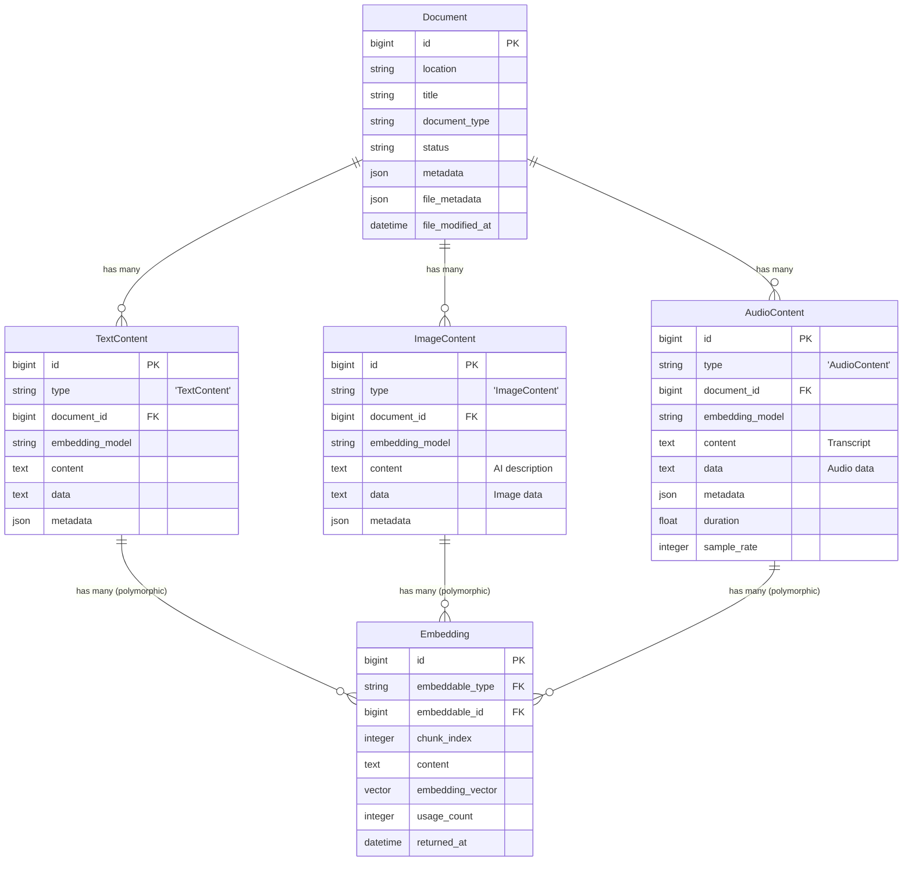

# Models Reference

Ragdoll uses a sophisticated ActiveRecord model architecture with Single Table Inheritance (STI) for multi-modal content storage and polymorphic associations for flexible embeddings.

## ActiveRecord Models and Relationships

The model architecture provides:

- **Single Table Inheritance (STI)**: Content models (`TextContent`, `ImageContent`, `AudioContent`) share a single table
- **Polymorphic Associations**: Embeddings can belong to any content type through polymorphic relationships
- **PostgreSQL Optimizations**: Native JSON columns, full-text search indexes, and pgvector integration
- **Rich Metadata Support**: Flexible metadata storage with validation and type-specific schemas
- **Usage Analytics**: Built-in tracking for search optimization and performance monitoring
- **Comprehensive Validations**: Data integrity through extensive validation rules and callbacks

## Core Models

### Document Model

**Class:** `Ragdoll::Document`

**Table:** `ragdoll_documents`

**Primary Attributes:**
```ruby
# Core document identification
id                :bigint           # Primary key
location          :string           # Source location (file path, URL, identifier)
title             :string           # Human-readable document title
document_type     :string           # Document format type (text, image, audio, pdf, etc.)
status            :string           # Processing status (pending, processing, processed, error)
file_modified_at  :datetime         # Source file modification timestamp

# Metadata storage
metadata          :json             # LLM-generated structured metadata
file_metadata     :json             # File properties and processing metadata

# Timestamps
created_at        :datetime
updated_at        :datetime
```

**Multi-Modal Content Associations:**
```ruby
# STI-based content relationships
has_many :contents, class_name: "Ragdoll::Content", dependent: :destroy
has_many :text_contents, class_name: "Ragdoll::TextContent"
has_many :image_contents, class_name: "Ragdoll::ImageContent"
has_many :audio_contents, class_name: "Ragdoll::AudioContent"

# Embedding relationships through content
has_many :text_embeddings, through: :text_contents, source: :embeddings
has_many :image_embeddings, through: :image_contents, source: :embeddings
has_many :audio_embeddings, through: :audio_contents, source: :embeddings
```

**Key Instance Methods:**
```ruby
# Content access
document.content                    # Returns combined content from all content types
document.content = "new content"    # Creates appropriate content model

# Multi-modal detection
document.multi_modal?               # True if document has multiple content types
document.content_types              # Array of content types: ['text', 'image', 'audio']
document.primary_content_type       # Primary content type for the document

# Statistics
document.total_word_count           # Sum of words across all text content
document.total_character_count      # Sum of characters across all text content
document.total_embedding_count      # Total embeddings across all content types
document.embeddings_by_type         # Hash: { text: 10, image: 5, audio: 2 }

# Processing
document.processed?                 # True if status == 'processed'
document.process_content!           # Generate embeddings and metadata
document.generate_metadata!         # Generate LLM-based metadata
```

**Search and Query Methods:**
```ruby
# PostgreSQL full-text search
Document.search_content("machine learning")

# Keywords search (array overlap - finds documents with any matching keywords)
Document.search_by_keywords(['machine', 'learning', 'ai'])
# Returns documents with keywords_match_count attribute

# Keywords search (array contains - finds documents with ALL keywords)
Document.search_by_keywords_all(['python', 'programming'])
# Returns documents with total_keywords_count attribute

# Faceted search with metadata filters
Document.faceted_search(
  query: "AI research",
  keywords: ["neural networks"],
  classification: "academic_paper",
  tags: ["machine-learning"]
)

# Hybrid search combining semantic and text search
Document.hybrid_search(
  "deep learning applications",
  query_embedding: embedding_vector,
  semantic_weight: 0.7,
  text_weight: 0.3
)
```

### Content Models (STI Architecture)

**Base Class:** `Ragdoll::Content`

**Table:** `ragdoll_contents` (shared by all content types)

**STI Classes:**
- `Ragdoll::TextContent`
- `Ragdoll::ImageContent` 
- `Ragdoll::AudioContent`

**Shared Attributes:**
```ruby
id              :bigint           # Primary key
type            :string           # STI discriminator (TextContent, ImageContent, etc.)
document_id     :bigint           # Foreign key to document
embedding_model :string           # Model used for embeddings
content         :text             # Content text (text, description, transcript)
data            :text             # Raw file data or metadata
metadata        :json             # Content-specific metadata
duration        :float            # Audio duration (audio content only)
sample_rate     :integer          # Audio sample rate (audio content only)
created_at      :datetime
updated_at      :datetime
```

**Polymorphic Relationships:**
```ruby
# Each content model belongs to a document
belongs_to :document, class_name: "Ragdoll::Document"

# Each content model can have many embeddings
has_many :embeddings, class_name: "Ragdoll::Embedding", as: :embeddable
```

#### TextContent Model

**Specific Validations:**
```ruby
validates :content, presence: true  # Text content is required
```

**Text-Specific Methods:**
```ruby
# Content analysis
text_content.word_count             # Number of words in content
text_content.character_count        # Number of characters in content
text_content.line_count             # Number of lines (from metadata)

# Chunking configuration
text_content.chunk_size             # Tokens per chunk (default: 1000)
text_content.chunk_size = 1500      # Set custom chunk size
text_content.overlap                # Token overlap (default: 200)
text_content.overlap = 300          # Set custom overlap

# Content processing
text_content.chunks                 # Array of content chunks with positions
text_content.generate_embeddings!   # Generate embeddings for all chunks
```

**Text Processing Example:**
```ruby
text_content = document.text_contents.create!(
  content: "Large document text...",
  embedding_model: "text-embedding-3-large",
  metadata: {
    encoding: "UTF-8",
    line_count: 150,
    chunk_size: 1000,
    overlap: 200
  }
)

# Generate embeddings automatically
text_content.generate_embeddings!

# Access generated chunks and embeddings
text_content.chunks.each do |chunk|
  puts "Chunk #{chunk[:chunk_index]}: #{chunk[:content][0..50]}..."
end

text_content.embeddings.each do |embedding|
  puts "Embedding #{embedding.chunk_index}: #{embedding.embedding_vector.length} dimensions"
end
```

#### ImageContent Model

**Image-Specific Attributes:**
```ruby
# content field stores AI-generated description
# data field stores image binary data or file reference
# metadata stores image properties
```

**Image-Specific Methods:**
```ruby
# Image properties (from metadata)
image_content.width                 # Image width in pixels
image_content.height                # Image height in pixels
image_content.file_size             # File size in bytes
image_content.format                # Image format (jpg, png, etc.)

# AI-generated content
image_content.description           # AI-generated description (stored in content field)
image_content.objects_detected      # Detected objects (from metadata)
image_content.scene_type            # Scene classification (from metadata)
```

#### AudioContent Model (Planned)

**Audio-Specific Attributes:**
```ruby
duration        :float            # Audio duration in seconds
sample_rate     :integer          # Sample rate in Hz
# content field stores transcript
# data field stores audio binary data
# metadata stores audio properties and timestamps
```

**Audio-Specific Methods (Planned):**
```ruby
# Audio properties
audio_content.duration_formatted    # "5:42" format
audio_content.bitrate               # Audio bitrate (from metadata)
audio_content.channels              # Number of audio channels

# Transcript and timestamps
audio_content.transcript            # Full transcript (stored in content field)
audio_content.timestamps            # Word-level timestamps (from metadata)
audio_content.speakers             # Speaker identification (from metadata)
```

### Embedding Model

**Class:** `Ragdoll::Embedding`

**Table:** `ragdoll_embeddings`

**Attributes:**
```ruby
id                :bigint           # Primary key
embeddable_type   :string           # Polymorphic type (Content class name)
embeddable_id     :bigint           # Polymorphic ID (Content record ID)
chunk_index       :integer          # Order within content
content           :text             # Original text that was embedded
embedding_vector  :vector(1536)     # pgvector column (configurable dimensions)
usage_count       :integer          # Number of times used in searches
returned_at       :datetime         # Last usage timestamp
created_at        :datetime
updated_at        :datetime
```

**Polymorphic Association:**
```ruby
# Belongs to any content type through polymorphic association
belongs_to :embeddable, polymorphic: true

# Can belong to TextContent, ImageContent, or AudioContent
embedding.embeddable                # Returns the associated content object
embedding.embeddable_type           # "Ragdoll::TextContent"
embedding.embeddable_id             # Content record ID
```

**Vector Search Methods:**
```ruby
# pgvector similarity search
Embedding.search_similar(
  query_embedding,
  limit: 20,
  threshold: 0.7,
  filters: {
    embeddable_type: "Ragdoll::TextContent",
    document_type: "pdf",
    embedding_model: "text-embedding-3-large"
  }
)

# Usage analytics
embedding.mark_as_used!             # Increment usage_count and update returned_at
embedding.usage_score               # Calculated usage score for ranking
embedding.embedding_dimensions      # Number of vector dimensions
```

**Search Result Format:**
```ruby
[
  {
    embedding_id: "123",
    embeddable_id: "456",
    embeddable_type: "Ragdoll::TextContent",
    document_id: "789",
    document_title: "AI Research Paper",
    document_location: "/path/to/document.pdf",
    content: "Machine learning algorithms...",
    similarity: 0.85,
    distance: 0.15,
    chunk_index: 5,
    embedding_dimensions: 1536,
    embedding_model: "text-embedding-3-large",
    usage_count: 12,
    returned_at: "2025-01-15T10:30:00Z",
    combined_score: 0.92
  }
]
```

## Model Relationships

Ragdoll uses a sophisticated relationship structure optimized for multi-modal content:

### Primary Relationships



### Association Details

**Document Associations:**
```ruby
class Document < ActiveRecord::Base
  # Content associations (STI)
  has_many :contents, class_name: "Content", dependent: :destroy
  has_many :text_contents, -> { where(type: "TextContent") }
  has_many :image_contents, -> { where(type: "ImageContent") }
  has_many :audio_contents, -> { where(type: "AudioContent") }
  
  # Embedding associations through content
  has_many :text_embeddings, through: :text_contents, source: :embeddings
  has_many :image_embeddings, through: :image_contents, source: :embeddings
  has_many :audio_embeddings, through: :audio_contents, source: :embeddings
  
  # Access all embeddings across content types
  def all_embeddings(content_type: nil)
    if content_type
      case content_type.to_s
      when 'text' then text_embeddings
      when 'image' then image_embeddings
      when 'audio' then audio_embeddings
      end
    else
      Embedding.where(
        embeddable_type: 'Ragdoll::Content',
        embeddable_id: contents.pluck(:id)
      )
    end
  end
end
```

**Content Associations (STI Base):**
```ruby
class Content < ActiveRecord::Base
  # Parent document relationship
  belongs_to :document, class_name: "Document", foreign_key: "document_id"
  
  # Polymorphic embedding relationship
  has_many :embeddings, as: :embeddable, dependent: :destroy
  
  # STI subclasses: TextContent, ImageContent, AudioContent
end
```

**Embedding Associations (Polymorphic):**
```ruby
class Embedding < ActiveRecord::Base
  # Polymorphic association - can belong to any content type
  belongs_to :embeddable, polymorphic: true
  
  # Access parent document through content
  def document
    embeddable&.document
  end
  
  # Scopes for different content types
  scope :text_embeddings, -> { where(embeddable_type: "Ragdoll::TextContent") }
  scope :image_embeddings, -> { where(embeddable_type: "Ragdoll::ImageContent") }
  scope :audio_embeddings, -> { where(embeddable_type: "Ragdoll::AudioContent") }
end
```

### Database Constraints and Foreign Keys

**Foreign Key Constraints:**
```sql
-- Document to Content relationship
ALTER TABLE ragdoll_contents 
ADD CONSTRAINT fk_contents_document 
FOREIGN KEY (document_id) REFERENCES ragdoll_documents(id) 
ON DELETE CASCADE;

-- Polymorphic embedding relationships (enforced by application)
-- Note: PostgreSQL doesn't support polymorphic foreign key constraints
-- These are enforced through ActiveRecord validations and callbacks
```

**Unique Constraints:**
```sql
-- Ensure unique document locations
ALTER TABLE ragdoll_documents 
ADD CONSTRAINT unique_document_location UNIQUE (location);

-- Ensure unique chunk indexes per content
ALTER TABLE ragdoll_embeddings 
ADD CONSTRAINT unique_chunk_per_content 
UNIQUE (embeddable_type, embeddable_id, chunk_index);
```

**Check Constraints:**
```sql
-- Ensure valid document types
ALTER TABLE ragdoll_documents 
ADD CONSTRAINT valid_document_type 
CHECK (document_type IN ('text', 'image', 'audio', 'pdf', 'docx', 'html', 'markdown', 'mixed'));

-- Ensure valid processing status
ALTER TABLE ragdoll_documents 
ADD CONSTRAINT valid_status 
CHECK (status IN ('pending', 'processing', 'processed', 'error'));

-- Ensure valid content types for STI
ALTER TABLE ragdoll_contents 
ADD CONSTRAINT valid_content_type 
CHECK (type IN ('Ragdoll::TextContent', 
                'Ragdoll::ImageContent', 
                'Ragdoll::AudioContent'));
```

### Index Strategy

**Performance Indexes:**
```sql
-- Document indexes
CREATE INDEX idx_documents_status ON ragdoll_documents(status);
CREATE INDEX idx_documents_type ON ragdoll_documents(document_type);
CREATE INDEX idx_documents_created_at ON ragdoll_documents(created_at);

-- Content indexes (STI table)
CREATE INDEX idx_contents_type ON ragdoll_contents(type);
CREATE INDEX idx_contents_document_id ON ragdoll_contents(document_id);
CREATE INDEX idx_contents_embedding_model ON ragdoll_contents(embedding_model);

-- Embedding indexes
CREATE INDEX idx_embeddings_embeddable ON ragdoll_embeddings(embeddable_type, embeddable_id);
CREATE INDEX idx_embeddings_usage_count ON ragdoll_embeddings(usage_count);
CREATE INDEX idx_embeddings_returned_at ON ragdoll_embeddings(returned_at);

-- pgvector similarity search index
CREATE INDEX idx_embeddings_vector_cosine ON ragdoll_embeddings 
USING ivfflat (embedding_vector vector_cosine_ops) WITH (lists = 100);
```

**Full-Text Search Indexes:**
```sql
-- Document full-text search
CREATE INDEX idx_documents_fulltext ON ragdoll_documents 
USING gin(to_tsvector('english', 
  title || ' ' || 
  COALESCE(metadata->>'summary', '') || ' ' || 
  COALESCE(metadata->>'keywords', '') || ' ' || 
  COALESCE(metadata->>'description', '')
));

-- Content full-text search
CREATE INDEX idx_contents_fulltext ON ragdoll_contents 
USING gin(to_tsvector('english', COALESCE(content, '')));
```

## Instance Methods

### Document Methods

#### Content Retrieval Methods

```ruby
# Dynamic content access based on primary content type
document.content                    
# Returns combined content from all content types
# For text: concatenated text from all text_contents
# For image: concatenated descriptions from all image_contents
# For audio: concatenated transcripts from all audio_contents

# Content type detection
document.content_types              # => ['text', 'image']
document.primary_content_type       # => 'text'
document.multi_modal?               # => true (if multiple content types)

# Content statistics
document.total_word_count           # Sum across all text content
document.total_character_count      # Sum across all text content
document.total_embedding_count      # Sum across all content types
document.embeddings_by_type         # => { text: 15, image: 3, audio: 0 }

# Content access by type
document.text_contents.each { |tc| puts tc.content }
document.image_contents.each { |ic| puts ic.content }  # AI descriptions
document.audio_contents.each { |ac| puts ac.content }  # Transcripts
```

#### Metadata Accessors

```ruby
# LLM-generated metadata (stored in metadata JSON column)
document.metadata                   # Full metadata hash
document.description                # metadata['description']
document.description = "New desc"   # Updates metadata hash
document.classification             # metadata['classification']
document.classification = "technical"
document.tags                       # metadata['tags'] (array)
document.tags = ['ai', 'research']

# Metadata utility methods
document.has_summary?               # Check if summary exists
document.has_keywords?              # Check if keywords exist
document.keywords_array             # Parse keywords into array
document.add_keyword('machine-learning')
document.remove_keyword('outdated')

# File metadata (stored in file_metadata JSON column)
document.file_metadata              # File processing metadata
document.total_file_size            # Sum of all content file sizes
document.primary_file_type          # Document's primary file type
```

#### Processing Status Methods

```ruby
# Status checking
document.processed?                 # status == 'processed'
document.status                     # 'pending', 'processing', 'processed', 'error'

# Content processing
document.process_content!           # Full processing pipeline:
                                    # 1. Generate embeddings for all content
                                    # 2. Generate LLM metadata
                                    # 3. Update status to 'processed'

document.generate_embeddings_for_all_content!
                                    # Generate embeddings only
                                    
document.generate_metadata!         # Generate LLM metadata only

# Processing validation
document.has_files?                 # Check if content has associated files
document.has_pending_content?       # Check for content awaiting processing
```

#### File Handling Methods

```ruby
# File association (through content models)
document.has_files?                 # Any content has file data
document.total_file_size            # Sum of all file sizes
document.primary_file_type          # Main file type

# File metadata access
document.file_modified_at           # Source file modification time
document.location                   # Source file path or URL

# Content creation from files
document.content = "new text"       # Creates TextContent automatically
# For images/audio, use specific content models:
document.image_contents.create!(data: image_data, embedding_model: 'clip')
```

### Content Methods

#### Embedding Generation

```ruby
# Base Content methods (inherited by all content types)
content.generate_embeddings!        # Generate embeddings for this content
content.should_generate_embeddings? # Check if embeddings needed
content.content_for_embedding       # Text to use for embedding (overrideable)

# TextContent specific
text_content.generate_embeddings!   # Chunks text and generates embeddings
text_content.chunks                 # Array of content chunks with metadata
text_content.chunk_size             # Tokens per chunk
text_content.overlap                # Token overlap between chunks

# Embedding management
content.embeddings.count            # Number of embeddings
content.embedding_count             # Alias for count
content.embeddings.destroy_all      # Remove all embeddings
```

#### Content Validation

```ruby
# Base validations (all content types)
content.valid?                      # ActiveRecord validation
content.errors.full_messages        # Validation error messages

# Content-specific validations
text_content.content.present?       # TextContent requires content
image_content.data.present?         # ImageContent requires data

# Custom validation methods
content.validate_embedding_model    # Ensure model is supported
content.validate_content_size       # Check content size limits
```

#### Processing Callbacks

```ruby
# Automatic processing callbacks
# after_create: Generate embeddings if content is ready
# after_update: Regenerate embeddings if content changed
# before_destroy: Clean up associated embeddings

# Manual callback triggering
content.run_callbacks(:create)      # Trigger create callbacks
content.run_callbacks(:update)      # Trigger update callbacks

# Callback status checking
content.embeddings_generated?       # Check if embeddings exist
content.metadata['embeddings_generated_at']  # Generation timestamp
```

### Embedding Methods

#### Similarity Search

```ruby
# Instance-level similarity (compare with other embeddings)
embedding.similarity_to(other_embedding)     # Cosine similarity score
embedding.distance_to(other_embedding)       # Distance (1 - similarity)

# Class-level similarity search
Embedding.search_similar(
  query_embedding,
  limit: 20,
  threshold: 0.7,
  filters: {
    embeddable_type: 'Ragdoll::TextContent',
    document_type: 'pdf'
  }
)

# Specialized search methods
embedding.find_similar(limit: 10)           # Find similar embeddings
embedding.find_related_in_document(limit: 5) # Similar chunks in same document
```

#### Usage Tracking

```ruby
# Usage analytics
embedding.mark_as_used!             # Increment usage_count, update returned_at
embedding.usage_count               # Number of times used in searches
embedding.returned_at               # Last usage timestamp
embedding.last_used_days_ago        # Days since last use

# Usage scoring
embedding.usage_score               # Calculated usage score for ranking
embedding.frequency_score           # Frequency-based component
embedding.recency_score             # Recency-based component

# Usage statistics
embedding.is_popular?               # usage_count > threshold
embedding.is_recent?                # used within recent timeframe
embedding.is_trending?              # increasing usage pattern
```

#### Analytics Methods

```ruby
# Embedding metadata
embedding.embedding_dimensions      # Vector dimensionality
embedding.embedding_model           # Model used (via content relationship)
embedding.chunk_index               # Position within content

# Content access
embedding.embeddable                # Associated content object
embedding.document                  # Parent document (through content)
embedding.content_preview(length: 100)  # Truncated content preview

# Search result formatting
embedding.to_search_result(similarity: 0.85)
# Returns formatted hash for search APIs

# Performance metrics
embedding.vector_magnitude          # Vector magnitude (for normalization)
embedding.vector_norm               # L2 norm of the vector
embedding.vector_sparsity           # Percentage of zero values
```

## Class Methods

### Document Class Methods

#### Scopes and Query Methods

```ruby
# Status-based scopes
Document.processed                  # WHERE status = 'processed'
Document.pending                    # WHERE status = 'pending'
Document.processing                 # WHERE status = 'processing'
Document.with_errors                # WHERE status = 'error'

# Content-based scopes
Document.by_type('pdf')             # WHERE document_type = 'pdf'
Document.multi_modal                # Documents with multiple content types
Document.text_only                  # Documents with only text content
Document.with_content               # Documents that have content models
Document.without_content            # Documents missing content models

# Time-based scopes
Document.recent                     # ORDER BY created_at DESC
Document.created_since(1.week.ago)  # WHERE created_at > ?
Document.modified_since(1.day.ago)  # WHERE file_modified_at > ?

# Advanced queries
Document.with_embeddings_count      # Includes embedding count
Document.by_content_length(min: 1000)  # Filter by content length
Document.by_file_size(max: 10.megabytes)  # Filter by file size
```

#### Search and Filtering

```ruby
# PostgreSQL full-text search
Document.search_content(
  "machine learning algorithms",
  limit: 20
)

# Faceted search with metadata filters
Document.faceted_search(
  query: "neural networks",
  keywords: ["deep learning", "AI"],
  classification: "research_paper",
  tags: ["computer-science"],
  limit: 50
)

# Hybrid search (semantic + full-text)
Document.hybrid_search(
  "artificial intelligence applications",
  query_embedding: embedding_vector,
  semantic_weight: 0.7,
  text_weight: 0.3,
  limit: 25
)

# Metadata-based filtering
Document.with_classification('technical_manual')
Document.with_keywords(['api', 'documentation'])
Document.with_tags(['development', 'guide'])
Document.by_metadata_field('complexity', 'advanced')
```

#### Statistics and Analytics

```ruby
# Comprehensive statistics
Document.stats
# Returns:
# {
#   total_documents: 1250,
#   by_status: { processed: 1100, pending: 50, processing: 75, error: 25 },
#   by_type: { pdf: 600, docx: 300, text: 200, image: 100, mixed: 50 },
#   multi_modal_documents: 75,
#   total_text_contents: 1000,
#   total_image_contents: 125,
#   total_audio_contents: 25,
#   total_embeddings: { text: 15000, image: 500, audio: 100 },
#   storage_type: "activerecord_polymorphic"
# }

# Usage analytics
Document.popular(limit: 10)         # Most searched documents
Document.trending(timeframe: 1.week) # Recently popular documents
Document.usage_summary(period: 1.month)  # Usage statistics

# Content analysis
Document.average_word_count          # Average words per document
Document.total_storage_size          # Total storage used
Document.embedding_coverage          # Percentage with embeddings

# Performance metrics
Document.processing_time_stats       # Processing time statistics
Document.error_rate(period: 1.day)   # Error rate percentage
Document.throughput_stats            # Documents processed per hour
```

#### Batch Operations

```ruby
# Batch processing
Document.process_pending!            # Process all pending documents
Document.regenerate_embeddings!(model: 'text-embedding-3-large')
Document.bulk_update_metadata(classification: 'archived')

# Batch import
Document.import_from_directory(
  '/path/to/documents',
  file_patterns: ['*.pdf', '*.docx'],
  recursive: true,
  batch_size: 100
)

# Batch cleanup
Document.cleanup_orphaned_content!   # Remove content without documents
Document.remove_old_embeddings!(older_than: 6.months)
Document.vacuum_unused_storage!      # Cleanup unused file storage
```

### Content Class Methods

#### Content-Type Specific Queries

```ruby
# Base Content class methods
Content.by_type('TextContent')       # Filter by STI type
Content.with_embeddings              # Content that has embeddings
Content.without_embeddings           # Content missing embeddings
Content.by_embedding_model('text-embedding-3-large')

# TextContent specific
TextContent.by_word_count(min: 500, max: 5000)
TextContent.by_character_count(min: 2000)
TextContent.with_long_content        # Content over threshold
TextContent.recently_processed       # Recently generated embeddings

# ImageContent specific
ImageContent.by_dimensions(min_width: 800, min_height: 600)
ImageContent.by_file_size(max: 5.megabytes)
ImageContent.with_descriptions       # Has AI-generated descriptions
ImageContent.by_format(['jpg', 'png'])

# AudioContent specific (planned)
AudioContent.by_duration(min: 30.seconds, max: 10.minutes)
AudioContent.by_sample_rate(44100)
AudioContent.with_transcripts        # Has speech-to-text transcripts
```

#### Content Statistics

```ruby
# TextContent statistics
TextContent.stats
# Returns:
# {
#   total_text_contents: 1000,
#   by_model: { 'text-embedding-3-large': 600, 'text-embedding-3-small': 400 },
#   total_embeddings: 15000,
#   average_word_count: 1250,
#   average_chunk_size: 1000
# }

# Processing statistics
Content.processing_stats             # Embedding generation statistics
Content.model_usage_stats            # Usage by embedding model
Content.error_rate_by_type           # Error rates by content type
```

### Embedding Class Methods

#### Advanced Search Methods

```ruby
# Vector similarity search with filters
Embedding.search_similar(
  query_embedding,
  limit: 20,
  threshold: 0.75,
  filters: {
    embeddable_type: 'Ragdoll::TextContent',
    embedding_model: 'text-embedding-3-large',
    document_type: 'pdf',
    created_after: 1.month.ago
  }
)

# Batch similarity search
Embedding.batch_search_similar(
  [embedding1, embedding2, embedding3],
  limit: 10,
  aggregate_results: true
)

# Specialized search methods
Embedding.find_duplicates(threshold: 0.95)  # Near-duplicate detection
Embedding.find_outliers(threshold: 0.3)     # Low-similarity outliers
Embedding.cluster_similar(max_clusters: 10) # K-means clustering
```

#### Usage Analytics

```ruby
# Usage tracking
Embedding.most_used(limit: 100)     # Highest usage_count
Embedding.recently_used(since: 1.hour.ago)
Embedding.trending(period: 1.day)   # Increasing usage pattern
Embedding.popular_content_types     # Usage by content type

# Performance analytics
Embedding.search_performance_stats  # Search timing statistics
Embedding.model_performance_comparison  # Compare model effectiveness
Embedding.quality_metrics           # Embedding quality assessment

# Cache optimization
Embedding.precompute_popular!       # Cache popular embeddings
Embedding.optimize_indexes!         # Rebuild vector indexes
```

#### Batch Operations

```ruby
# Batch embedding operations
Embedding.regenerate_for_model!(
  old_model: 'text-embedding-ada-002',
  new_model: 'text-embedding-3-large'
)

Embedding.update_usage_analytics!   # Recalculate usage scores
Embedding.cleanup_orphaned!         # Remove embeddings without content
Embedding.normalize_vectors!        # L2 normalize all vectors

# Database maintenance
Embedding.rebuild_vector_indexes!   # Rebuild pgvector indexes
Embedding.vacuum_embeddings_table!  # PostgreSQL VACUUM operation
Embedding.analyze_vector_distribution!  # Update query planner statistics
```

## Model Validations

Ragdoll implements comprehensive validation rules to ensure data integrity:

### Document Model Validations

#### Required Fields

```ruby
class Document < ActiveRecord::Base
  validates :location, presence: true
  validates :title, presence: true
  validates :document_type, presence: true
  validates :status, presence: true
  validates :file_modified_at, presence: true
end
```

#### Format Validations

```ruby
# Document type validation
validates :document_type, 
  inclusion: { 
    in: %w[text image audio pdf docx html markdown mixed],
    message: "must be a valid document type"
  }

# Status validation
validates :status,
  inclusion: {
    in: %w[pending processing processed error],
    message: "must be a valid processing status"
  }

# Location format validation
validates :location, format: {
  with: /\A(https?:\/\/|\/).*\z/,
  message: "must be a valid URL or absolute file path"
}

# Metadata JSON validation
validate :validate_metadata_structure

private

def validate_metadata_structure
  return unless metadata.present?
  
  # Validate metadata against document type schema
  schema_errors = MetadataSchemas.validate_metadata(document_type, metadata)
  schema_errors.each { |error| errors.add(:metadata, error) }
end
```

#### Custom Validators

```ruby
# Custom location validator
validate :validate_location_accessibility

def validate_location_accessibility
  return unless location.present?
  
  # For file paths, check if file exists and is readable
  if location.start_with?('/')
    unless File.exist?(location) && File.readable?(location)
      errors.add(:location, "file does not exist or is not readable")
    end
  end
  
  # For URLs, validate format more strictly
  if location.start_with?('http')
    begin
      uri = URI.parse(location)
      unless uri.is_a?(URI::HTTP) || uri.is_a?(URI::HTTPS)
        errors.add(:location, "must be a valid HTTP or HTTPS URL")
      end
    rescue URI::InvalidURIError
      errors.add(:location, "is not a valid URL")
    end
  end
end

# File size validation
validate :validate_reasonable_file_size

def validate_reasonable_file_size
  if location.present? && File.exist?(location)
    file_size = File.size(location)
    max_size = 100.megabytes  # Configurable limit
    
    if file_size > max_size
      errors.add(:location, "file size (#{file_size} bytes) exceeds maximum (#{max_size} bytes)")
    end
  end
end
```

### Content Model Validations

#### Base Content Validations

```ruby
class Content < ActiveRecord::Base
  validates :type, presence: true
  validates :embedding_model, presence: true
  validates :document_id, presence: true
  
  # Ensure valid STI type
  validates :type, inclusion: {
    in: %w[
      Ragdoll::TextContent
      Ragdoll::ImageContent
      Ragdoll::AudioContent
    ],
    message: "must be a valid content type"
  }
  
  # Validate embedding model exists
  validate :validate_embedding_model_exists
  
  private
  
  def validate_embedding_model_exists
    return unless embedding_model.present?
    
    valid_models = Ragdoll.config.embedding_config.keys.map(&:to_s)
    unless valid_models.include?(embedding_model)
      errors.add(:embedding_model, "'#{embedding_model}' is not a configured embedding model")
    end
  end
end
```

#### TextContent Specific Validations

```ruby
class TextContent < Content
  validates :content, presence: true
  validates :content, length: {
    minimum: 10,
    maximum: 1_000_000,  # 1MB text limit
    message: "must be between 10 and 1,000,000 characters"
  }
  
  # Validate chunk configuration
  validate :validate_chunk_configuration
  
  private
  
  def validate_chunk_configuration
    chunk_size_val = chunk_size
    overlap_val = overlap
    
    if chunk_size_val <= 0
      errors.add(:chunk_size, "must be greater than 0")
    end
    
    if overlap_val < 0
      errors.add(:overlap, "cannot be negative")
    end
    
    if overlap_val >= chunk_size_val
      errors.add(:overlap, "must be less than chunk_size")
    end
  end
end
```

#### ImageContent Specific Validations

```ruby
class ImageContent < Content
  validates :data, presence: true
  
  # Validate image metadata
  validate :validate_image_metadata
  
  private
  
  def validate_image_metadata
    return unless metadata.present?
    
    # Validate dimensions if present
    if metadata['width'] && metadata['height']
      width = metadata['width'].to_i
      height = metadata['height'].to_i
      
      if width <= 0 || height <= 0
        errors.add(:metadata, "image dimensions must be positive integers")
      end
      
      # Reasonable size limits
      if width > 50000 || height > 50000
        errors.add(:metadata, "image dimensions are unreasonably large")
      end
    end
    
    # Validate file format
    if metadata['file_type']
      valid_formats = %w[jpg jpeg png gif bmp webp svg ico tiff tif]
      unless valid_formats.include?(metadata['file_type'].downcase)
        errors.add(:metadata, "unsupported image format: #{metadata['file_type']}")
      end
    end
  end
end
```

### Embedding Model Validations

#### Vector and Content Validations

```ruby
class Embedding < ActiveRecord::Base
  validates :embeddable_id, presence: true
  validates :embeddable_type, presence: true
  validates :chunk_index, presence: true
  validates :content, presence: true
  validates :embedding_vector, presence: true
  
  # Unique chunk index per content
  validates :chunk_index, uniqueness: {
    scope: [:embeddable_id, :embeddable_type],
    message: "must be unique within the same content"
  }
  
  # Vector dimension validation
  validate :validate_embedding_dimensions
  
  # Content length validation
  validates :content, length: {
    minimum: 1,
    maximum: 10000,  # Reasonable chunk size limit
    message: "must be between 1 and 10,000 characters"
  }
  
  # Usage count validation
  validates :usage_count, numericality: {
    greater_than_or_equal_to: 0,
    message: "cannot be negative"
  }
  
  private
  
  def validate_embedding_dimensions
    return unless embedding_vector.present?
    
    # Get expected dimensions for the model
    expected_dimensions = get_expected_dimensions
    actual_dimensions = embedding_vector.length
    
    if actual_dimensions != expected_dimensions
      errors.add(
        :embedding_vector,
        "has #{actual_dimensions} dimensions, expected #{expected_dimensions}"
      )
    end
    
    # Validate vector values
    if embedding_vector.any? { |val| !val.is_a?(Numeric) }
      errors.add(:embedding_vector, "must contain only numeric values")
    end
    
    # Check for NaN or infinite values
    if embedding_vector.any? { |val| val.nan? || val.infinite? }
      errors.add(:embedding_vector, "cannot contain NaN or infinite values")
    end
  end
  
  def get_expected_dimensions
    model_name = embeddable&.embedding_model
    return 1536 unless model_name  # Default OpenAI dimension
    
    # Look up dimensions from configuration
    config = Ragdoll.config.embedding_config
    config.dig(model_name.to_sym, :dimensions) || 1536
  end
end
```

### Error Handling

#### Validation Error Processing

```ruby
# Custom error handling for validation failures
class ValidationErrorHandler
  def self.handle_document_errors(document)
    return { success: true } if document.valid?
    
    {
      success: false,
      errors: {
        validation_errors: document.errors.full_messages,
        field_errors: document.errors.messages,
        error_count: document.errors.count
      }
    }
  end
  
  def self.handle_content_errors(content)
    return { success: true } if content.valid?
    
    {
      success: false,
      content_type: content.class.name,
      errors: {
        validation_errors: content.errors.full_messages,
        field_errors: content.errors.messages,
        suggested_fixes: generate_fix_suggestions(content.errors)
      }
    }
  end
  
  private
  
  def self.generate_fix_suggestions(errors)
    suggestions = []
    
    errors.each do |field, messages|
      case field
      when :content
        if messages.any? { |m| m.include?('too short') }
          suggestions << "Ensure content has at least 10 characters"
        end
      when :embedding_model
        suggestions << "Use a configured embedding model: #{available_models.join(', ')}"
      when :chunk_size
        suggestions << "Set chunk_size to a positive integer (recommended: 1000)"
      end
    end
    
    suggestions
  end
  
  def self.available_models
    Ragdoll.config.embedding_config.keys.map(&:to_s)
  end
end
```

#### Validation Callbacks

```ruby
# Before validation callbacks for cleanup
class Document < ActiveRecord::Base
  before_validation :normalize_location
  before_validation :set_default_file_modified_at
  before_validation :sanitize_metadata
  
  private
  
  def normalize_location
    return unless location.present?
    
    # Convert relative paths to absolute paths
    if location.start_with?('./')
      self.location = File.expand_path(location)
    end
    
    # Normalize URL protocols
    if location.match?(/^https?:\/\//i)
      self.location = location.downcase.gsub(/^http:/i, 'https:')
    end
  end
  
  def sanitize_metadata
    return unless metadata.present?
    
    # Remove nil values and empty strings
    self.metadata = metadata.reject { |k, v| v.nil? || v == '' }
    
    # Ensure arrays are actually arrays
    ['tags', 'keywords'].each do |field|
      if metadata[field].is_a?(String)
        metadata[field] = metadata[field].split(',').map(&:strip)
      end
    end
  end
end
```

---

*This document is part of the Ragdoll documentation suite. For immediate help, see the [Quick Start Guide](../getting-started/quick-start.md) or [API Reference](../api-reference/api-client.md).*