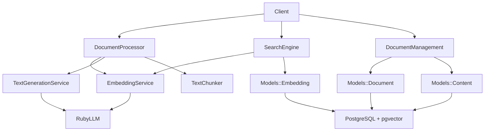

# Services Reference

## Business Logic and Processing Services

Ragdoll implements a comprehensive service layer architecture that handles document processing, content analysis, vector generation, and search operations. All services are designed for production use with PostgreSQL and pgvector.

### Service Architecture Overview



## Core Services

### DocumentProcessor

**Responsibility**: Multi-format document parsing and content extraction with metadata

**Implementation**: `/lib/ragdoll/core/document_processor.rb`

```ruby
class DocumentProcessor
  class ParseError < DocumentError; end
  class UnsupportedFormatError < ParseError; end

  # Parse document from file path
  def self.parse(file_path)
    new(file_path).parse
    # Returns: { content:, metadata:, document_type: }
  end
  
  # Parse from Shrine attached file
  def self.parse_attachment(attached_file)
    attached_file.open { |tempfile| new(tempfile.path, attached_file).parse }
  end
  
  # Create document with file processing
  def self.create_document_from_file(file_path, **options)
    # Returns: Document model instance with content extracted
  end
end
```

**Supported Formats**:
- **PDF**: Uses `pdf-reader` gem for text extraction and metadata
- **DOCX**: Uses `docx` gem for Office document processing
- **HTML**: Strip tags and extract clean text content
- **Text/Markdown**: Direct file reading with encoding detection
- **Images**: Uses `ImageMagick` for metadata and AI description via `ImageDescriptionService`

**Usage Examples**:
```ruby
# Basic document parsing
result = DocumentProcessor.parse('/path/to/document.pdf')
puts result[:content]      # Extracted text content
puts result[:metadata]     # Document properties (title, author, etc.)
puts result[:document_type] # "pdf"

# Error handling
begin
  result = DocumentProcessor.parse('/path/to/corrupted.pdf')
rescue DocumentProcessor::ParseError => e
  puts "Failed to parse document: #{e.message}"
end

# Image processing with AI description
result = DocumentProcessor.parse('/path/to/image.jpg')
puts result[:content]  # AI-generated description
puts result[:metadata][:width]   # Image dimensions
puts result[:metadata][:height]  # Image dimensions
```

### DocumentManagement

**Responsibility**: High-level document CRUD operations and database persistence

**Implementation**: `/lib/ragdoll/core/document_management.rb`

```ruby
class DocumentManagement
  class << self
    # Create document with duplicate detection
    def add_document(location, content, metadata = {})
      # Returns: document_id (string)
    end
    
    # Retrieve document with full content
    def get_document(id)
      # Returns: document hash with content and metadata
    end
    
    # Update document properties
    def update_document(id, **updates)
      # Returns: updated document hash
    end
    
    # Delete document and all associated data
    def delete_document(id)
      # Returns: true on success, nil if not found
    end
    
    # Paginated document listing
    def list_documents(options = {})
      # Returns: array of document hashes
    end
    
    # System-wide statistics
    def get_document_stats
      # Returns: comprehensive statistics hash
    end
    
    # Direct embedding creation (advanced usage)
    def add_embedding(embeddable_id, chunk_index, embedding_vector, metadata = {})
      # Returns: embedding_id (string)
    end
  end
end
```

**Features**:
- **Duplicate Prevention**: Detects existing documents by location and modification time
- **Path Normalization**: Converts relative paths to absolute paths automatically
- **Multi-modal Content**: Handles text, image, and audio content via STI models
- **Background Integration**: Triggers embedding generation jobs automatically

**Usage Examples**:
```ruby
# Add document with metadata
doc_id = DocumentManagement.add_document(
  '/path/to/document.pdf',
  'Document content here',
  {
    title: 'Research Paper',
    author: 'John Doe',
    document_type: 'pdf',
    tags: ['research', 'ai']
  }
)

# Retrieve with full content
document = DocumentManagement.get_document(doc_id)
puts document[:title]
puts document[:content]
puts document[:metadata][:author]

# Update metadata
DocumentManagement.update_document(doc_id, 
  metadata: { classification: 'academic' }
)

# Get system statistics
stats = DocumentManagement.get_document_stats
puts "Total documents: #{stats[:total_documents]}"
puts "By type: #{stats[:by_type]}"
puts "Multi-modal: #{stats[:multi_modal_documents]}"
```

### EmbeddingService

**Responsibility**: Vector embedding generation using multiple LLM providers

**Implementation**: `/lib/ragdoll/core/embedding_service.rb`

```ruby
class EmbeddingService
  class EmbeddingError < Error; end

  def initialize(client: nil)
    @client = client
    configure_ruby_llm unless @client
  end

  # Generate single embedding
  def generate_embedding(text)
    # Returns: Array of floats (embedding vector) or nil
  end
  
  # Batch processing for efficiency
  def generate_embeddings_batch(texts)
    # Returns: Array of embedding vectors
  end
  
  # Vector similarity calculation
  def cosine_similarity(embedding1, embedding2)
    # Returns: Float similarity score (0.0 to 1.0)
  end
end
```

**Provider Support**:
- **OpenAI**: `text-embedding-3-small`, `text-embedding-3-large`
- **Anthropic**: Via API compatibility
- **Google**: Vertex AI embedding models
- **Azure OpenAI**: Enterprise deployment support
- **Ollama**: Local embedding models
- **HuggingFace**: Custom model deployment

**Usage Examples**:
```ruby
# Initialize service
service = EmbeddingService.new

# Generate single embedding
embedding = service.generate_embedding("This is sample text")
puts "Embedding dimensions: #{embedding.length}"

# Batch processing for efficiency
texts = ["Text 1", "Text 2", "Text 3"]
embeddings = service.generate_embeddings_batch(texts)
puts "Generated #{embeddings.length} embeddings"

# Calculate similarity
similarity = service.cosine_similarity(embedding1, embedding2)
puts "Similarity: #{similarity.round(3)}"

# Error handling
begin
  embedding = service.generate_embedding("")
rescue EmbeddingService::EmbeddingError => e
  puts "Embedding failed: #{e.message}"
end
```

### SearchEngine

**Responsibility**: Semantic search operations using pgvector similarity

**Implementation**: `/lib/ragdoll/core/search_engine.rb`

```ruby
class SearchEngine
  def initialize(embedding_service)
    @embedding_service = embedding_service
  end

  # Document-level semantic search
  def search_documents(query, options = {})
    # Returns: Array of document results with similarity scores
  end
  
  # Content chunk-level search
  def search_similar_content(query_or_embedding, options = {})
    # Returns: Array of content chunk matches
  end
end
```

**Search Options**:
- `limit`: Maximum results (default: configured max_results)
- `threshold`: Minimum similarity score (default: configured threshold) 
- `filters`: Document type, embedding model, date range filters
- `embeddable_type`: Filter by content type (text, image, audio)

**Usage Examples**:
```ruby
# Initialize with embedding service
embedding_service = EmbeddingService.new
search_engine = SearchEngine.new(embedding_service)

# Basic semantic search
results = search_engine.search_documents(
  "machine learning algorithms",
  limit: 10,
  threshold: 0.7
)

results.each do |result|
  puts "Document: #{result[:document_title]}"
  puts "Similarity: #{result[:similarity].round(3)}"
  puts "Content: #{result[:content][0..200]}..."
end

# Search with filters
results = search_engine.search_similar_content(
  "neural networks",
  filters: {
    document_type: 'pdf',
    embeddable_type: 'Ragdoll::Core::Models::TextContent'
  }
)

# Direct embedding search
query_embedding = embedding_service.generate_embedding("query text")
results = search_engine.search_similar_content(query_embedding)
```

### TextGenerationService

**Responsibility**: LLM-powered content analysis including summarization and keyword extraction

**Implementation**: `/lib/ragdoll/core/text_generation_service.rb`

```ruby
class TextGenerationService
  class GenerationError < StandardError; end

  def initialize(client: nil)
    @configuration = Ragdoll.config
    @client = client
    configure_ruby_llm_if_possible unless @client
  end

  # Generate document summary
  def generate_summary(text, max_length: nil)
    # Returns: String summary or fallback extraction
  end
  
  # Extract important keywords
  def extract_keywords(text, max_keywords: 20)
    # Returns: Array of keyword strings
  end
end
```

**Features**:
- **Intelligent Fallbacks**: Uses rule-based extraction when LLM APIs fail
- **Configurable Models**: Supports different models for summaries vs keywords
- **Content-Length Aware**: Skips processing for very short content
- **Error Recovery**: Graceful degradation with informative logging

**Usage Examples**:
```ruby
# Initialize service
service = TextGenerationService.new

# Generate summary
long_text = File.read('long_document.txt')
summary = service.generate_summary(long_text, max_length: 300)
puts "Summary: #{summary}"

# Extract keywords
keywords = service.extract_keywords(long_text, max_keywords: 15)
puts "Keywords: #{keywords.join(', ')}"

# Handle configuration-disabled scenarios
Ragdoll::Core.configure do |config|
  config.summarization_config[:enable] = false
end

# Will use fallback extraction
summary = service.generate_summary(text)  # Returns first 500 chars
```

### TextChunker

**Responsibility**: Intelligent text segmentation for optimal embedding generation

**Implementation**: `/lib/ragdoll/core/text_chunker.rb`

```ruby
class TextChunker
  # Basic chunking with overlap
  def self.chunk(text, chunk_size: 1000, chunk_overlap: 200)
    # Returns: Array of text chunks with metadata
  end
  
  # Structure-aware chunking (preserves paragraphs, sections)
  def self.chunk_by_structure(text, options = {})
    # Returns: Chunks respecting document structure
  end
  
  # Programming language-aware chunking
  def self.chunk_code(text, language: nil)
    # Returns: Chunks respecting code boundaries (functions, classes)
  end
end
```

**Chunking Strategies**:
- **Token-based**: Splits based on approximate token counts
- **Sentence-aware**: Preserves sentence boundaries
- **Paragraph-aware**: Maintains paragraph structure
- **Code-aware**: Respects programming language syntax

**Usage Examples**:
```ruby
# Basic chunking
text = File.read('large_document.txt')
chunks = TextChunker.chunk(text, chunk_size: 1500, chunk_overlap: 300)

chunks.each_with_index do |chunk, index|
  puts "Chunk #{index + 1}: #{chunk.length} characters"
end

# Structure-aware chunking
chunks = TextChunker.chunk_by_structure(text, 
  preserve_paragraphs: true,
  min_chunk_size: 500
)

# Code chunking
code_text = File.read('source_code.rb')
code_chunks = TextChunker.chunk_code(code_text, language: 'ruby')
```

## Specialized Services

### MetadataGenerator

**Responsibility**: AI-powered structured metadata creation

**Implementation**: `/lib/ragdoll/core/services/metadata_generator.rb`

```ruby
class Services::MetadataGenerator
  def generate_for_document(document)
    # Returns: Hash of structured metadata following document-type schemas
  end
  
  private
  
  def generate_text_metadata(content)
    # Generates classification, topics, difficulty_level, etc.
  end
  
  def generate_image_metadata(description, image_metadata)
    # Generates scene_type, objects, colors, mood, etc.
  end
end
```

**Metadata Schemas**:
- **Text Documents**: classification, topics, difficulty_level, audience, language
- **Images**: scene_type, objects, colors, mood, artistic_style
- **PDFs**: academic_level, document_structure, reference_count
- **Code**: programming_language, complexity, patterns

### ImageDescriptionService

**Responsibility**: AI-powered image content description

**Implementation**: `/lib/ragdoll/core/services/image_description_service.rb`

```ruby
class Services::ImageDescriptionService
  def generate_description(image_path)
    # Returns: String description of image content for embedding
  end
end
```

## Service Configuration

### Provider Selection and Setup

```ruby
Ragdoll::Core.configure do |config|
  # LLM Provider Configuration
  config.ruby_llm_config[:openai][:api_key] = ENV['OPENAI_API_KEY']
  config.ruby_llm_config[:anthropic][:api_key] = ENV['ANTHROPIC_API_KEY']
  
  # Model Selection by Task
  config.models[:default] = 'openai/gpt-4o-mini'    # General purpose
  config.models[:summary] = 'openai/gpt-4o'         # High-quality summarization
  config.models[:keywords] = 'openai/gpt-4o-mini'   # Fast keyword extraction
  
  # Embedding Models by Content Type
  config.models[:embedding][:text] = 'text-embedding-3-small'
  config.models[:embedding][:image] = 'clip-vit-large-patch14'
  config.models[:embedding][:audio] = 'whisper-embedding-v1'
  
  # Performance Tuning
  config.embedding_config[:cache_embeddings] = true
  config.embedding_config[:max_embedding_dimensions] = 3072
  
  # Chunking Configuration  
  config.chunking[:text][:max_tokens] = 1000
  config.chunking[:text][:overlap] = 200
end
```

### Error Handling Strategies

```ruby
# Service-level error handling
begin
  result = DocumentProcessor.parse(file_path)
rescue DocumentProcessor::UnsupportedFormatError => e
  # Handle unsupported file format
  logger.warn "Unsupported format: #{e.message}"
  fallback_to_text_extraction(file_path)
rescue DocumentProcessor::ParseError => e
  # Handle parsing errors
  logger.error "Parse failed: #{e.message}"
  create_error_document(file_path, e.message)
end

# Embedding service with retries
service = EmbeddingService.new
begin
  embedding = service.generate_embedding(text)
rescue EmbeddingService::EmbeddingError => e
  if e.message.include?('rate limit')
    sleep(2)
    retry
  else
    raise e
  end
end
```

## Usage Patterns

### Service Composition

```ruby
# Complete document processing pipeline
class DocumentPipeline
  def self.process_document(file_path)
    # 1. Parse document
    parsed = DocumentProcessor.parse(file_path)
    
    # 2. Create database record
    doc_id = DocumentManagement.add_document(
      file_path, 
      parsed[:content], 
      parsed[:metadata]
    )
    
    # 3. Generate embeddings (via background job)
    document = Models::Document.find(doc_id)
    document.generate_embeddings_for_all_content!
    
    # 4. Generate metadata (via background job)
    document.generate_metadata!
    
    doc_id
  end
end
```

### Service Testing Patterns

```ruby
# Mock LLM services for testing
class MockEmbeddingService < EmbeddingService
  def initialize
    @client = MockLLMClient.new
  end
  
  def generate_embedding(text)
    # Return consistent mock embedding for testing
    Array.new(1536) { rand }
  end
end

# Test with mock service
RSpec.describe DocumentProcessor do
  let(:embedding_service) { MockEmbeddingService.new }
  let(:search_engine) { SearchEngine.new(embedding_service) }
  
  it 'processes documents correctly' do
    result = DocumentProcessor.parse('test/fixtures/sample.pdf')
    expect(result[:content]).to be_present
    expect(result[:document_type]).to eq('pdf')
  end
end
```

### Background Job Integration

```ruby
# Services work seamlessly with ActiveJob
class GenerateEmbeddings < ActiveJob::Base
  def perform(document_id)
    document = Models::Document.find(document_id)
    
    # Use services within jobs
    chunker = TextChunker
    embedding_service = EmbeddingService.new
    
    chunks = chunker.chunk(document.content)
    embeddings = embedding_service.generate_embeddings_batch(chunks)
    
    # Store embeddings
    chunks.zip(embeddings).each_with_index do |(chunk, embedding), index|
      DocumentManagement.add_embedding(
        document.id, index, embedding, 
        { content: chunk }
      )
    end
  end
end
```

## Performance Considerations

### Service Optimization

- **Batch Processing**: Use `generate_embeddings_batch()` for multiple texts
- **Caching**: Enable embedding caching for repeated content
- **Connection Pooling**: Configure database pools for concurrent operations
- **Background Jobs**: Offload expensive operations to background processing
- **Error Recovery**: Implement exponential backoff for API rate limits

### Monitoring Service Health

```ruby
# Service health check
class ServiceHealth
  def self.check_all_services
    {
      database: Database.connected?,
      embedding_api: test_embedding_service,
      text_generation: test_text_generation,
      document_parsing: test_document_parsing
    }
  end
  
  private
  
  def self.test_embedding_service
    service = EmbeddingService.new
    service.generate_embedding("test").present?
  rescue => e
    false
  end
end
```

---

*This document is part of the Ragdoll documentation suite. For immediate help, see the [Quick Start Guide](../getting-started/quick-start.md) or [API Reference](../api-reference/api-client.md).*