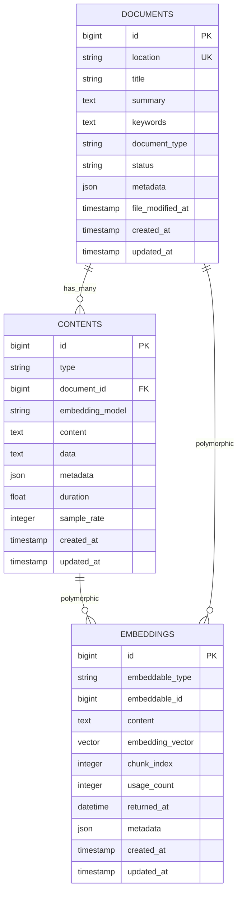

# Database Schema

Ragdoll implements a sophisticated PostgreSQL database schema designed for high-performance vector similarity search and multi-modal content management. The schema uses polymorphic associations, Single Table Inheritance (STI), and advanced PostgreSQL features including pgvector for embedding storage.

## Polymorphic Multi-Modal Database Design

The database architecture is built around three core principles:

1. **Multi-Modal Content Support**: Single schema handles text, images, audio, and mixed content
2. **Polymorphic Embeddings**: Vector embeddings can be associated with any content type
3. **Performance Optimization**: Advanced indexing strategies for both vector and full-text search

### Schema Architecture Overview



### Key Design Features

#### Single Table Inheritance (STI) for Content
```ruby
# Content types inherit from base Content model
class Content < ActiveRecord::Base
  # Base functionality for all content types
end

class TextContent < Content
  # Text-specific methods and validations
end

class ImageContent < Content
  # Image-specific methods and validations
end

class AudioContent < Content
  # Audio-specific methods and validations
end
```

#### Polymorphic Embedding Architecture
```ruby
# Embeddings can belong to any content type or document
belongs_to :embeddable, polymorphic: true

# Examples:
embedding.embeddable = text_content
embedding.embeddable = image_content
embedding.embeddable = document
```

#### Dual Metadata System
- **Document.metadata**: LLM-generated semantic metadata (classification, topics, etc.)
- **Content.metadata**: Technical file metadata (encoding, dimensions, etc.)
- **Embedding.metadata**: Vector processing metadata (positions, chunks, etc.)

## Core Tables

Ragdoll uses four primary tables for data storage:

### Documents Table (`ragdoll_documents`)

The central table for document management and LLM-generated metadata storage.

```sql
CREATE TABLE ragdoll_documents (
  id                 BIGINT PRIMARY KEY,
  location           VARCHAR NOT NULL,           -- File path, URL, or identifier
  title              VARCHAR NOT NULL,           -- Human-readable title
  summary            TEXT NOT NULL DEFAULT '',  -- LLM-generated summary
  keywords           TEXT NOT NULL DEFAULT '',  -- LLM-generated keywords
  document_type      VARCHAR NOT NULL DEFAULT 'text', -- Document format
  status             VARCHAR NOT NULL DEFAULT 'pending', -- Processing status
  metadata           JSON DEFAULT '{}',         -- LLM-generated structured metadata
  file_modified_at   TIMESTAMP NOT NULL DEFAULT CURRENT_TIMESTAMP,
  created_at         TIMESTAMP NOT NULL,
  updated_at         TIMESTAMP NOT NULL
);
```

#### Column Details

| Column | Type | Purpose | Example |
|--------|------|---------|----------|
| `location` | VARCHAR | Unique document identifier | `/path/to/doc.pdf`, `https://example.com/file` |
| `title` | VARCHAR | Display name for search results | "Machine Learning Research Paper" |
| `summary` | TEXT | LLM-generated content summary | "This paper explores neural networks..." |
| `keywords` | TEXT | Comma-separated keywords | "machine learning, AI, neural networks" |
| `document_type` | VARCHAR | Content format type | `pdf`, `text`, `image`, `mixed` |
| `status` | VARCHAR | Processing state | `pending`, `processing`, `completed`, `failed` |
| `metadata` | JSON | Structured LLM metadata | `{"classification": "research", "topics": [...]}` |
| `file_modified_at` | TIMESTAMP | Source file modification time | Used for change detection |

#### Relationships
```ruby
# Document model relationships
has_many :contents, dependent: :destroy
has_many :text_contents, -> { where(type: 'TextContent') }
has_many :image_contents, -> { where(type: 'ImageContent') }
has_many :audio_contents, -> { where(type: 'AudioContent') }
has_many :embeddings, as: :embeddable, dependent: :destroy
```

#### Status Values
- `pending`: Document added but not yet processed
- `processing`: Currently being analyzed by LLM services
- `completed`: All processing finished successfully
- `failed`: Processing encountered errors
- `outdated`: Source file modified since last processing

### Contents Table (`ragdoll_contents`)

Single Table Inheritance (STI) table storing all content types with type-specific fields.

```sql
CREATE TABLE ragdoll_contents (
  id               BIGINT PRIMARY KEY,
  type             VARCHAR NOT NULL,              -- STI discriminator
  document_id      BIGINT NOT NULL REFERENCES ragdoll_documents(id),
  embedding_model  VARCHAR NOT NULL,              -- Model for embedding generation
  content          TEXT,                          -- Text content or description
  data             TEXT,                          -- Raw file data (base64, etc.)
  metadata         JSON DEFAULT '{}',            -- Technical file metadata
  duration         FLOAT,                         -- Audio duration (seconds)
  sample_rate      INTEGER,                       -- Audio sample rate (Hz)
  created_at       TIMESTAMP NOT NULL,
  updated_at       TIMESTAMP NOT NULL
);
```

#### Content Types (STI)

**TextContent (`type = 'TextContent'`)**
- `content`: The actual text content
- `metadata`: `{"encoding": "UTF-8", "line_count": 150, "chunk_size": 1000}`

**ImageContent (`type = 'ImageContent'`)**
- `content`: LLM-generated image description
- `data`: Base64 encoded image data or file path
- `metadata`: `{"width": 1920, "height": 1080, "format": "PNG", "file_size": 2048576}`

**AudioContent (`type = 'AudioContent'`)**
- `content`: Transcribed text or audio description
- `data`: Audio file path or encoded data
- `duration`: Audio length in seconds
- `sample_rate`: Audio quality (e.g., 44100 Hz)
- `metadata`: `{"format": "MP3", "bitrate": 320, "channels": 2}`

#### Technical Metadata Examples
```json
// TextContent metadata
{
  "encoding": "UTF-8",
  "line_count": 245,
  "word_count": 1850,
  "chunk_size": 1000,
  "overlap": 200,
  "processing_time_ms": 150
}

// ImageContent metadata
{
  "width": 1920,
  "height": 1080,
  "format": "PNG",
  "file_size": 2048576,
  "color_depth": 24,
  "has_transparency": false,
  "exif_data": {...}
}

// AudioContent metadata
{
  "format": "MP3",
  "bitrate": 320,
  "channels": 2,
  "codec": "LAME",
  "file_size": 5242880,
  "transcription_confidence": 0.95
}
```

### Embeddings Table (`ragdoll_embeddings`)

Polymorphic table storing vector embeddings with usage tracking and similarity search optimization.

```sql
CREATE TABLE ragdoll_embeddings (
  id                 BIGINT PRIMARY KEY,
  embeddable_type    VARCHAR NOT NULL,           -- Polymorphic type
  embeddable_id      BIGINT NOT NULL,            -- Polymorphic ID
  content            TEXT NOT NULL DEFAULT '',  -- Original text that was embedded
  embedding_vector   VECTOR(1536) NOT NULL,     -- pgvector embedding
  chunk_index        INTEGER NOT NULL,          -- Chunk ordering
  usage_count        INTEGER DEFAULT 0,         -- Search usage tracking
  returned_at        TIMESTAMP,                 -- Last usage timestamp
  metadata           JSON DEFAULT '{}',         -- Processing metadata
  created_at         TIMESTAMP NOT NULL,
  updated_at         TIMESTAMP NOT NULL
);
```

#### Vector Storage Details

**Embedding Vector (`embedding_vector`)**
- Uses pgvector's `VECTOR(1536)` type for OpenAI embeddings
- Supports other dimensions: 768 (sentence-transformers), 4096 (large models)
- Stored as compressed binary data for performance

**Polymorphic Associations**
```ruby
# Can belong to any content type or document
belongs_to :embeddable, polymorphic: true

# Examples:
embedding.embeddable_type = 'TextContent'
embedding.embeddable_type = 'Document'
embedding.embeddable_type = 'ImageContent'
```

**Usage Tracking**
- `usage_count`: Incremented each time embedding appears in search results
- `returned_at`: Updated when embedding is returned in search
- Used for analytics and caching strategies

**Chunk Management**
- `chunk_index`: Orders chunks within a document (0, 1, 2, ...)
- `content`: Original text chunk that was embedded
- `metadata`: Processing info like start/end positions

#### Embedding Metadata Examples
```json
{
  "start_position": 1250,
  "end_position": 2250,
  "chunk_size": 1000,
  "overlap": 200,
  "embedding_model": "openai/text-embedding-3-small",
  "embedding_dimensions": 1536,
  "generation_time_ms": 45,
  "token_count": 180
}
```

### PostgreSQL Extensions Table

Ragdoll requires several PostgreSQL extensions enabled in the database:

```sql
-- Vector similarity search (REQUIRED)
CREATE EXTENSION IF NOT EXISTS vector;

-- Text processing extensions
CREATE EXTENSION IF NOT EXISTS unaccent;  -- Remove accents
CREATE EXTENSION IF NOT EXISTS pg_trgm;   -- Trigram fuzzy search

-- UUID support
CREATE EXTENSION IF NOT EXISTS "uuid-ossp";
```

## Database Requirements

Ragdoll has strict database requirements for optimal performance and functionality.

### PostgreSQL Version Requirements

**Minimum Requirements:**
- PostgreSQL 12+ (for JSON operators and improved indexing)
- pgvector 0.4.0+ (for vector similarity search)
- Recommended: PostgreSQL 14+ with pgvector 0.5.0+

**Version Compatibility Matrix:**

| PostgreSQL | pgvector | Status | Notes |
|------------|----------|--------|---------|
| 12.x | 0.4.0+ | ✅ Supported | Minimum required version |
| 13.x | 0.4.0+ | ✅ Supported | Good performance |
| 14.x | 0.5.0+ | ✅ Recommended | Improved vector performance |
| 15.x | 0.5.0+ | ✅ Recommended | Best JSON performance |
| 16.x | 0.5.0+ | ✅ Latest | Latest features |

### Required Extensions

#### pgvector Extension (CRITICAL)
```sql
-- Enable vector similarity search
CREATE EXTENSION IF NOT EXISTS vector;

-- Verify installation
SELECT * FROM pg_extension WHERE extname = 'vector';
```

**Installation Methods:**

```bash
# Ubuntu/Debian
sudo apt-get install postgresql-14-pgvector

# macOS with Homebrew
brew install pgvector

# Docker
docker run -d --name ragdoll-postgres \
  -e POSTGRES_PASSWORD=password \
  -p 5432:5432 \
  pgvector/pgvector:pg14
```

#### Text Processing Extensions
```sql
-- Remove accents for better text search
CREATE EXTENSION IF NOT EXISTS unaccent;

-- Trigram similarity for fuzzy matching
CREATE EXTENSION IF NOT EXISTS pg_trgm;

-- UUID generation
CREATE EXTENSION IF NOT EXISTS "uuid-ossp";
```

### Database Configuration

#### Memory Settings
```postgresql
# postgresql.conf optimizations
shared_buffers = 256MB                    # 25% of RAM for small instances
effective_cache_size = 1GB                # Available cache memory
work_mem = 64MB                          # Per-operation memory
maintenance_work_mem = 256MB              # Index maintenance

# Vector-specific settings
max_connections = 100                     # Adjust based on needs
random_page_cost = 1.1                   # SSD optimization
```

#### Connection Settings
```yaml
# database.yml configuration
production:
  adapter: postgresql
  database: ragdoll_production
  username: ragdoll
  password: <%= ENV['DATABASE_PASSWORD'] %>
  host: localhost
  port: 5432
  pool: 25                                # Connection pool size
  timeout: 5000                          # Connection timeout (ms)
  prepared_statements: true              # Performance optimization
  advisory_locks: true                   # Enable advisory locking
```

### Performance Optimization

#### Vector Search Optimization
```sql
-- Adjust IVFFlat parameters for your dataset size
SET ivfflat.probes = 10;                 -- Search accuracy vs speed

-- Monitor vector index performance
EXPLAIN (ANALYZE, BUFFERS) 
SELECT * FROM ragdoll_embeddings 
ORDER BY embedding_vector <=> '[0.1,0.2,...]' 
LIMIT 10;
```

#### JSON Indexing
```sql
-- Create expression indexes for frequently queried JSON fields
CREATE INDEX idx_metadata_classification 
ON ragdoll_documents USING btree ((metadata->>'classification'));

CREATE INDEX idx_metadata_topics 
ON ragdoll_documents USING gin ((metadata->'topics'));
```

#### Full-Text Search Optimization
```sql
-- Update full-text search statistics
ANALYZE ragdoll_documents;
ANALYZE ragdoll_contents;

-- Monitor full-text query performance
EXPLAIN (ANALYZE, BUFFERS)
SELECT * FROM ragdoll_documents 
WHERE to_tsvector('english', title || ' ' || summary) 
      @@ plainto_tsquery('english', 'machine learning');
```

## Indexing Strategy

Ragdoll uses a comprehensive indexing strategy optimized for vector similarity search, full-text search, and metadata filtering.

### Vector Similarity Indexes

#### IVFFlat Index for Embeddings
```sql
-- Primary vector similarity index (cosine distance)
CREATE INDEX index_ragdoll_embeddings_on_embedding_vector_cosine
ON ragdoll_embeddings 
USING ivfflat (embedding_vector vector_cosine_ops)
WITH (lists = 100);

-- Alternative: L2 distance index
CREATE INDEX index_ragdoll_embeddings_on_embedding_vector_l2
ON ragdoll_embeddings 
USING ivfflat (embedding_vector vector_l2_ops)
WITH (lists = 100);
```

#### IVFFlat Configuration

**Lists Parameter Sizing:**
- Small datasets (< 100K vectors): `lists = 100`
- Medium datasets (100K - 1M vectors): `lists = 1000`
- Large datasets (> 1M vectors): `lists = sqrt(rows)`

**Query-Time Parameters:**
```sql
-- Adjust search accuracy vs speed
SET ivfflat.probes = 10;  -- Default: good balance
SET ivfflat.probes = 1;   -- Fastest, less accurate
SET ivfflat.probes = 50;  -- Most accurate, slower
```

#### Vector Index Maintenance
```sql
-- Rebuild vector indexes after significant data changes
REINDEX INDEX index_ragdoll_embeddings_on_embedding_vector_cosine;

-- Monitor index usage
SELECT schemaname, tablename, indexname, idx_scan, idx_tup_read, idx_tup_fetch
FROM pg_stat_user_indexes 
WHERE indexname LIKE '%embedding_vector%';
```

### Full-Text Search Indexes

#### Document Full-Text Index
```sql
-- Comprehensive full-text search across multiple fields
CREATE INDEX index_ragdoll_documents_on_fulltext_search
ON ragdoll_documents 
USING gin (
  to_tsvector('english', 
    COALESCE(title, '') || ' ' ||
    COALESCE(metadata->>'summary', '') || ' ' ||
    COALESCE(metadata->>'keywords', '') || ' ' ||
    COALESCE(metadata->>'description', '')
  )
);
```

#### Content Full-Text Index
```sql
-- Content-specific full-text search
CREATE INDEX index_ragdoll_contents_on_fulltext_search
ON ragdoll_contents 
USING gin (to_tsvector('english', COALESCE(content, '')));
```

#### Full-Text Search Usage
```sql
-- Example full-text queries
SELECT * FROM ragdoll_documents 
WHERE to_tsvector('english', title || ' ' || (metadata->>'summary'))
      @@ plainto_tsquery('english', 'machine learning neural networks');

-- Ranked full-text search
SELECT *, ts_rank(to_tsvector('english', title), query) as rank
FROM ragdoll_documents, plainto_tsquery('english', 'AI research') query
WHERE to_tsvector('english', title) @@ query
ORDER BY rank DESC;
```

### JSON Metadata Indexes

#### Classification and Type Indexes
```sql
-- Document type filtering
CREATE INDEX index_ragdoll_documents_on_metadata_type
ON ragdoll_documents ((metadata->>'document_type'));

-- Content classification filtering
CREATE INDEX index_ragdoll_documents_on_metadata_classification
ON ragdoll_documents ((metadata->>'classification'));

-- Language filtering
CREATE INDEX index_ragdoll_documents_on_metadata_language
ON ragdoll_documents ((metadata->>'language'));
```

#### Composite JSON Indexes
```sql
-- Multi-field filtering
CREATE INDEX index_ragdoll_documents_on_type_and_classification
ON ragdoll_documents (
  (metadata->>'document_type'),
  (metadata->>'classification')
);

-- Date-based filtering with type
CREATE INDEX index_ragdoll_documents_on_type_and_date
ON ragdoll_documents (
  (metadata->>'document_type'),
  created_at
);
```

#### Array and Complex JSON Indexes
```sql
-- GIN index for array fields (topics, keywords)
CREATE INDEX index_ragdoll_documents_on_metadata_topics
ON ragdoll_documents USING gin ((metadata->'topics'));

CREATE INDEX index_ragdoll_documents_on_metadata_keywords_array
ON ragdoll_documents USING gin ((metadata->'keywords'));

-- JSONB path indexes for nested objects
CREATE INDEX index_ragdoll_documents_on_author_info
ON ragdoll_documents USING gin ((metadata->'author_info'));
```

### Performance-Optimized Indexes

#### Primary Key and Foreign Key Indexes
```sql
-- Documents table indexes
CREATE UNIQUE INDEX index_ragdoll_documents_on_location 
ON ragdoll_documents (location);  -- Unique document lookup

CREATE INDEX index_ragdoll_documents_on_status 
ON ragdoll_documents (status);    -- Processing status filtering

CREATE INDEX index_ragdoll_documents_on_document_type 
ON ragdoll_documents (document_type);  -- Document type filtering

-- Contents table indexes
CREATE INDEX index_ragdoll_contents_on_document_id 
ON ragdoll_contents (document_id);     -- Foreign key performance

CREATE INDEX index_ragdoll_contents_on_type 
ON ragdoll_contents (type);            -- STI type filtering

CREATE INDEX index_ragdoll_contents_on_embedding_model 
ON ragdoll_contents (embedding_model); -- Model-based filtering

-- Embeddings table indexes
CREATE INDEX index_ragdoll_embeddings_on_embeddable 
ON ragdoll_embeddings (embeddable_type, embeddable_id);  -- Polymorphic lookup

CREATE INDEX index_ragdoll_embeddings_on_usage_tracking 
ON ragdoll_embeddings (returned_at DESC, usage_count DESC);  -- Analytics
```

#### Composite Performance Indexes
```sql
-- Multi-column indexes for common query patterns
CREATE INDEX index_ragdoll_documents_on_type_and_status 
ON ragdoll_documents (document_type, status);

CREATE INDEX index_ragdoll_contents_on_document_and_type 
ON ragdoll_contents (document_id, type);

CREATE INDEX index_ragdoll_embeddings_on_type_and_usage 
ON ragdoll_embeddings (embeddable_type, usage_count DESC);
```

#### Time-Based Indexes
```sql
-- Chronological sorting and filtering
CREATE INDEX index_ragdoll_documents_on_created_at 
ON ragdoll_documents (created_at DESC);

CREATE INDEX index_ragdoll_documents_on_file_modified_at 
ON ragdoll_documents (file_modified_at DESC);

CREATE INDEX index_ragdoll_embeddings_on_returned_at 
ON ragdoll_embeddings (returned_at DESC) 
WHERE returned_at IS NOT NULL;
```

### Index Maintenance and Monitoring

#### Index Usage Statistics
```sql
-- Monitor index performance
SELECT 
  schemaname,
  tablename,
  indexname,
  idx_scan as scans,
  idx_tup_read as tuples_read,
  idx_tup_fetch as tuples_fetched,
  idx_scan::float / NULLIF(seq_scan + idx_scan, 0) as index_usage_ratio
FROM pg_stat_user_indexes 
WHERE schemaname = 'public'
  AND tablename LIKE 'ragdoll_%'
ORDER BY idx_scan DESC;
```

#### Index Size Monitoring
```sql
-- Check index sizes
SELECT 
  indexname,
  tablename,
  pg_size_pretty(pg_relation_size(indexname::regclass)) as size
FROM pg_indexes 
WHERE schemaname = 'public'
  AND tablename LIKE 'ragdoll_%'
ORDER BY pg_relation_size(indexname::regclass) DESC;
```

#### Index Maintenance Commands
```sql
-- Rebuild indexes after major data changes
REINDEX TABLE ragdoll_documents;
REINDEX TABLE ragdoll_contents;
REINDEX TABLE ragdoll_embeddings;

-- Update table statistics
ANALYZE ragdoll_documents;
ANALYZE ragdoll_contents;
ANALYZE ragdoll_embeddings;

-- Vacuum for space reclamation
VACUUM ANALYZE ragdoll_documents;
VACUUM ANALYZE ragdoll_contents;
VACUUM ANALYZE ragdoll_embeddings;
```

## Database Migrations

Ragdoll includes a comprehensive migration system with automatic setup, versioning, and backward compatibility management.

### Migration Files Overview

The migration system consists of four primary migration files:

1. **001_enable_postgresql_extensions.rb** - PostgreSQL extensions setup
2. **004_create_ragdoll_documents.rb** - Documents table and indexes
3. **005_create_ragdoll_embeddings.rb** - Embeddings table with vector support
4. **006_create_ragdoll_contents.rb** - Contents table with STI architecture

### Auto-Migration Feature

#### Automatic Database Setup
```ruby
# Ragdoll automatically runs migrations on first use
Ragdoll::Core.configure do |config|
  config.database_config = {
    adapter: 'postgresql',
    database: 'ragdoll_production',
    username: 'ragdoll',
    password: ENV['DATABASE_PASSWORD'],
    host: 'localhost',
    port: 5432,
    auto_migrate: true  # Enables automatic migrations
  }
end

# First client creation triggers migration
client = Ragdoll::Core.client  # Automatically sets up database
```

#### Migration Trigger Points
```ruby
# Auto-migration triggers
class DatabaseManager
  def self.ensure_database_ready!
    return if @database_initialized
    
    if Ragdoll.config.database_config[:auto_migrate]
      run_pending_migrations!
      verify_extensions!
      @database_initialized = true
    end
  end
  
  private
  
  def self.run_pending_migrations!
    ActiveRecord::Migration.verbose = true
    ActiveRecord::MigrationContext.new(migrations_path).migrate
  end
end
```

### Manual Migration Process

#### Running Migrations Manually
```bash
# Using ActiveRecord migration commands
bundle exec rake db:migrate

# Run specific migration
bundle exec rake db:migrate:up VERSION=20240115000001

# Rollback migrations
bundle exec rake db:migrate:down VERSION=20240115000001

# Check migration status
bundle exec rake db:migrate:status
```

#### Custom Migration Runner
```ruby
# Manual migration execution
class MigrationRunner
  def self.run_all_migrations
    migration_context = ActiveRecord::MigrationContext.new(
      Rails.root.join('db', 'migrate')
    )
    
    migration_context.migrate
  end
  
  def self.rollback_to_version(version)
    migration_context = ActiveRecord::MigrationContext.new(
      Rails.root.join('db', 'migrate')
    )
    
    migration_context.migrate(version)
  end
  
  def self.migration_status
    migration_context = ActiveRecord::MigrationContext.new(
      Rails.root.join('db', 'migrate')
    )
    
    migration_context.migrations_status
  end
end
```

### Schema Versioning

#### Migration Version Management
```ruby
# Migration file naming convention
# YYYYMMDDHHMMSS_migration_name.rb

# 001_enable_postgresql_extensions.rb
class EnablePostgresqlExtensions < ActiveRecord::Migration[7.0]
  def up
    execute "CREATE EXTENSION IF NOT EXISTS vector"
    execute "CREATE EXTENSION IF NOT EXISTS unaccent"
    execute "CREATE EXTENSION IF NOT EXISTS pg_trgm"
    execute "CREATE EXTENSION IF NOT EXISTS \"uuid-ossp\""
  end
  
  def down
    # Extensions are rarely dropped to avoid data loss
    # execute "DROP EXTENSION IF EXISTS vector CASCADE"
  end
end
```

#### Schema Version Tracking
```sql
-- ActiveRecord schema_migrations table
CREATE TABLE schema_migrations (
  version VARCHAR PRIMARY KEY
);

-- Check current schema version
SELECT version FROM schema_migrations ORDER BY version DESC;

-- Example output:
-- 20240115000006  (006_create_ragdoll_contents)
-- 20240115000005  (005_create_ragdoll_embeddings)
-- 20240115000004  (004_create_ragdoll_documents)
-- 20240115000001  (001_enable_postgresql_extensions)
```

#### Version Compatibility Matrix

| Schema Version | Ragdoll Version | PostgreSQL | pgvector | Features |
|----------------|-----------------|------------|-----------|-----------|
| 001-004 | 1.0.0 | 12+ | 0.4.0+ | Basic functionality |
| 005 | 1.1.0 | 13+ | 0.4.0+ | Vector embeddings |
| 006 | 1.2.0 | 13+ | 0.5.0+ | Multi-modal content |
| 007+ | 2.0.0+ | 14+ | 0.5.0+ | Advanced features |

### Backward Compatibility

#### Migration Safety Features
```ruby
# Safe migration practices in Ragdoll
class SafeMigrationBase < ActiveRecord::Migration[7.0]
  # Disable DDL transactions for extension creation
  disable_ddl_transaction!
  
  def safe_add_column(table, column, type, options = {})
    # Add column with default to avoid locks on large tables
    add_column table, column, type, options.merge(default: options[:default])
    
    # Remove default after column is added (if temporary)
    if options[:temporary_default]
      change_column_default table, column, nil
    end
  end
  
  def safe_add_index(table, columns, options = {})
    # Use concurrent index creation for large tables
    options[:algorithm] = :concurrently
    add_index table, columns, options
  end
end
```

#### Data Migration Strategies
```ruby
# Data-safe migration example
class AddNewMetadataFields < ActiveRecord::Migration[7.0]
  def up
    # Add new columns with defaults
    add_column :ragdoll_documents, :new_field, :string, default: ''
    
    # Migrate existing data in batches
    Document.find_in_batches(batch_size: 1000) do |batch|
      batch.each do |document|
        document.update_column(:new_field, migrate_old_data(document))
      end
    end
  end
  
  def down
    remove_column :ragdoll_documents, :new_field
  end
  
  private
  
  def migrate_old_data(document)
    # Safe data transformation logic
    document.old_field&.transform_data || ''
  end
end
```

#### Rollback Safety
```ruby
# Reversible migration patterns
class ReversibleMigration < ActiveRecord::Migration[7.0]
  def change
    # Automatically reversible operations
    create_table :new_table do |t|
      t.string :name, null: false
      t.timestamps
    end
    
    add_index :new_table, :name
  end
  
  # For complex operations requiring explicit rollback
  def up
    # Forward migration
    execute "CREATE MATERIALIZED VIEW complex_view AS ..."
  end
  
  def down
    # Explicit rollback
    execute "DROP MATERIALIZED VIEW IF EXISTS complex_view"
  end
end
```

### Migration Best Practices

#### Development Workflow
```bash
# 1. Create new migration
rails generate migration AddFeatureToDocuments feature:string

# 2. Edit migration file with safe practices
# 3. Test migration on development data
bundle exec rake db:migrate

# 4. Test rollback
bundle exec rake db:rollback

# 5. Re-run migration
bundle exec rake db:migrate

# 6. Commit migration file
git add db/migrate/*
git commit -m "Add feature column to documents"
```

#### Production Deployment
```bash
# Production migration checklist:
# 1. Backup database
pg_dump ragdoll_production > backup_$(date +%Y%m%d_%H%M%S).sql

# 2. Run migration with monitoring
time bundle exec rake db:migrate

# 3. Verify data integrity
bundle exec rake db:migrate:status

# 4. Test application functionality
curl -f http://localhost:3000/health

# 5. Monitor performance
psql -c "SELECT * FROM pg_stat_activity WHERE state = 'active';"
```

#### Emergency Rollback Procedures
```bash
# If migration causes issues:
# 1. Stop application
sudo systemctl stop ragdoll

# 2. Rollback migration
bundle exec rake db:rollback

# 3. Restore from backup if needed
psql ragdoll_production < backup_20240115_120000.sql

# 4. Restart application
sudo systemctl start ragdoll

# 5. Investigate and fix migration
```

## Database Maintenance

### Regular Maintenance Tasks

#### Vacuum and Analyze
```sql
-- Weekly maintenance routine
VACUUM ANALYZE ragdoll_documents;
VACUUM ANALYZE ragdoll_contents;
VACUUM ANALYZE ragdoll_embeddings;

-- Full vacuum (monthly, during low usage)
VACUUM FULL ragdoll_embeddings;  -- Reclaim space from deleted vectors
```

#### Index Maintenance
```sql
-- Rebuild vector indexes after significant changes
REINDEX INDEX index_ragdoll_embeddings_on_embedding_vector_cosine;

-- Update statistics for query planner
ANALYZE ragdoll_embeddings;
```

#### Performance Monitoring
```sql
-- Monitor slow queries
SELECT query, mean_exec_time, calls, total_exec_time
FROM pg_stat_statements 
WHERE query LIKE '%ragdoll_%'
ORDER BY mean_exec_time DESC
LIMIT 10;

-- Check index usage
SELECT indexname, idx_scan, idx_tup_read, idx_tup_fetch
FROM pg_stat_user_indexes 
WHERE tablename LIKE 'ragdoll_%'
ORDER BY idx_scan DESC;
```

### Backup and Recovery

#### Backup Strategy
```bash
# Full database backup
pg_dump -Fc ragdoll_production > ragdoll_backup_$(date +%Y%m%d).dump

# Schema-only backup
pg_dump -s ragdoll_production > ragdoll_schema_$(date +%Y%m%d).sql

# Data-only backup
pg_dump -a ragdoll_production > ragdoll_data_$(date +%Y%m%d).sql
```

#### Recovery Procedures
```bash
# Restore full database
pg_restore -d ragdoll_production ragdoll_backup_20240115.dump

# Restore specific table
pg_restore -d ragdoll_production -t ragdoll_embeddings ragdoll_backup_20240115.dump
```

---

*This document is part of the Ragdoll documentation suite. For immediate help, see the [Quick Start Guide](quick-start.md) or [API Reference](api-client.md).*