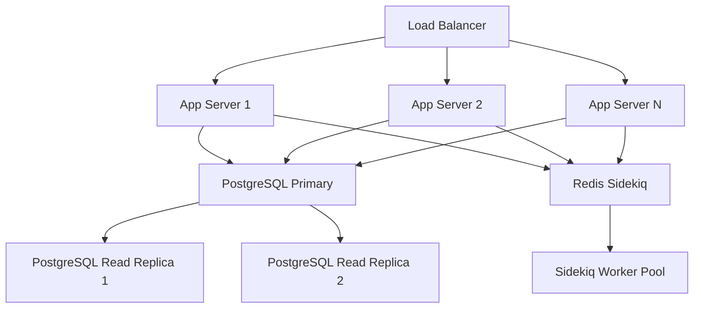

# Performance Tuning

## Optimization Strategies and Monitoring

Ragdoll is designed for high-performance RAG operations with PostgreSQL and pgvector at its foundation. This guide covers comprehensive optimization strategies for production deployments.

### Key Performance Areas
- **Database optimization**: PostgreSQL + pgvector tuning
- **Vector search performance**: Index strategies and similarity search optimization
- **Memory management**: Embedding caching and object lifecycle
- **Background job performance**: ActiveJob and queue optimization
- **Application-level optimization**: Service layer and API response tuning

## Database Performance

### PostgreSQL + pgvector Optimization

#### Vector Index Configuration

```sql
-- IVFFlat index for embeddings (default in Ragdoll)
CREATE INDEX CONCURRENTLY ragdoll_embeddings_vector_idx 
ON ragdoll_embeddings 
USING ivfflat (embedding_vector vector_cosine_ops) 
WITH (lists = 100);

-- HNSW index for better performance (PostgreSQL 14+)
CREATE INDEX CONCURRENTLY ragdoll_embeddings_hnsw_idx 
ON ragdoll_embeddings 
USING hnsw (embedding_vector vector_cosine_ops) 
WITH (m = 16, ef_construction = 64);
```

#### Connection Pool Configuration

```ruby
# config/database.yml or Ragdoll configuration
Ragdoll::Core.configure do |config|
  config.database_config = {
    adapter: 'postgresql',
    database: 'ragdoll_production',
    username: 'ragdoll',
    password: ENV['DATABASE_PASSWORD'],
    host: 'localhost',
    port: 5432,
    pool: 20,              # Connection pool size
    timeout: 5000,         # Connection timeout in ms
    checkout_timeout: 5,   # Pool checkout timeout
    reaping_frequency: 10  # Dead connection reaping
  }
end
```

#### Query Optimization

```ruby
# Optimize embedding searches with proper scoping
results = Ragdoll::Embedding
  .includes(:embeddable) # Eager load to avoid N+1
  .nearest_neighbors(:embedding_vector, query_vector, distance: "cosine")
  .limit(50)
  .where("neighbor_distance < ?", 0.3) # Threshold filtering
```

#### Memory Allocation Tuning

```sql
-- PostgreSQL configuration (postgresql.conf)
shared_buffers = 256MB          # 25% of RAM for small systems
effective_cache_size = 1GB      # Available memory for caching
work_mem = 4MB                  # Per-operation memory
maintenance_work_mem = 64MB     # Maintenance operations
max_connections = 100           # Concurrent connections

-- pgvector specific
hnsw.ef_search = 40             # HNSW search parameter
```

## Vector Search Optimization

### Index Strategy Selection

```mermaid
flowchart TD
    A[Vector Search Requirements] --> B{Dataset Size}
    B -->|< 100K vectors| C[IVFFlat Index]
    B -->|> 100K vectors| D[HNSW Index]
    
    C --> E[Good recall/performance balance]
    D --> F[Better performance, higher memory]
    
    E --> G[lists = sqrt(rows)]
    F --> H[m=16, ef_construction=64]
    
    G --> I[Moderate build time]
    H --> J[Longer build time]
```

### Similarity Threshold Tuning

```ruby
# Performance vs accuracy trade-offs
class SearchEngine
  PERFORMANCE_THRESHOLDS = {
    high_precision: 0.85,   # Fewer, more relevant results
    balanced: 0.70,         # Default Ragdoll setting
    high_recall: 0.50       # More results, lower precision
  }
  
  def search_optimized(query, mode: :balanced)
    threshold = PERFORMANCE_THRESHOLDS[mode]
    search_similar_content(query, threshold: threshold)
  end
end
```

### Batch Processing Optimization

```ruby
# Efficient batch embedding generation
class EmbeddingService
  def generate_embeddings_batch_optimized(texts, batch_size: 50)
    texts.each_slice(batch_size).flat_map do |batch|
      generate_embeddings_batch(batch)
    end
  end
end
```

## Memory Management

### Embedding Cache Strategies

```ruby
# In-memory embedding cache
class EmbeddingCache
  def initialize(max_size: 1000)
    @cache = {}
    @max_size = max_size
    @access_times = {}
  end
  
  def get_or_generate(text)
    key = Digest::SHA256.hexdigest(text)
    
    if @cache.key?(key)
      @access_times[key] = Time.current
      return @cache[key]
    end
    
    embedding = generate_embedding(text)
    store_with_eviction(key, embedding)
    embedding
  end
  
  private
  
  def store_with_eviction(key, embedding)
    if @cache.size >= @max_size
      # Evict least recently used
      lru_key = @access_times.min_by { |_, time| time }&.first
      @cache.delete(lru_key)
      @access_times.delete(lru_key)
    end
    
    @cache[key] = embedding
    @access_times[key] = Time.current
  end
end
```

### Object Lifecycle Management

```ruby
# Efficient document processing
class DocumentProcessor
  def self.process_large_document(file_path)
    File.open(file_path, 'r') do |file|
      file.each_line.lazy
          .each_slice(1000)  # Process in chunks
          .each do |chunk|
            process_chunk(chunk.join)
            GC.start if chunk.size % 10 == 0  # Periodic GC
          end
    end
  end
end
```

### Memory Leak Prevention

```ruby
# Monitor memory usage in background jobs
class GenerateEmbeddings < ActiveJob::Base
  def perform(document_id)
    memory_before = get_memory_usage
    
    # Process document
    process_document(document_id)
    
    memory_after = get_memory_usage
    
    if (memory_after - memory_before) > 100.megabytes
      Rails.logger.warn "High memory usage detected: #{memory_after - memory_before} MB"
    end
  end
  
  private
  
  def get_memory_usage
    `ps -o rss= -p #{Process.pid}`.to_i.kilobytes
  end
end
```

## Background Job Performance

### Queue Configuration

```ruby
# Sidekiq configuration for production
Ragdoll::Core.configure do |config|
  # Use Sidekiq for background processing
  ActiveJob::Base.queue_adapter = :sidekiq
end

# config/sidekiq.yml
:concurrency: 10
:queues:
  - [critical, 4]
  - [embeddings, 3]
  - [default, 2]
  - [low, 1]
```

### Worker Scaling Strategies

```ruby
# Dynamic worker scaling based on queue size
class WorkerScaler
  def self.scale_workers
    queue_size = Sidekiq::Queue.new('embeddings').size
    
    case queue_size
    when 0..10
      target_workers = 2
    when 11..50
      target_workers = 5
    when 51..100
      target_workers = 10
    else
      target_workers = 15
    end
    
    adjust_worker_count(target_workers)
  end
end
```

### Batch Processing Techniques

```ruby
# Efficient batch job processing
class BatchEmbeddingJob < ActiveJob::Base
  def perform(document_ids)
    document_ids.each_slice(10) do |batch|
      process_batch(batch)
      
      # Yield control to other jobs
      sleep(0.1) if batch.size == 10
    end
  end
  
  private
  
  def process_batch(document_ids)
    documents = Document.where(id: document_ids).includes(:contents)
    
    # Batch generate embeddings
    contents = documents.flat_map(&:contents)
    texts = contents.map(&:content)
    embeddings = EmbeddingService.new.generate_embeddings_batch(texts)
    
    # Bulk insert embeddings
    embedding_data = contents.zip(embeddings).map do |content, embedding|
      {
        embeddable: content,
        embedding_vector: embedding,
        content: content.content,
        chunk_index: 0,
        created_at: Time.current,
        updated_at: Time.current
      }
    end
    
    Ragdoll::Embedding.insert_all(embedding_data)
  end
end
```

## Application Performance

### Service Layer Optimization

```ruby
# Optimized search engine with caching
class SearchEngine
  def initialize(embedding_service)
    @embedding_service = embedding_service
    @query_cache = LRUCache.new(100)
  end
  
  def search_similar_content(query, **options)
    cache_key = "#{query}_#{options.hash}"
    
    @query_cache.fetch(cache_key) do
      perform_search(query, **options)
    end
  end
  
  private
  
  def perform_search(query, **options)
    # Cached embedding generation
    query_embedding = @embedding_service.generate_embedding_cached(query)
    
    # Optimized database query
    Ragdoll::Embedding.search_similar(
      query_embedding,
      limit: options[:limit] || 20,
      threshold: options[:threshold] || 0.7
    )
  end
end
```

### API Response Optimization

```ruby
# Streaming responses for large result sets
class Client
  def search_stream(query:, **options)
    Enumerator.new do |yielder|
      results = search_similar_content(query: query, **options)
      
      results.find_each(batch_size: 100) do |result|
        yielder << format_result(result)
      end
    end
  end
end
```

## Monitoring and Profiling

### Key Metrics to Track

```ruby
# Custom metrics collection
class PerformanceMonitor
  METRICS = {
    embedding_generation_time: 'histogram',
    search_query_time: 'histogram',
    database_connection_pool: 'gauge',
    memory_usage: 'gauge',
    background_job_queue_size: 'gauge'
  }
  
  def self.track_embedding_generation(text_length)
    start_time = Time.current
    yield
    duration = Time.current - start_time
    
    # Log metrics (integrate with your monitoring system)
    Rails.logger.info({
      metric: 'embedding_generation',
      duration_ms: (duration * 1000).round(2),
      text_length: text_length,
      timestamp: Time.current.iso8601
    }.to_json)
  end
end
```

### Performance Benchmarking

```ruby
# Benchmark suite for performance regression testing
class PerformanceBenchmark
  def self.run_search_benchmark
    queries = [
      "machine learning algorithms",
      "natural language processing",
      "computer vision techniques"
    ]
    
    client = Ragdoll::Core.client
    
    queries.each do |query|
      iterations = 100
      total_time = 0
      
      iterations.times do
        start_time = Time.current
        client.search(query: query)
        total_time += Time.current - start_time
      end
      
      avg_time = (total_time / iterations * 1000).round(2)
      puts "Query: #{query} - Average time: #{avg_time}ms"
    end
  end
end
```

## Scaling Strategies

### Horizontal Scaling Architecture



### Database Sharding Considerations

```ruby
# Document-based sharding strategy
class ShardedDocument < Document
  def self.shard_key(document_id)
    Digest::SHA1.hexdigest(document_id.to_s)[0..7].to_i(16) % 4
  end
  
  def self.find_sharded(document_id)
    shard = shard_key(document_id)
    connection_handler.retrieve_connection("shard_#{shard}")
    find(document_id)
  end
end
```

### Load Testing Strategy

```ruby
# Load testing with realistic usage patterns
class LoadTest
  def self.simulate_concurrent_searches(concurrent_users: 50)
    threads = []
    
    concurrent_users.times do |i|
      threads << Thread.new do
        client = Ragdoll::Core.client
        
        10.times do
          query = generate_random_query
          start_time = Time.current
          
          begin
            client.search(query: query)
            duration = Time.current - start_time
            
            puts "Thread #{i}: #{query} - #{(duration * 1000).round(2)}ms"
          rescue => e
            puts "Thread #{i}: Error - #{e.message}"
          end
          
          sleep(rand(0.5..2.0)) # Realistic user behavior
        end
      end
    end
    
    threads.each(&:join)
  end
end
```

## Production Optimization Checklist

- [ ] Configure PostgreSQL connection pooling (20+ connections)
- [ ] Set up pgvector indexes (IVFFlat or HNSW)
- [ ] Implement embedding caching strategy
- [ ] Configure background job queues with priorities
- [ ] Set up performance monitoring and alerting
- [ ] Implement database read replicas for search queries
- [ ] Configure memory limits and garbage collection
- [ ] Set up load testing and performance benchmarks
- [ ] Implement query result caching
- [ ] Configure log aggregation and analysis

---

*This document is part of the Ragdoll documentation suite. For immediate help, see the [Quick Start Guide](../getting-started/quick-start.md) or [API Reference](../api-reference/api-client.md).*