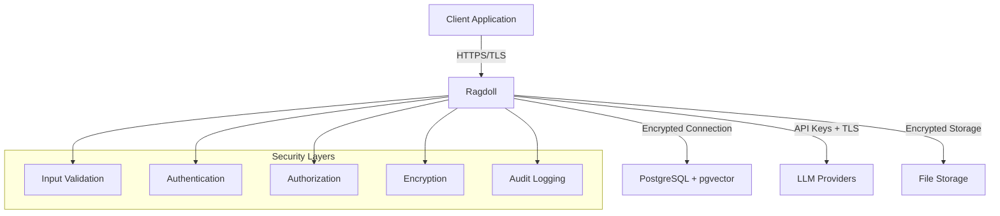

# Security Considerations

## Production Security Best Practices

Ragdoll processes sensitive documents and integrates with external LLM APIs, requiring comprehensive security measures. This guide covers data protection, access control, API security, and compliance considerations for production deployments.

### Security Architecture Overview



## Data Protection

### Encryption at Rest

#### Database Encryption

```sql
-- PostgreSQL encryption configuration
-- Enable transparent data encryption (TDE)
ALTER SYSTEM SET ssl = on;
ALTER SYSTEM SET ssl_cert_file = '/path/to/server.crt';
ALTER SYSTEM SET ssl_key_file = '/path/to/server.key';
ALTER SYSTEM SET ssl_ca_file = '/path/to/ca.crt';

-- Enable encryption for specific tablespaces
CREATE TABLESPACE encrypted_space 
  LOCATION '/encrypted/data' 
  WITH (encryption_key_id = 'your-key-id');

-- Move sensitive tables to encrypted tablespace
ALTER TABLE ragdoll_documents SET TABLESPACE encrypted_space;
ALTER TABLE ragdoll_embeddings SET TABLESPACE encrypted_space;
```

#### File Storage Encryption

```ruby
# Shrine configuration with encryption
class DocumentUploader < Shrine
  plugin :encryption, algorithm: 'aes-256-gcm'
  
  Attacher.validate do
    validate_max_size 50.megabytes
    validate_mime_type %w[application/pdf text/plain image/jpeg image/png]
    validate_extension %w[pdf txt jpg jpeg png docx]
  end
  
  # Encrypt files before storage
  process(:store) do |io, context|
    if context[:record].sensitive?
      encrypted_io = encrypt_file(io)
      [encrypted_io, { encryption: true }]
    else
      io
    end
  end
  
  private
  
  def encrypt_file(io)
    require 'openssl'
    
    cipher = OpenSSL::Cipher.new('aes-256-gcm')
    cipher.encrypt
    
    key = ENV['FILE_ENCRYPTION_KEY'] || raise('FILE_ENCRYPTION_KEY not set')
    iv = cipher.random_iv
    
    cipher.key = key[0..31]  # 32 bytes for AES-256
    cipher.iv = iv
    
    encrypted_data = cipher.update(io.read) + cipher.final
    auth_tag = cipher.auth_tag
    
    # Prepend IV and auth tag to encrypted data
    combined_data = iv + auth_tag + encrypted_data
    StringIO.new(combined_data)
  end
end
```

#### Key Management

```ruby
# Secure key management configuration
class KeyManager
  def self.setup_encryption_keys
    # Use environment-specific key derivation
    master_key = ENV['MASTER_ENCRYPTION_KEY'] || 
                 raise(SecurityError, 'MASTER_ENCRYPTION_KEY required')
    
    # Derive application-specific keys
    {
      database_key: derive_key(master_key, 'database'),
      file_encryption_key: derive_key(master_key, 'files'),
      api_signing_key: derive_key(master_key, 'api')
    }
  end
  
  private
  
  def self.derive_key(master_key, purpose)
    require 'openssl'
    
    OpenSSL::PKCS5.pbkdf2_hmac(
      master_key,
      purpose,  # Use purpose as salt
      10_000,   # Iterations
      32,       # Key length (256 bits)
      OpenSSL::Digest::SHA256.new
    )
  end
end
```

### Encryption in Transit

#### TLS/SSL Configuration

```ruby
# Database connection with SSL
Ragdoll::Core.configure do |config|
  config.database_config = {
    adapter: 'postgresql',
    database: 'ragdoll_production',
    username: 'ragdoll',
    password: ENV['DATABASE_PASSWORD'],
    host: 'db.example.com',
    port: 5432,
    sslmode: 'require',           # Require SSL connection
    sslcert: '/path/to/client.crt',
    sslkey: '/path/to/client.key',
    sslrootcert: '/path/to/ca.crt'
  }
end
```

#### API Communication Security

```ruby
# Secure HTTP client configuration
class SecureAPIClient
  def initialize
    @http_client = Faraday.new do |conn|
      conn.use :ssl, {
        verify: true,
        ca_file: '/etc/ssl/certs/ca-certificates.crt',
        version: 'TLSv1_2'  # Minimum TLS version
      }
      
      conn.request :retry, {
        max: 3,
        retry_statuses: [429, 500, 502, 503, 504]
      }
      
      conn.response :json
      conn.adapter Faraday.default_adapter
    end
  end
  
  def make_request(url, headers = {})
    secure_headers = headers.merge({
      'User-Agent' => 'Ragdoll/1.0',
      'Accept': 'application/json',
      'Content-Type': 'application/json'
    })
    
    @http_client.post(url, secure_headers)
  end
end
```

## Access Control

### Authentication Patterns

#### API Key Management

```ruby
# Secure API key configuration
class APIKeyManager
  REQUIRED_KEYS = %w[
    OPENAI_API_KEY
    ANTHROPIC_API_KEY
    DATABASE_PASSWORD
    MASTER_ENCRYPTION_KEY
  ].freeze
  
  def self.validate_keys!
    missing_keys = REQUIRED_KEYS.select { |key| ENV[key].nil? || ENV[key].empty? }
    
    if missing_keys.any?
      raise SecurityError, "Missing required API keys: #{missing_keys.join(', ')}"
    end
    
    # Validate key formats
    validate_openai_key(ENV['OPENAI_API_KEY'])
    validate_anthropic_key(ENV['ANTHROPIC_API_KEY'])
  end
  
  def self.rotate_keys!
    # Implement key rotation logic
    puts "Key rotation initiated at #{Time.current}"
    
    # 1. Generate new keys
    # 2. Update configuration
    # 3. Test connectivity
    # 4. Revoke old keys
    # 5. Log rotation event
  end
  
  private
  
  def self.validate_openai_key(key)
    unless key&.start_with?('sk-') && key.length >= 50
      raise SecurityError, 'Invalid OpenAI API key format'
    end
  end
  
  def self.validate_anthropic_key(key)
    unless key&.start_with?('sk-ant-') && key.length >= 100
      raise SecurityError, 'Invalid Anthropic API key format'
    end
  end
end

# Initialize security checks
APIKeyManager.validate_keys!
```

#### Token-Based Authentication

```ruby
# JWT token authentication for API access
class TokenAuthenticator
  def initialize(secret_key = ENV['JWT_SECRET_KEY'])
    @secret_key = secret_key || raise('JWT_SECRET_KEY required')
  end
  
  def generate_token(user_id, permissions = [])
    payload = {
      user_id: user_id,
      permissions: permissions,
      iat: Time.current.to_i,
      exp: (Time.current + 1.hour).to_i  # 1 hour expiry
    }
    
    JWT.encode(payload, @secret_key, 'HS256')
  end
  
  def verify_token(token)
    decoded = JWT.decode(token, @secret_key, true, algorithm: 'HS256')
    payload = decoded.first
    
    # Check expiration
    if Time.current.to_i > payload['exp']
      raise SecurityError, 'Token expired'
    end
    
    payload
  rescue JWT::DecodeError => e
    raise SecurityError, "Invalid token: #{e.message}"
  end
end
```

### Authorization

#### Role-Based Access Control

```ruby
# RBAC implementation
class AccessController
  PERMISSIONS = {
    'admin' => %w[read write delete manage],
    'editor' => %w[read write],
    'viewer' => %w[read],
    'api_user' => %w[read search]
  }.freeze
  
  def self.check_permission(user_role, action, resource = nil)
    user_permissions = PERMISSIONS[user_role] || []
    
    unless user_permissions.include?(action)
      raise SecurityError, "Access denied: #{user_role} cannot #{action}"
    end
    
    # Additional resource-level checks
    if resource && !resource_accessible?(user_role, resource)
      raise SecurityError, "Resource access denied"
    end
    
    true
  end
  
  private
  
  def self.resource_accessible?(user_role, resource)
    # Implement resource-specific access logic
    case resource
    when Ragdoll::Document
      # Check document ownership or sharing permissions
      true  # Placeholder
    else
      true
    end
  end
end
```

## File Upload Security

### File Validation

```ruby
# Comprehensive file validation
class FileValidator
  ALLOWED_MIME_TYPES = %w[
    application/pdf
    text/plain
    text/markdown
    text/html
    application/vnd.openxmlformats-officedocument.wordprocessingml.document
    image/jpeg
    image/png
    image/gif
  ].freeze
  
  MAX_FILE_SIZE = 50.megabytes
  
  def self.validate_file(file_path)
    # Check file existence and readability
    unless File.exist?(file_path) && File.readable?(file_path)
      raise SecurityError, "File not accessible: #{file_path}"
    end
    
    # Check file size
    file_size = File.size(file_path)
    if file_size > MAX_FILE_SIZE
      raise SecurityError, "File too large: #{file_size} bytes (max: #{MAX_FILE_SIZE})"
    end
    
    # Validate MIME type
    mime_type = detect_mime_type(file_path)
    unless ALLOWED_MIME_TYPES.include?(mime_type)
      raise SecurityError, "Unsupported file type: #{mime_type}"
    end
    
    # Content-based validation
    validate_file_content(file_path, mime_type)
    
    true
  end
  
  private
  
  def self.detect_mime_type(file_path)
    # Use multiple methods for MIME type detection
    require 'mimemagic'
    
    # File extension check
    ext_mime = MIME::Types.type_for(file_path).first&.content_type
    
    # Magic number check
    magic_mime = MimeMagic.by_path(file_path)&.type
    
    # Verify consistency
    if ext_mime && magic_mime && ext_mime != magic_mime
      raise SecurityError, "MIME type mismatch: extension=#{ext_mime}, magic=#{magic_mime}"
    end
    
    magic_mime || ext_mime || 'application/octet-stream'
  end
  
  def self.validate_file_content(file_path, mime_type)
    case mime_type
    when 'application/pdf'
      validate_pdf_content(file_path)
    when /^image\//
      validate_image_content(file_path)
    end
  end
  
  def self.validate_pdf_content(file_path)
    # Basic PDF structure validation
    File.open(file_path, 'rb') do |file|
      header = file.read(8)
      unless header.start_with?('%PDF-')
        raise SecurityError, "Invalid PDF header"
      end
    end
  end
  
  def self.validate_image_content(file_path)
    # Validate image using ImageMagick
    require 'rmagick'
    
    begin
      img = Magick::Image.read(file_path).first
      
      # Check for reasonable dimensions
      if img.columns > 10_000 || img.rows > 10_000
        raise SecurityError, "Image dimensions too large: #{img.columns}x#{img.rows}"
      end
    rescue Magick::ImageMagickError => e
      raise SecurityError, "Invalid image file: #{e.message}"
    end
  end
end
```

### Secure File Storage

```ruby
# Secure file storage implementation
class SecureFileStorage
  def initialize
    @storage_path = ENV['SECURE_STORAGE_PATH'] || '/secure/storage'
    @file_permissions = 0o600  # Owner read/write only
    @dir_permissions = 0o700   # Owner access only
  end
  
  def store_file(source_path, secure_filename)
    # Sanitize filename
    safe_filename = sanitize_filename(secure_filename)
    
    # Create secure directory structure
    date_path = Date.current.strftime('%Y/%m/%d')
    secure_dir = File.join(@storage_path, date_path)
    FileUtils.mkdir_p(secure_dir, mode: @dir_permissions)
    
    # Generate unique secure path
    secure_path = File.join(secure_dir, "#{SecureRandom.uuid}_#{safe_filename}")
    
    # Copy file with secure permissions
    FileUtils.cp(source_path, secure_path)
    FileUtils.chmod(@file_permissions, secure_path)
    
    # Log file storage event
    SecurityLogger.log_file_storage(source_path, secure_path)
    
    secure_path
  end
  
  private
  
  def sanitize_filename(filename)
    # Remove dangerous characters
    sanitized = filename.gsub(/[^\w\-_\.]/, '_')
    
    # Prevent path traversal
    sanitized = File.basename(sanitized)
    
    # Limit length
    sanitized = sanitized[0..100] if sanitized.length > 100
    
    sanitized
  end
end
```

## API Security

### Input Validation

```ruby
# Comprehensive input validation
class InputValidator
  # SQL injection prevention
  def self.validate_search_query(query)
    # Remove potential SQL injection patterns
    dangerous_patterns = [
      /';\s*(drop|delete|update|insert|create|alter)/i,
      /union\s+select/i,
      /exec\s*\(/i,
      /<script[^>]*>/i
    ]
    
    dangerous_patterns.each do |pattern|
      if query.match?(pattern)
        raise SecurityError, "Potentially dangerous query pattern detected"
      end
    end
    
    # Limit query length
    if query.length > 1000
      raise SecurityError, "Query too long (max 1000 characters)"
    end
    
    query.strip
  end
  
  # Parameter sanitization
  def self.sanitize_parameters(params)
    sanitized = {}
    
    params.each do |key, value|
      sanitized_key = sanitize_key(key)
      
      case value
      when String
        sanitized[sanitized_key] = sanitize_string(value)
      when Integer
        sanitized[sanitized_key] = value.clamp(0, 1_000_000)
      when Array
        sanitized[sanitized_key] = value.map { |v| sanitize_string(v.to_s) }
      when Hash
        sanitized[sanitized_key] = sanitize_parameters(value)
      else
        sanitized[sanitized_key] = value.to_s
      end
    end
    
    sanitized
  end
  
  private
  
  def self.sanitize_key(key)
    # Only allow alphanumeric keys with underscores
    key.to_s.gsub(/[^a-zA-Z0-9_]/, '')
  end
  
  def self.sanitize_string(str)
    # Remove control characters and limit length
    str.gsub(/[\x00-\x1f\x7f]/, '').strip[0..10_000]
  end
end
```

### Rate Limiting

```ruby
# Rate limiting implementation
class RateLimiter
  def initialize(redis_client = Redis.new)
    @redis = redis_client
  end
  
  def check_rate_limit(identifier, limit: 100, window: 3600)
    key = "rate_limit:#{identifier}"
    current_time = Time.current.to_i
    window_start = current_time - window
    
    # Clean old entries
    @redis.zremrangebyscore(key, '-inf', window_start)
    
    # Count current requests
    current_count = @redis.zcard(key)
    
    if current_count >= limit
      remaining_time = @redis.zrange(key, 0, 0, with_scores: true).first&.last&.to_i
      reset_time = remaining_time + window if remaining_time
      
      raise SecurityError, "Rate limit exceeded. Reset at #{Time.at(reset_time)}"
    end
    
    # Add current request
    @redis.zadd(key, current_time, SecureRandom.uuid)
    @redis.expire(key, window)
    
    {
      remaining: limit - current_count - 1,
      reset_time: current_time + window
    }
  end
end
```

## Database Security

### Connection Security

```ruby
# Secure database configuration
class DatabaseSecurity
  def self.configure_secure_connection
    Ragdoll::Core.configure do |config|
      config.database_config = {
        adapter: 'postgresql',
        database: ENV['DB_NAME'],
        username: ENV['DB_USER'],
        password: ENV['DB_PASSWORD'],
        host: ENV['DB_HOST'],
        port: ENV['DB_PORT']&.to_i || 5432,
        
        # SSL configuration
        sslmode: 'require',
        sslcert: ENV['DB_SSL_CERT_PATH'],
        sslkey: ENV['DB_SSL_KEY_PATH'],
        sslrootcert: ENV['DB_SSL_CA_PATH'],
        
        # Connection pool security
        pool: 20,
        timeout: 5000,
        checkout_timeout: 5,
        idle_timeout: 300,
        
        # Query logging (be careful with sensitive data)
        logger: ENV['RAILS_ENV'] == 'production' ? nil : Logger.new(STDOUT)
      }
    end
  end
  
  def self.create_restricted_user
    # SQL commands to create restricted database user
    <<~SQL
      -- Create restricted user for application
      CREATE USER ragdoll_app WITH PASSWORD '#{ENV['DB_APP_PASSWORD']}';
      
      -- Grant only necessary permissions
      GRANT CONNECT ON DATABASE ragdoll_production TO ragdoll_app;
      GRANT USAGE ON SCHEMA public TO ragdoll_app;
      GRANT SELECT, INSERT, UPDATE, DELETE ON ALL TABLES IN SCHEMA public TO ragdoll_app;
      GRANT USAGE ON ALL SEQUENCES IN SCHEMA public TO ragdoll_app;
      
      -- Revoke dangerous permissions
      REVOKE CREATE ON SCHEMA public FROM ragdoll_app;
      REVOKE ALL ON pg_user FROM ragdoll_app;
      REVOKE ALL ON pg_database FROM ragdoll_app;
    SQL
  end
end
```

### Data Protection

```ruby
# PII data handling
class PIIProtection
  SENSITIVE_FIELDS = %w[email phone ssn credit_card].freeze
  
  def self.anonymize_content(content)
    anonymized = content.dup
    
    # Email anonymization
    anonymized.gsub!(/\b[A-Za-z0-9._%+-]+@[A-Za-z0-9.-]+\.[A-Z|a-z]{2,}\b/, '[EMAIL]')
    
    # Phone number anonymization
    anonymized.gsub!(/\b\d{3}[-.]?\d{3}[-.]?\d{4}\b/, '[PHONE]')
    
    # SSN anonymization
    anonymized.gsub!(/\b\d{3}-\d{2}-\d{4}\b/, '[SSN]')
    
    # Credit card anonymization
    anonymized.gsub!(/\b\d{4}[\s-]?\d{4}[\s-]?\d{4}[\s-]?\d{4}\b/, '[CREDIT_CARD]')
    
    anonymized
  end
  
  def self.contains_pii?(content)
    patterns = [
      /\b[A-Za-z0-9._%+-]+@[A-Za-z0-9.-]+\.[A-Z|a-z]{2,}\b/,  # Email
      /\b\d{3}[-.]?\d{3}[-.]?\d{4}\b/,                          # Phone
      /\b\d{3}-\d{2}-\d{4}\b/,                                  # SSN
      /\b\d{4}[\s-]?\d{4}[\s-]?\d{4}[\s-]?\d{4}\b/             # Credit card
    ]
    
    patterns.any? { |pattern| content.match?(pattern) }
  end
end
```

## LLM Provider Security

### API Key Protection

```ruby
# Secure LLM API integration
class LLMSecurity
  def self.validate_api_responses(response)
    # Check for potential data leakage in responses
    if response.is_a?(Hash) && response['error']
      error_msg = response['error']['message']
      
      # Remove potentially sensitive information from error messages
      sanitized_error = error_msg.gsub(/api[_-]?key[^\s]*/i, '[API_KEY]')
      sanitized_error = sanitized_error.gsub(/token[^\s]*/i, '[TOKEN]')
      
      response['error']['message'] = sanitized_error
    end
    
    response
  end
  
  def self.audit_llm_request(provider, model, request_data)
    # Log LLM requests for audit purposes (without sensitive data)
    audit_data = {
      timestamp: Time.current.iso8601,
      provider: provider,
      model: model,
      request_size: request_data.to_s.length,
      request_hash: Digest::SHA256.hexdigest(request_data.to_s),
      user_id: Current.user&.id,
      ip_address: Current.ip_address
    }
    
    SecurityLogger.log_llm_request(audit_data)
  end
end
```

### Data Privacy

```ruby
# Content privacy protection
class ContentPrivacy
  def self.sanitize_for_llm(content)
    # Remove sensitive information before sending to LLM
    sanitized = PIIProtection.anonymize_content(content)
    
    # Remove internal references
    sanitized.gsub!(/\b(internal|confidential|proprietary)\b/i, '[REDACTED]')
    
    # Limit content size to prevent data leakage
    if sanitized.length > 50_000
      sanitized = sanitized[0..50_000] + "\n[CONTENT TRUNCATED FOR SECURITY]"
    end
    
    sanitized
  end
  
  def self.should_process_with_llm?(content, metadata = {})
    # Check if content is safe to send to external LLM
    return false if PIIProtection.contains_pii?(content)
    return false if metadata[:confidentiality] == 'high'
    return false if content.match?(/confidential|secret|private/i)
    
    true
  end
end
```

## Compliance

### GDPR Compliance

```ruby
# GDPR compliance implementation
class GDPRCompliance
  def self.handle_data_subject_request(request_type, user_id)
    case request_type
    when 'access'
      export_user_data(user_id)
    when 'rectification'
      allow_data_correction(user_id)
    when 'erasure'
      delete_user_data(user_id)
    when 'portability'
      export_user_data_portable(user_id)
    end
  end
  
  private
  
  def self.delete_user_data(user_id)
    # Comprehensive data deletion
    Ragdoll::Document.where(user_id: user_id).destroy_all
    Ragdoll::Embedding.joins(:embeddable)
                                   .where(ragdoll_contents: { user_id: user_id })
                                   .destroy_all
    
    # Log deletion for audit
    SecurityLogger.log_data_deletion(user_id, Time.current)
  end
end
```

### Security Auditing

```ruby
# Comprehensive security logging
class SecurityLogger
  def self.log_security_event(event_type, details = {})
    log_entry = {
      timestamp: Time.current.iso8601,
      event_type: event_type,
      user_id: Current.user&.id,
      ip_address: Current.ip_address,
      user_agent: Current.user_agent,
      session_id: Current.session_id,
      details: details
    }
    
    # Log to secure audit file
    audit_logger.info(log_entry.to_json)
    
    # Send to SIEM if configured
    send_to_siem(log_entry) if ENV['SIEM_ENDPOINT']
  end
  
  def self.log_file_storage(source, destination)
    log_security_event('file_stored', {
      source_path: source,
      destination_path: destination,
      file_size: File.size(destination)
    })
  end
  
  def self.log_data_deletion(user_id, timestamp)
    log_security_event('data_deleted', {
      target_user_id: user_id,
      deletion_timestamp: timestamp
    })
  end
  
  private
  
  def self.audit_logger
    @audit_logger ||= Logger.new(
      ENV['SECURITY_LOG_PATH'] || '/var/log/ragdoll/security.log',
      10,  # Keep 10 old log files
      100.megabytes  # Max 100MB per file
    )
  end
end
```

## Security Monitoring

### Threat Detection

```ruby
# Anomaly detection system
class ThreatDetector
  def self.detect_anomalies
    {
      unusual_access_patterns: detect_unusual_access,
      bulk_data_access: detect_bulk_access,
      failed_auth_attempts: detect_auth_failures,
      suspicious_queries: detect_suspicious_queries
    }
  end
  
  private
  
  def self.detect_unusual_access
    # Detect access patterns outside normal hours
    current_hour = Time.current.hour
    
    if (current_hour < 6 || current_hour > 22) && 
       Rails.env.production? && 
       recent_activity_count > 100
      {
        type: 'off_hours_access',
        severity: 'medium',
        count: recent_activity_count
      }
    end
  end
  
  def self.detect_bulk_access
    # Detect potential data exfiltration
    recent_searches = SearchLog.where('created_at > ?', 1.hour.ago)
    
    if recent_searches.count > 1000
      {
        type: 'bulk_access',
        severity: 'high',
        count: recent_searches.count
      }
    end
  end
end
```

### Incident Response

```ruby
# Security incident response system
class IncidentResponse
  def self.handle_security_incident(incident_type, severity, details)
    incident_id = SecureRandom.uuid
    
    # Log incident
    SecurityLogger.log_security_event('security_incident', {
      incident_id: incident_id,
      type: incident_type,
      severity: severity,
      details: details
    })
    
    # Immediate response based on severity
    case severity
    when 'critical'
      # Immediate lockdown
      initiate_lockdown_procedures
      notify_security_team
      escalate_to_management
    when 'high'
      # Enhanced monitoring
      increase_monitoring_level
      notify_security_team
    when 'medium'
      # Standard response
      log_for_review
    end
    
    incident_id
  end
  
  private
  
  def self.initiate_lockdown_procedures
    # Disable API access
    Rails.cache.write('api_lockdown', true, expires_in: 1.hour)
    
    # Revoke active sessions
    ActiveSession.where('created_at > ?', 24.hours.ago).destroy_all
    
    # Alert administrators
    SecurityAlert.create!(
      type: 'lockdown_initiated',
      message: 'Security lockdown initiated due to critical incident'
    )
  end
end
```

## Production Security Checklist

### Pre-Deployment Security Checklist

- [ ] **Database Security**
  - [ ] PostgreSQL SSL/TLS enabled
  - [ ] Database user permissions restricted
  - [ ] Connection encryption configured
  - [ ] Backup encryption enabled

- [ ] **API Security**
  - [ ] All API keys rotated and secured
  - [ ] Rate limiting implemented
  - [ ] Input validation comprehensive
  - [ ] Error messages sanitized

- [ ] **File Security**
  - [ ] File upload validation implemented
  - [ ] File storage encryption configured
  - [ ] File access permissions restricted
  - [ ] Malware scanning enabled

- [ ] **Monitoring & Logging**
  - [ ] Security event logging enabled
  - [ ] Audit trails comprehensive
  - [ ] Anomaly detection configured
  - [ ] Incident response procedures documented

- [ ] **Compliance**
  - [ ] GDPR compliance measures implemented
  - [ ] Data retention policies configured
  - [ ] Privacy controls operational
  - [ ] Audit procedures established

### Regular Security Maintenance

```bash
# Monthly security maintenance script
#!/bin/bash

# Rotate API keys
echo "Rotating API keys..."
rake security:rotate_keys

# Update security certificates
echo "Updating SSL certificates..."
rake security:update_certificates

# Run security audit
echo "Running security audit..."
rake security:audit

# Generate security report
echo "Generating security report..."
rake security:report

# Check for security vulnerabilities
echo "Checking for vulnerabilities..."
bundle audit
```

---

*This document is part of the Ragdoll documentation suite. For immediate help, see the [Quick Start Guide](../getting-started/quick-start.md) or [API Reference](../api-reference/api-client.md).*