# Architecture Overview

Ragdoll Core is a **database-oriented RAG (Retrieval-Augmented Generation) framework** built on ActiveRecord with PostgreSQL as the primary data store. The architecture follows a layered service-oriented design with clear separation of concerns, optimized for performance and extensibility.

## System Design and Component Relationships

### High-Level Architecture

```mermaid
graph TB
    subgraph "Client Interface Layer"
        Client[Ragdoll::Core::Client<br/>🏗️ Facade Pattern]
        API[Public API Methods<br/>🔌 High-level Interface]
        Delegation[Module Delegation<br/>📡 Method Forwarding]
    end
    
    subgraph "Service Layer"
        DocProc[Document Processor<br/>📄 Multi-format Parsing]
        DocMgmt[Document Management<br/>🗂️ CRUD Operations]
        EmbedSvc[Embedding Service<br/>🧠 Vector Generation]
        SearchEng[Search Engine<br/>🔍 Semantic & Hybrid Search]
        TextChunk[Text Chunker<br/>✂️ Content Segmentation]
        TextGen[Text Generation Service<br/>💬 LLM Integration]
        Config[Configuration Manager<br/>⚙️ Settings & Providers]
    end
    
    subgraph "Background Processing Layer"
        ActiveJob[ActiveJob Integration<br/>⚡ Queue Management]
        EmbedJob[Generate Embeddings Job<br/>🔄 Async Processing]
        MetaJob[Metadata Generation Job<br/>📊 LLM Enhancement]
    end
    
    subgraph "Data Layer"
        DocModel[Document Model<br/>📑 Central Entity]
        TextContent[Text Content<br/>📝 Text Processing]
        ImageContent[Image Content<br/>🖼️ Image Analysis]
        AudioContent[Audio Content<br/>🎵 Audio Processing]
        EmbedModel[Embedding Model<br/>🎯 Vector Storage]
        SearchModel[Search Model<br/>🔍 Query Tracking]
        SearchResultModel[Search Result Model<br/>📊 Analytics]
    end
    
    subgraph "Infrastructure Layer"
        PostgreSQL[(PostgreSQL + pgvector<br/>🐘 Vector Database)]
        Shrine[Shrine File Storage<br/>📁 Upload Management]
        FullText[Full-text Search<br/>🔎 GIN Indexes]
        VectorSearch[Vector Similarity<br/>📐 IVFFlat Indexes]
    end
    
    subgraph "External Services"
        LLMProviders[LLM Providers<br/>🤖 OpenAI, Anthropic, etc.]
        FileStorage[File Storage Backends<br/>☁️ Local, S3, etc.]
    end
    
    %% Client Layer Connections
    Client --> DocProc
    Client --> DocMgmt
    Client --> SearchEng
    Client --> EmbedSvc
    API --> Client
    Delegation --> Client
    
    %% Service Layer Connections
    DocProc --> TextChunk
    DocMgmt --> DocProc
    DocMgmt --> EmbedJob
    SearchEng --> EmbedSvc
    EmbedSvc --> LLMProviders
    TextGen --> LLMProviders
    
    %% Background Processing
    EmbedJob --> EmbedSvc
    EmbedJob --> TextChunk
    MetaJob --> TextGen
    ActiveJob --> EmbedJob
    ActiveJob --> MetaJob
    
    %% Data Layer Connections
    DocModel --> TextContent
    DocModel --> ImageContent
    DocModel --> AudioContent
    TextContent --> EmbedModel
    ImageContent --> EmbedModel
    AudioContent --> EmbedModel
    SearchEng --> SearchModel
    SearchModel --> SearchResultModel
    SearchResultModel --> EmbedModel
    
    %% Infrastructure Connections
    DocModel --> PostgreSQL
    EmbedModel --> PostgreSQL
    SearchModel --> PostgreSQL
    SearchResultModel --> PostgreSQL
    EmbedModel --> VectorSearch
    SearchModel --> VectorSearch
    DocModel --> FullText
    DocProc --> Shrine
    Shrine --> FileStorage
    VectorSearch --> PostgreSQL
    FullText --> PostgreSQL
    
    %% Styling
    classDef clientLayer fill:#e1f5fe
    classDef serviceLayer fill:#f3e5f5
    classDef processLayer fill:#fff3e0
    classDef dataLayer fill:#e8f5e8
    classDef infraLayer fill:#fce4ec
    classDef externalLayer fill:#f1f8e9
    
    class Client,API,Delegation clientLayer
    class DocProc,DocMgmt,EmbedSvc,SearchEng,TextChunk,TextGen,Config serviceLayer
    class ActiveJob,EmbedJob,MetaJob processLayer
    class DocModel,TextContent,ImageContent,AudioContent,EmbedModel dataLayer
    class PostgreSQL,Shrine,FullText,VectorSearch infraLayer
    class LLMProviders,FileStorage externalLayer
```



### Data Flow Through the System

#### 1. Document Ingestion Flow


#### 2. Search and Retrieval Flow


#### 3. RAG Enhancement Flow


### Integration Points with External Services

- **LLM Providers**: OpenAI, Anthropic, Google, Azure, Ollama via `ruby_llm` gem
- **File Storage**: Shrine gem with configurable backends (filesystem, cloud storage)
- **Background Processing**: ActiveJob with multiple adapter support
- **Search Extensions**: Optional OpenSearch/Elasticsearch integration
- **Monitoring**: Built-in analytics and optional external monitoring tools

## Core Components

### 1. Client Interface Layer

**Primary Component**: `Ragdoll::Core::Client`

**Responsibilities**:
- High-level API facade for all RAG operations
- Document lifecycle management (add, update, delete, list)
- Context retrieval and prompt enhancement
- Multi-modal search capabilities (semantic, hybrid, full-text)
- Health monitoring and system analytics

**Key Methods**:
```ruby
# Document Management
add_document(path:) → result_hash
add_text(content:, title:, **options) → document_id
add_directory(path:, recursive: false) → results_array

# Search & Retrieval
search(query:, **options) → search_results
hybrid_search(query:, **options) → weighted_results
get_context(query:, limit: 10, **options) → context_hash
enhance_prompt(prompt:, context_limit: 5, **options) → enhanced_prompt

# Analytics & Health
stats() → system_statistics
healthy?() → boolean
search_analytics(days: 30) → analytics_data
```

**Design Pattern**: **Facade Pattern** - Simplifies complex subsystem interactions

### 2. Document Processing Pipeline

**Primary Component**: `Ragdoll::DocumentProcessor`

**Responsibilities**:
- Multi-format document parsing (PDF, DOCX, HTML, Markdown, Text)
- Content extraction and normalization
- Format-specific handling and validation
- Error handling for malformed documents

**Related Component**: `Ragdoll::DocumentManagement`

**Responsibilities**:
- Document CRUD operations (create, read, update, delete)
- Database persistence and retrieval
- Document metadata management
- Integration with background job processing

**Architecture Details**:
```ruby
class DocumentProcessor
  # Strategy pattern for format-specific parsing
  PARSERS = {
    '.pdf' => :parse_pdf,
    '.docx' => :parse_docx,
    '.html' => :parse_html,
    '.md' => :parse_markdown
  }.freeze

  def parse(file_path)
    # Returns structured result with content, metadata, and document_type
    {
      content: extracted_text,
      metadata: { title:, author:, creation_date:, ... },
      document_type: mime_type
    }
  end
end
```

**Architecture Details**:
```ruby
class DocumentManagement
  # Handles all document database operations
  def self.add_document(location, content, metadata = {})
    # Create document record with metadata
    # Returns document ID for further processing
  end
  
  def self.get_document(id)
    # Retrieve document with all associated content
  end
  
  def self.update_document(id, **updates)
    # Update document metadata and properties
  end
end
```

**Integration Points**:
- DocumentProcessor for content parsing
- Background jobs for asynchronous processing
- ActiveRecord models for data persistence

### 3. Embedding Generation System

**Primary Component**: `Ragdoll::EmbeddingService`

**Responsibilities**:
- Vector embedding generation using multiple LLM providers
- Text preprocessing and normalization
- Batch processing for efficiency
- Cosine similarity calculations
- Provider failover and error handling

**Provider Integration**:
```ruby
class EmbeddingService
  SUPPORTED_PROVIDERS = [
    :openai, :anthropic, :google, :azure, 
    :ollama, :huggingface, :openrouter
  ].freeze

  def generate_embedding(text)
    # Unified interface to multiple providers via ruby_llm
    @client.embed(text: clean_text(text))
  end

  def generate_embeddings_batch(texts)
    # Optimized batch processing
    texts.each_slice(batch_size).flat_map { |batch| process_batch(batch) }
  end
end
```

**Design Pattern**: **Adapter Pattern** - Unifies diverse LLM provider APIs

### 4. Search and Retrieval Engine

**Primary Component**: `Ragdoll::SearchEngine`

**Responsibilities**:
- Semantic search using vector embeddings and pgvector
- Hybrid search combining semantic and full-text approaches
- Multi-modal content search across text, image, and audio
- Query embedding generation and similarity matching
- Search result ranking and relevance scoring

**Search Types**:

1. **Semantic Search**: Vector similarity using cosine distance
2. **Hybrid Search**: Combines semantic search with keyword extraction and filtering
3. **Content-Type Search**: Specialized search for text, image, or audio content
4. **Filtered Search**: Document-type and metadata-based filtering

**Performance Optimizations**:
```ruby
class SearchEngine
  def search_similar_content(query, **options)
    # Generate query embedding for semantic search
    embedding = @embedding_service.generate_embedding(query)
    
    # Use pgvector for efficient similarity search
    Ragdoll::Embedding.search_similar(
      embedding,
      limit: options[:limit],
      threshold: options[:threshold],
      filters: options[:filters]
    )
  end
  
  def search_documents(query, options = {})
    # High-level search interface with filtering
    search_similar_content(query, options)
  end
end
```

### 5. Database Abstraction Layer

**Primary Component**: `Ragdoll::Core::Database`

**Responsibilities**:
- Database connection management and health monitoring
- Automatic migration execution on startup
- Schema versioning and compatibility checks
- Development database reset capabilities
- Connection pooling optimization

**Key Features**:
```ruby
class Database
  def self.setup(config)
    establish_connection(config)
    run_migrations if config[:auto_migrate]
    verify_extensions  # Ensure pgvector is available
  end

  def self.healthy?
    connection.active? && verify_schema_version
  rescue StandardError
    false
  end
end
```

### 6. Background Job System

**Primary Component**: `Ragdoll::GenerateEmbeddingsJob`

**Responsibilities**:
- Asynchronous embedding generation for new content
- LLM-powered metadata enhancement
- Text extraction and chunking for large documents
- Error handling and retry logic
- Progress tracking and status updates

**Job Architecture**:
```ruby
class GenerateEmbeddings < ActiveJob::Base
  def perform(document_id)
    document = Ragdoll::Document.find(document_id)
    
    # Process each content type polymorphically
    document.content_items.each do |content|
      generate_embeddings_for_content(content)
    end
    
    document.update!(status: 'processed', processed_at: Time.current)
  end
end
```

**Design Pattern**: **Observer Pattern** - Jobs triggered by model lifecycle events

## Architecture Decisions

### Choice of ActiveRecord for ORM

**Decision**: Use ActiveRecord as the primary ORM with PostgreSQL

**Rationale**:
- **Performance**: Direct SQL generation with optimization capabilities
- **Ecosystem**: Rich plugin ecosystem (pgvector, full-text search)
- **Migrations**: Built-in schema versioning and migration management
- **Associations**: Powerful polymorphic associations for multi-modal content
- **Connection Management**: Built-in pooling and health monitoring

**Trade-offs**:
- ✅ Familiar Rails conventions and patterns
- ✅ Excellent PostgreSQL integration
- ✅ Rich querying capabilities with Arel
- ❌ Not database-agnostic (PostgreSQL-specific features used)
- ❌ Potential N+1 query issues (mitigated with careful includes)

### Polymorphic Multi-Modal Design

**Decision**: Use polymorphic associations for content types (text, image, audio)

**Rationale**:
- **Extensibility**: Easy addition of new content types without schema changes
- **Consistency**: Unified embedding storage across all content types
- **Performance**: Single embedding table with efficient indexing
- **Flexibility**: Content-type specific processing while maintaining common interfaces

**Implementation**:
```ruby
class Document < ActiveRecord::Base
  has_many :text_contents, dependent: :destroy
  has_many :image_contents, dependent: :destroy
  has_many :audio_contents, dependent: :destroy
end

class Embedding < ActiveRecord::Base
  belongs_to :embeddable, polymorphic: true  # Text, Image, or Audio content
end
```

**Database Schema Relationships**:


### Dual Metadata Architecture

**Decision**: Separate LLM-generated content metadata from file metadata

**Rationale**:
- **Separation of Concerns**: Technical file properties vs. semantic content analysis
- **Search Optimization**: Different indexing strategies for different metadata types
- **Cost Management**: LLM metadata generation only when needed
- **Extensibility**: Easy addition of domain-specific metadata schemas

**Schema Design**:
```ruby
class Document < ActiveRecord::Base
  # System-generated file properties
  store :file_metadata, accessors: [:file_size, :mime_type, :dimensions, :processing_params]
  
  # LLM-generated content analysis
  store :metadata, accessors: [:summary, :keywords, :classification, :topics, :sentiment]
end
```

### Search Tracking Architecture

**Decision**: Comprehensive search analytics with vector similarity for query analysis

**Rationale**:
- **User Behavior Analytics**: Track search patterns, click-through rates, and engagement
- **Query Similarity**: Use vector embeddings to find similar searches and improve relevance
- **Performance Monitoring**: Measure search execution times and optimize slow queries
- **Session Tracking**: Associate searches with users and sessions for personalization
- **Automatic Cleanup**: Cascade deletion and orphaned search cleanup for data integrity

**Schema Design**:
```ruby
class Search < ActiveRecord::Base
  # Vector similarity support for finding similar searches
  has_neighbors :query_embedding
  has_many :search_results, dependent: :destroy
  has_many :embeddings, through: :search_results
  
  # Analytics methods
  def click_through_rate
    return 0.0 if search_results.count.zero?
    (search_results.clicked.count / search_results.count.to_f) * 100
  end
  
  # Find searches with similar queries
  def similar_searches(limit: 5)
    nearest_neighbors(:query_embedding, distance: :cosine).limit(limit)
  end
end

class SearchResult < ActiveRecord::Base
  belongs_to :search
  belongs_to :embedding
  
  # User engagement tracking
  def mark_as_clicked!
    update!(clicked: true, clicked_at: Time.current)
  end
  
  # Automatic cleanup when search becomes empty
  after_destroy :cleanup_empty_search
  
  private
  
  def cleanup_empty_search
    search.destroy if search.search_results.count == 0
  end
end
```

**Key Features**:
- **Automatic Recording**: All searches tracked unless explicitly disabled
- **Vector Similarity**: Query embeddings enable finding similar searches
- **Performance Metrics**: Execution time, result counts, and similarity scores
- **User Engagement**: Click tracking and analytics
- **Data Integrity**: Cascade deletion and automatic cleanup

### Background Processing Approach

**Decision**: Use ActiveJob with asynchronous embedding generation

**Rationale**:
- **User Experience**: Non-blocking document upload and immediate response
- **Resource Management**: Controlled concurrency for expensive LLM operations
- **Reliability**: Retry logic and error handling for API failures
- **Scalability**: Horizontal scaling through job queue workers

**Error Handling Strategy**:
```ruby
class GenerateEmbeddings < ActiveJob::Base
  retry_on EmbeddingService::APIError, wait: :exponentially_longer, attempts: 3
  discard_on EmbeddingService::InvalidInputError
  
  def perform(document_id)
    # Robust error handling with fallback strategies
  end
end
```

### Vector Database Integration Strategy

**Decision**: Use PostgreSQL + pgvector instead of dedicated vector databases

**Rationale**:
- **Simplicity**: Single database system reduces operational complexity
- **Performance**: Native PostgreSQL optimizations with pgvector extension
- **ACID Compliance**: Transactional consistency between documents and embeddings
- **Ecosystem**: Leverages existing PostgreSQL tooling and expertise

**Performance Characteristics**:
- **IVFFlat Indexing**: Sub-linear search performance O(log n)
- **Concurrent Access**: PostgreSQL's MVCC for high concurrency
- **Memory Efficiency**: Configurable vector dimensions and precision
- **Backup/Recovery**: Standard PostgreSQL tools work seamlessly

## Performance Considerations

### Database Indexing Strategy

**Vector Indexes**:
```sql
-- IVFFlat index for similarity search
CREATE INDEX idx_embeddings_vector ON ragdoll_embeddings 
USING ivfflat (vector vector_cosine_ops) WITH (lists = 100);

-- Composite index for filtered searches
CREATE INDEX idx_embeddings_content_vector ON ragdoll_embeddings 
USING ivfflat (embeddable_type, vector vector_cosine_ops);
```

**Text Search Indexes**:
```sql
-- GIN index for full-text search
CREATE INDEX idx_documents_content_gin ON ragdoll_documents 
USING gin(to_tsvector('english', title || ' ' || coalesce(content, '')));

-- Metadata search optimization
CREATE INDEX idx_documents_metadata_gin ON ragdoll_documents 
USING gin(metadata);
```

**Performance Optimizations**:


**Implementation Details**:
- **Query Planning**: Use of `EXPLAIN ANALYZE` for query optimization
- **Index Maintenance**: Regular `VACUUM` and `ANALYZE` operations
- **Connection Pooling**: ActiveRecord pool configuration for concurrency
- **Prepared Statements**: Automatic statement caching for repeated queries

### Async Processing Design

**Batch Processing**:
- Embedding generation in configurable batch sizes (default: 10)
- Parallel processing of independent content items
- Memory management for large document processing

**Queue Management**:
```ruby
# Configuration for different job priorities
class GenerateEmbeddings < ActiveJob::Base
  queue_as :embeddings
  
  # High priority for interactive operations
  def self.perform_now_if_small(document_id)
    document = Ragdoll::Document.find(document_id)
    if document.estimated_processing_time < 5.seconds
      perform_now(document_id)
    else
      perform_later(document_id)
    end
  end
end
```

### Caching Strategy

**Application-Level Caching**:
- Configuration memoization for frequently accessed settings
- Embedding result caching for repeated queries
- Search result caching with TTL-based invalidation

**Database-Level Optimization**:
- Query result caching through PostgreSQL's shared buffers
- Materialized views for complex analytics queries
- Partial indexes for status-based filtering

**Memory Management**:
- Streaming file processing for large documents
- Configurable chunk sizes balancing quality vs. performance
- Connection pool sizing based on concurrency requirements

### Monitoring and Observability

**Built-in Analytics**:
- Search frequency and result quality tracking
- Embedding generation performance metrics
- Document processing success/failure rates
- API response time monitoring

**Health Checks**:
```ruby
def healthy?
  checks = {
    database: Database.healthy?,
    embedding_service: @embedding_service.healthy?,
    job_queue: ActiveJob::Base.queue_adapter.healthy?
  }
  
  checks.all? { |_name, status| status }
end
```

**Performance Monitoring**:
- Query execution time tracking
- Memory usage monitoring during document processing
- Background job queue depth monitoring
- LLM API latency and error rate tracking

---

*This document is part of the Ragdoll documentation suite. For immediate help, see the [Quick Start Guide](../getting-started/quick-start.md) or [API Reference](../api-reference/api-client.md).*