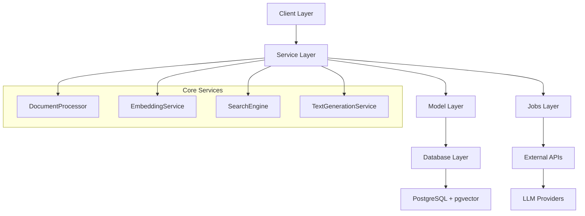

# Contributing

## Guidelines for Contributing to the Project

Welcome to Ragdoll! We appreciate your interest in contributing to this PostgreSQL-focused RAG system. This guide provides comprehensive information for all types of contributions.

### Quick Start for Contributors

1. **Fork** the repository on GitHub
2. **Clone** your fork locally
3. **Set up** the development environment
4. **Create** a feature branch
5. **Make** your changes with tests
6. **Submit** a pull request

## Getting Started

### Development Setup

#### Fork and Clone Process

```bash
# 1. Fork the repository on GitHub (click Fork button)

# 2. Clone your fork
git clone https://github.com/YOUR_USERNAME/ragdoll.git
cd ragdoll

# 3. Add upstream remote
git remote add upstream https://github.com/original-org/ragdoll.git

# 4. Verify remotes
git remote -v
# origin    https://github.com/YOUR_USERNAME/ragdoll.git (fetch)
# origin    https://github.com/YOUR_USERNAME/ragdoll.git (push)
# upstream  https://github.com/original-org/ragdoll.git (fetch)
# upstream  https://github.com/original-org/ragdoll.git (push)
```

#### Development Environment Setup

**Prerequisites**:
- Ruby 3.0+ (recommended: 3.2+)
- PostgreSQL 12+ with pgvector extension
- Git 2.0+
- Basic development tools (gcc, make, etc.)

```bash
# Install dependencies
bundle install

# Set up environment variables
cp .env.example .env
# Edit .env with your API keys and database credentials

# Set up PostgreSQL database
./bin/setup_postgresql.rb

# Run tests to verify setup
bundle exec rake test

# Check code style
bundle exec rubocop
```

#### Initial Configuration

```ruby
# config/development.rb (create if needed)
Ragdoll::Core.configure do |config|
  config.database_config = {
    adapter: 'postgresql',
    database: 'ragdoll_development',
    username: 'ragdoll',
    password: ENV['DATABASE_PASSWORD'],
    host: 'localhost',
    port: 5432,
    auto_migrate: true,
    logger: Logger.new(STDOUT, level: Logger::INFO)
  }
  
  # Set up API keys for testing
  config.ruby_llm_config[:openai][:api_key] = ENV['OPENAI_API_KEY']
end
```

### Understanding the Codebase

#### Architecture Overview



#### Code Organization

```
lib/ragdoll/core/
├── client.rb              # Main public API
├── configuration.rb       # System configuration
├── database.rb           # Database setup and migrations
├── document_processor.rb # Multi-format parsing
├── embedding_service.rb  # Vector generation
├── search_engine.rb      # Semantic search
├── text_chunker.rb       # Content segmentation
├── text_generation_service.rb # LLM integration
├── jobs/                 # Background processing
│   ├── generate_embeddings.rb
│   ├── extract_keywords.rb
│   └── generate_summary.rb
├── models/               # ActiveRecord models
│   ├── document.rb
│   ├── embedding.rb
│   └── content.rb        # STI base class
└── services/             # Specialized services
    ├── metadata_generator.rb
    └── image_description_service.rb
```

#### Design Patterns

- **Service Layer Pattern**: Business logic in dedicated service classes
- **Repository Pattern**: Database access through ActiveRecord models
- **Factory Pattern**: Document creation through DocumentProcessor
- **Strategy Pattern**: Multiple LLM providers via configuration
- **Observer Pattern**: Background jobs triggered by model callbacks

#### Coding Conventions

- **Ruby Style**: Follow Ruby community conventions
- **RuboCop**: Automated style enforcement
- **Naming**: Descriptive names over comments
- **Methods**: Single responsibility, max 20 lines
- **Classes**: Max 200 lines, extract services for complex logic

## Contribution Types

### Code Contributions

#### Bug Fixes

```bash
# Create bug fix branch
git checkout -b fix/document-parsing-error

# Write failing test first
# test/core/document_processor_test.rb
def test_handles_corrupted_pdf
  assert_raises(DocumentProcessor::ParseError) do
    DocumentProcessor.parse('test/fixtures/corrupted.pdf')
  end
end

# Implement fix
# lib/ragdoll/core/document_processor.rb
def parse_pdf
  # Add error handling
rescue PDF::Reader::MalformedPDFError => e
  raise ParseError, "Corrupted PDF: #{e.message}"
end

# Verify fix works
bundle exec rake test
```

#### Feature Implementations

```bash
# Create feature branch
git checkout -b feature/add-excel-support

# Plan implementation
# 1. Add Excel gem dependency
# 2. Implement parse_excel method
# 3. Add Excel to supported formats
# 4. Write comprehensive tests
# 5. Update documentation

# Implementation example
# Gemfile
gem 'roo', '~> 2.9'

# lib/ragdoll/core/document_processor.rb
when '.xlsx', '.xls'
  parse_excel
  
private

def parse_excel
  workbook = Roo::Spreadsheet.open(@file_path)
  content = extract_excel_content(workbook)
  metadata = extract_excel_metadata(workbook)
  
  {
    content: content,
    metadata: metadata,
    document_type: 'excel'
  }
end
```

#### Performance Improvements

```ruby
# Example: Optimize batch embedding generation
class EmbeddingService
  def generate_embeddings_batch_optimized(texts, batch_size: 50)
    # Process in smaller batches to reduce memory usage
    texts.each_slice(batch_size).flat_map do |batch|
      generate_embeddings_batch(batch)
    end
  end
end

# Add benchmark test
class EmbeddingServicePerformanceTest < Minitest::Test
  def test_batch_processing_performance
    texts = Array.new(1000) { "Sample text #{rand(1000)}" }
    
    time = Benchmark.measure do
      service.generate_embeddings_batch_optimized(texts)
    end
    
    assert time.real < 30, "Batch processing too slow: #{time.real}s"
  end
end
```

### Documentation Contributions

#### Documentation Updates

```markdown
# Always include code examples
## New Feature Documentation

### Usage

```ruby
# Basic usage
client = Ragdoll::Core.client
result = client.new_feature(param: 'value')

# Advanced usage with options
result = client.new_feature(
  param: 'value',
  advanced_option: true,
  callback: ->(data) { puts data }
)
```

### Configuration

```ruby
Ragdoll::Core.configure do |config|
  config.new_feature_config = {
    enabled: true,
    timeout: 30
  }
end
```
```

#### API Documentation

```ruby
# Use YARD-style documentation
class NewService
  # Process documents with advanced filtering
  #
  # @param documents [Array<Document>] Documents to process
  # @param options [Hash] Processing options
  # @option options [String] :filter_type ('all') Filter criteria
  # @option options [Integer] :batch_size (100) Batch processing size
  # @return [Array<Hash>] Processed document results
  # @raise [ProcessingError] When processing fails
  #
  # @example Basic usage
  #   service = NewService.new
  #   results = service.process(documents)
  #
  # @example With options
  #   results = service.process(documents, 
  #     filter_type: 'academic',
  #     batch_size: 50
  #   )
  def process(documents, options = {})
    # Implementation
  end
end
```

### Testing Contributions

#### Test Coverage Improvements

```ruby
# Always test edge cases
class DocumentProcessorTest < Minitest::Test
  def test_handles_empty_file
    File.write('test/fixtures/empty.txt', '')
    result = DocumentProcessor.parse('test/fixtures/empty.txt')
    assert_equal '', result[:content]
  end
  
  def test_handles_binary_file
    assert_raises(DocumentProcessor::UnsupportedFormatError) do
      DocumentProcessor.parse('test/fixtures/binary.exe')
    end
  end
  
  def test_handles_very_large_file
    # Create 100MB test file
    large_content = 'x' * (100 * 1024 * 1024)
    File.write('test/fixtures/large.txt', large_content)
    
    result = DocumentProcessor.parse('test/fixtures/large.txt')
    assert result[:content].length > 0
  ensure
    File.delete('test/fixtures/large.txt') if File.exist?('test/fixtures/large.txt')
  end
end
```

## Development Process

### Branch Management

#### Branch Naming Conventions

- **Features**: `feature/short-description`
- **Bug fixes**: `fix/issue-description`
- **Documentation**: `docs/section-being-updated`
- **Refactoring**: `refactor/component-name`
- **Performance**: `perf/optimization-area`

#### Commit Message Format

```
Type: Brief description (50 characters max)

Detailed explanation of what changed and why. Include:
- What problem this solves
- How it was implemented
- Any breaking changes
- References to issues (#123)

Types: feat, fix, docs, style, refactor, test, chore
```

**Examples**:
```
feat: Add Excel document processing support

- Implement parse_excel method using roo gem
- Support .xlsx and .xls file formats
- Extract cell values, formulas, and metadata
- Add comprehensive test coverage
- Update documentation with usage examples

Resolves #145
```

```
fix: Handle corrupted PDF files gracefully

- Add proper error handling for PDF::Reader exceptions
- Return informative error messages
- Add test cases for various corruption scenarios
- Prevent application crashes during parsing

Fixes #178
```

### Code Quality

#### Pre-commit Checklist

```bash
# Run before every commit

# 1. Code style check
bundle exec rubocop

# 2. Run all tests
bundle exec rake test

# 3. Check test coverage
open coverage/index.html
# Ensure coverage >= 85%

# 4. Run specific tests for changed code
bundle exec rake test test/core/your_changed_test.rb

# 5. Manual testing of changes
./bin/console
# Test your changes interactively
```

#### Code Review Preparation

```bash
# Before creating PR

# 1. Rebase on latest main
git fetch upstream
git rebase upstream/main

# 2. Squash commits if needed
git rebase -i HEAD~3

# 3. Update documentation
# Update relevant .md files
# Add code examples
# Update CHANGELOG.md

# 4. Self-review your changes
git diff upstream/main..HEAD
```

## Submission Process

### Pull Request Process

#### PR Creation Guidelines

1. **Title**: Clear, concise description of changes
2. **Description**: Use the PR template
3. **Labels**: Add appropriate labels (bug, feature, documentation)
4. **Reviewers**: Request reviews from maintainers
5. **Linked Issues**: Reference related issues

#### PR Template

```markdown
## Summary

Brief description of changes and motivation.

## Changes Made

- [ ] Added new feature X
- [ ] Fixed bug in component Y
- [ ] Updated documentation
- [ ] Added test coverage

## Testing

- [ ] All existing tests pass
- [ ] Added new tests for changes
- [ ] Manual testing completed
- [ ] Performance impact assessed

## Documentation

- [ ] Updated relevant documentation
- [ ] Added code examples
- [ ] Updated CHANGELOG.md

## Breaking Changes

- [ ] No breaking changes
- [ ] Breaking changes documented below

## Checklist

- [ ] Code follows style guidelines
- [ ] Self-review completed
- [ ] Code is commented where needed
- [ ] Tests cover edge cases
```

#### Review Process

1. **Automated Checks**: CI must pass
2. **Code Review**: At least one maintainer approval
3. **Testing**: Manual testing by reviewer
4. **Documentation**: Verify docs are complete
5. **Merge**: Squash and merge after approval

### Code Review Guidelines

#### For Contributors

- **Respond promptly** to review feedback
- **Ask questions** if feedback is unclear
- **Test suggested changes** before implementing
- **Update PR description** if scope changes
- **Be patient** - thorough reviews take time

#### For Reviewers

- **Be constructive** and specific in feedback
- **Explain the why** behind suggestions
- **Acknowledge good code** when you see it
- **Test the changes** locally when possible
- **Consider backward compatibility** impact

## Bug Reports

### Issue Templates

#### Bug Report Template

```markdown
**Bug Description**
A clear description of what the bug is.

**To Reproduce**
Steps to reproduce the behavior:
1. Configure Ragdoll with...
2. Process document...
3. Call search method...
4. See error

**Expected Behavior**
What you expected to happen.

**Actual Behavior**
What actually happened, including error messages.

**Environment**
- Ruby version: [e.g. 3.2.0]
- Ragdoll version: [e.g. 0.1.0]
- PostgreSQL version: [e.g. 14.2]
- Operating System: [e.g. macOS 12.0]

**Additional Context**
- Configuration details
- Log output
- Sample files (if applicable)
- Stack trace

**Possible Solution**
(Optional) Suggest a fix or workaround
```

#### Information Requirements

**Always include**:
- **Reproduction steps**: Minimal code to reproduce
- **Environment details**: Ruby, PostgreSQL, OS versions
- **Configuration**: Relevant Ragdoll configuration
- **Error messages**: Complete stack traces
- **Expected vs actual**: What should happen vs what happens

**For document processing issues**:
- File format and size
- Sample file (if not sensitive)
- Processing configuration

**For search issues**:
- Query text
- Search configuration
- Database state (document count, embedding count)

## Feature Requests

### Request Format

#### Feature Request Template

```markdown
**Feature Summary**
One-line summary of the requested feature.

**Problem Statement**
What problem does this solve? What use case does it enable?

**Proposed Solution**
Detailed description of the proposed implementation.

**Alternative Solutions**
Other approaches you've considered.

**Use Cases**
Specific scenarios where this would be useful:
1. Scenario 1: ...
2. Scenario 2: ...

**Implementation Considerations**
- Database schema changes needed
- API changes required
- Backward compatibility impact
- Performance implications

**Priority**
- [ ] Critical - Blocking current work
- [ ] High - Important for upcoming release
- [ ] Medium - Would be nice to have
- [ ] Low - Future consideration

**Would you be willing to implement this?**
- [ ] Yes, I can submit a PR
- [ ] Yes, with guidance
- [ ] No, but I can test
- [ ] No
```

### Evaluation Process

1. **Initial Review**: Maintainers assess fit with project goals
2. **Community Discussion**: Gather feedback from users
3. **Technical Design**: Plan implementation approach
4. **Priority Assignment**: Based on impact and complexity
5. **Implementation**: Either by maintainers or community

## Community Guidelines

### Code of Conduct

#### Behavioral Expectations

- **Be respectful** in all interactions
- **Be inclusive** and welcoming to newcomers
- **Be constructive** in criticism and feedback
- **Be patient** with questions and learning
- **Be professional** in all communications

#### Communication Guidelines

- **Use clear, descriptive titles** for issues and PRs
- **Provide context** when asking questions
- **Search existing issues** before creating new ones
- **Stay on topic** in discussions
- **Use appropriate channels** for different types of communication

### Communication Channels

- **GitHub Issues**: Bug reports, feature requests
- **GitHub Discussions**: General questions, ideas
- **Pull Requests**: Code review and discussion
- **Documentation**: Inline comments and suggestions

## Release Process

### Version Management

Ragdoll follows **Semantic Versioning** (SemVer):

- **MAJOR.MINOR.PATCH** (e.g., 1.2.3)
- **MAJOR**: Breaking changes
- **MINOR**: New features (backward compatible)
- **PATCH**: Bug fixes (backward compatible)

### Release Cycle

- **Patch releases**: As needed for critical bugs
- **Minor releases**: Monthly with new features
- **Major releases**: Quarterly with breaking changes

### Changelog Maintenance

```markdown
# Changelog

## [Unreleased]

### Added
- New feature descriptions

### Changed
- Modified behavior descriptions

### Fixed
- Bug fix descriptions

### Removed
- Deprecated feature removals

## [1.2.0] - 2024-01-15

### Added
- Excel document processing support
- Batch embedding optimization

### Fixed
- PDF parsing error handling
- Memory leak in background jobs
```

## Getting Help

### Before Contributing

1. **Read the documentation** - Check existing docs first
2. **Search issues** - Your question might already be answered
3. **Try the troubleshooting guide** - Common issues and solutions
4. **Check the development guide** - Setup and workflow information

### Need Assistance?

- **Questions**: Use GitHub Discussions
- **Bugs**: Create detailed issue reports
- **Features**: Submit feature request with use cases
- **Code**: Start with small contributions and ask for guidance

### Recognition

Contributors are recognized in:
- **README.md** - Contributor section
- **CHANGELOG.md** - Release notes
- **GitHub** - Automatic contribution tracking
- **Documentation** - Author attribution where appropriate

Thank you for contributing to Ragdoll! 🎉

---

*This document is part of the Ragdoll documentation suite. For immediate help, see the [Quick Start Guide](../getting-started/quick-start.md) or [API Reference](../api-reference/api-client.md).*