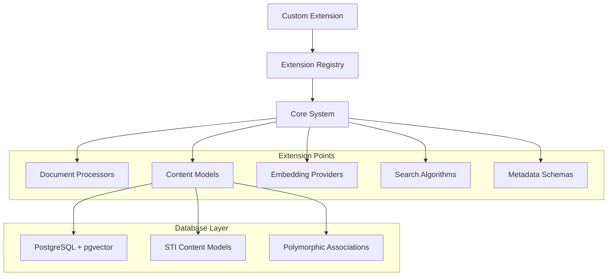

# Extending the System

## Adding New Content Types and Processors

Ragdoll is designed for extensibility with clear patterns for adding new content types, document processors, embedding providers, and search algorithms. This guide shows how to extend the system while maintaining PostgreSQL-first architecture.

### Extension Architecture Overview



## Content Type Extensions

### Custom Content Models

Extend the STI (Single Table Inheritance) content model system:

```ruby
# lib/ragdoll/core/models/video_content.rb
module Ragdoll
  module Core
    module Models
      class VideoContent < Content
        # STI automatically handled by ActiveRecord
        
        validates :content, presence: true  # content field stores transcript
        
        # Video-specific methods
        def transcript
          content  # STI content field stores transcript
        end
        
        def transcript=(value)
          self.content = value
        end
        
        def duration
          metadata['duration']
        end
        
        def resolution
          "#{metadata['width']}x#{metadata['height']}"
        end
        
        def video_codec
          metadata['codec']
        end
        
        # Override embedding generation for video-specific handling
        def generate_embeddings!
          return unless transcript.present?
          
          # Use video-specific embedding model
          service = EmbeddingService.new
          chunks = TextChunker.chunk(transcript, 
            chunk_size: Ragdoll.config.chunking[:audio][:max_tokens],
            chunk_overlap: Ragdoll.config.chunking[:audio][:overlap]
          )
          
          chunks.each_with_index do |chunk, index|
            embedding_vector = service.generate_embedding(chunk)
            next unless embedding_vector
            
            embeddings.create!(
              chunk_index: index,
              embedding_vector: embedding_vector,
              content: chunk,
              metadata: { content_type: 'video_transcript' }
            )
          end
        end
        
        # Custom search relevance for video content
        def search_boost_factor
          # Boost based on video quality and duration
          duration_boost = [duration.to_f / 3600, 2.0].min  # Max 2x for longer videos
          quality_boost = resolution.include?('1080') ? 1.2 : 1.0
          
          duration_boost * quality_boost
        end
      end
    end
  end
end
```

### Document Model Integration

Extend the Document model to handle new content types:

```ruby
# Add to existing Document model
module Ragdoll
  module Core
    module Models
      class Document
        # Add video content relationship
        has_many :video_contents,
                 -> { where(type: "Ragdoll::Core::Models::VideoContent") },
                 class_name: "Ragdoll::Core::Models::VideoContent",
                 foreign_key: "document_id"
        
        has_many :video_embeddings, through: :video_contents, source: :embeddings
        
        # Update content_types method
        def content_types
          types = []
          types << "text" if text_contents.any?
          types << "image" if image_contents.any?
          types << "audio" if audio_contents.any?
          types << "video" if video_contents.any?  # Add this line
          types
        end
        
        # Update content method for video support
        def content
          case primary_content_type
          when "text"
            text_contents.pluck(:content).compact.join("\n\n")
          when "image"
            image_contents.pluck(:content).compact.join("\n\n")
          when "audio"
            audio_contents.pluck(:content).compact.join("\n\n")
          when "video"
            video_contents.pluck(:content).compact.join("\n\n")  # Add this
          else
            contents.pluck(:content).compact.join("\n\n")
          end
        end
        
        # Update all_embeddings method
        def all_embeddings(content_type: nil)
          content_ids = []
          
          if content_type
            case content_type.to_s
            when 'text'
              content_ids.concat(text_contents.pluck(:id))
            when 'image'
              content_ids.concat(image_contents.pluck(:id))
            when 'audio'
              content_ids.concat(audio_contents.pluck(:id))
            when 'video'  # Add this
              content_ids.concat(video_contents.pluck(:id))
            end
          else
            content_ids.concat(text_contents.pluck(:id))
            content_ids.concat(image_contents.pluck(:id))
            content_ids.concat(audio_contents.pluck(:id))
            content_ids.concat(video_contents.pluck(:id))  # Add this
          end
          
          return Embedding.none if content_ids.empty?
          
          Embedding.where(
            embeddable_type: 'Ragdoll::Core::Models::Content',
            embeddable_id: content_ids
          )
        end
      end
    end
  end
end
```

## Document Processor Extensions

### Custom File Processors

Extend DocumentProcessor to handle new file formats:

```ruby
# Extend DocumentProcessor class
module Ragdoll
  module Core
    class DocumentProcessor
      # Add video support to parse method
      def parse
        case @file_extension
        when ".pdf"
          parse_pdf
        when ".docx"
          parse_docx
        when ".txt", ".md", ".markdown"
          parse_text
        when ".html", ".htm"
          parse_html
        when ".jpg", ".jpeg", ".png", ".gif", ".bmp", ".webp", ".svg", ".ico", ".tiff", ".tif"
          parse_image
        when ".mp4", ".avi", ".mov", ".wmv", ".flv", ".webm"  # Add video formats
          parse_video
        when ".xlsx", ".xls"  # Add Excel support
          parse_excel
        else
          parse_text # Default fallback
        end
      rescue StandardError => e
        raise ParseError, "Failed to parse #{@file_path}: #{e.message}"
      end
      
      private
      
      # New video parser
      def parse_video
        require 'streamio-ffmpeg'  # Add to Gemfile
        
        metadata = {
          file_size: File.size(@file_path),
          file_type: @file_extension.sub(".", ""),
          original_filename: File.basename(@file_path)
        }
        
        begin
          # Extract video metadata using FFmpeg
          movie = FFMPEG::Movie.new(@file_path)
          
          metadata.merge!({
            duration: movie.duration,
            width: movie.width,
            height: movie.height,
            frame_rate: movie.frame_rate,
            codec: movie.video_codec,
            audio_codec: movie.audio_codec,
            bitrate: movie.bitrate
          })
          
          # Extract transcript if available (placeholder)
          # In production, integrate with speech-to-text service
          transcript = extract_video_transcript(movie)
          
        rescue StandardError => e
          puts "Warning: Could not extract video metadata: #{e.message}"
          transcript = "Video file: #{File.basename(@file_path)}"
        end
        
        {
          content: transcript,
          metadata: metadata,
          document_type: "video"
        }
      end
      
      # New Excel parser
      def parse_excel
        require 'roo'  # Add to Gemfile
        
        content = ""
        metadata = {
          file_size: File.size(@file_path),
          file_type: @file_extension.sub(".", ""),
          original_filename: File.basename(@file_path)
        }
        
        begin
          workbook = Roo::Spreadsheet.open(@file_path)
          
          # Process each sheet
          workbook.sheets.each_with_index do |sheet_name, index|
            workbook.sheet(sheet_name)
            
            content += "\n\n--- Sheet: #{sheet_name} ---\n\n" if index > 0
            
            # Process rows
            (workbook.first_row..workbook.last_row).each do |row_num|
              row_data = (workbook.first_column..workbook.last_column).map do |col|
                workbook.cell(row_num, col)&.to_s&.strip
              end.compact.reject(&:empty?)
              
              next if row_data.empty?
              
              content += row_data.join(" | ") + "\n"
            end
          end
          
          metadata.merge!({
            sheet_count: workbook.sheets.count,
            sheets: workbook.sheets
          })
          
        rescue StandardError => e
          raise ParseError, "Failed to parse Excel file: #{e.message}"
        end
        
        {
          content: content.strip,
          metadata: metadata,
          document_type: "excel"
        }
      end
      
      def extract_video_transcript(movie)
        # Placeholder for speech-to-text integration
        # In production, integrate with:
        # - OpenAI Whisper API
        # - Google Speech-to-Text
        # - Azure Speech Services
        
        "Video transcript extraction not yet implemented. "
        "Duration: #{movie.duration}s, Resolution: #{movie.width}x#{movie.height}"
      end
      
      # Update helper methods
      def self.determine_document_type(file_path)
        case File.extname(file_path).downcase
        when ".pdf" then "pdf"
        when ".docx" then "docx"
        when ".txt" then "text"
        when ".md", ".markdown" then "markdown"
        when ".html", ".htm" then "html"
        when ".jpg", ".jpeg", ".png", ".gif", ".bmp", ".webp", ".svg", ".ico", ".tiff", ".tif" then "image"
        when ".mp4", ".avi", ".mov", ".wmv", ".flv", ".webm" then "video"  # Add this
        when ".xlsx", ".xls" then "excel"  # Add this
        else "text"
        end
      end
    end
  end
end
```

## Embedding Provider Extensions

### Custom Embedding Providers

Add support for new embedding providers:

```ruby
# lib/ragdoll/core/embedding_providers/custom_provider.rb
module Ragdoll
  module Core
    module EmbeddingProviders
      class CustomProvider
        def initialize(config = {})
          @api_key = config[:api_key] || ENV['CUSTOM_PROVIDER_API_KEY']
          @endpoint = config[:endpoint] || 'https://api.customprovider.com'
          @model = config[:model] || 'custom-embedding-v1'
        end
        
        def generate_embedding(text)
          response = make_request('/embeddings', {
            input: text,
            model: @model
          })
          
          parse_embedding_response(response)
        end
        
        def generate_embeddings_batch(texts)
          response = make_request('/embeddings/batch', {
            inputs: texts,
            model: @model
          })
          
          parse_batch_response(response)
        end
        
        def supports_batch?
          true
        end
        
        def max_batch_size
          100
        end
        
        def embedding_dimensions
          1536  # Return the dimension count for this provider
        end
        
        private
        
        def make_request(path, data)
          require 'faraday'
          
          conn = Faraday.new(url: @endpoint) do |f|
            f.request :json
            f.response :json
          end
          
          response = conn.post(path) do |req|
            req.headers['Authorization'] = "Bearer #{@api_key}"
            req.headers['Content-Type'] = 'application/json'
            req.body = data
          end
          
          handle_response(response)
        end
        
        def handle_response(response)
          case response.status
          when 200..299
            response.body
          when 429
            raise EmbeddingError, "Rate limit exceeded for custom provider"
          when 401
            raise EmbeddingError, "Authentication failed for custom provider"
          else
            raise EmbeddingError, "Custom provider error: #{response.status}"
          end
        end
        
        def parse_embedding_response(response)
          response.dig('data', 0, 'embedding') || 
            response['embedding'] ||
            raise(EmbeddingError, "Invalid response format from custom provider")
        end
        
        def parse_batch_response(response)
          if response['data']
            response['data'].map { |item| item['embedding'] }
          elsif response['embeddings']
            response['embeddings']
          else
            raise EmbeddingError, "Invalid batch response format from custom provider"
          end
        end
      end
    end
  end
end
```

### Provider Integration

Integrate the custom provider with the main EmbeddingService:

```ruby
# Extend EmbeddingService configuration
module Ragdoll
  module Core
    class EmbeddingService
      private
      
      def configure_ruby_llm
        # Existing provider configuration...
        
        # Add custom provider support
        if Ragdoll.config.embedding_config[:provider] == :custom
          @custom_provider = EmbeddingProviders::CustomProvider.new(
            Ragdoll.config.ruby_llm_config[:custom] || {}
          )
          return
        end
        
        # Existing RubyLLM configuration...
      end
      
      def generate_embedding(text)
        return nil if text.nil? || text.strip.empty?
        
        cleaned_text = clean_text(text)
        
        # Use custom provider if configured
        if @custom_provider
          return @custom_provider.generate_embedding(cleaned_text)
        end
        
        # Existing implementation...
      end
    end
  end
end
```

## Search Engine Extensions

### Custom Search Algorithms

Implement specialized search algorithms:

```ruby
# lib/ragdoll/core/search_algorithms/semantic_hybrid.rb
module Ragdoll
  module Core
    module SearchAlgorithms
      class SemanticHybrid
        def initialize(embedding_service, options = {})
          @embedding_service = embedding_service
          @semantic_weight = options[:semantic_weight] || 0.7
          @keyword_weight = options[:keyword_weight] || 0.3
          @boost_recent = options[:boost_recent] || false
        end
        
        def search(query, **options)
          # Generate query embedding
          query_embedding = @embedding_service.generate_embedding(query)
          
          # Perform semantic search
          semantic_results = semantic_search(query_embedding, options)
          
          # Perform keyword search
          keyword_results = keyword_search(query, options)
          
          # Combine and rank results
          combined_results = combine_results(semantic_results, keyword_results)
          
          # Apply additional ranking factors
          ranked_results = apply_ranking_factors(combined_results, options)
          
          ranked_results.take(options[:limit] || 10)
        end
        
        private
        
        def semantic_search(query_embedding, options)
          Models::Embedding.search_similar(
            query_embedding,
            limit: options[:limit] || 50,
            threshold: options[:threshold] || 0.5,
            filters: options[:filters] || {}
          ).map do |result|
            result.merge(
              search_type: 'semantic',
              base_score: result[:similarity]
            )
          end
        end
        
        def keyword_search(query, options)
          # Use PostgreSQL full-text search
          documents = Models::Document.search_content(
            query,
            limit: options[:limit] || 50
          )
          
          documents.map.with_index do |doc, index|
            # Calculate keyword relevance score
            relevance = calculate_keyword_relevance(doc, query)
            
            {
              document_id: doc.id.to_s,
              document_title: doc.title,
              document_location: doc.location,
              content: doc.content[0..500],
              search_type: 'keyword',
              base_score: relevance,
              similarity: relevance
            }
          end
        end
        
        def combine_results(semantic_results, keyword_results)
          # Merge results by document_id
          combined = {}
          
          semantic_results.each do |result|
            doc_id = result[:document_id]
            combined[doc_id] = result.merge(
              semantic_score: result[:base_score] * @semantic_weight
            )
          end
          
          keyword_results.each do |result|
            doc_id = result[:document_id]
            
            if combined[doc_id]
              # Combine scores
              combined[doc_id][:keyword_score] = result[:base_score] * @keyword_weight
              combined[doc_id][:combined_score] = 
                combined[doc_id][:semantic_score] + (result[:base_score] * @keyword_weight)
              combined[doc_id][:search_types] = ['semantic', 'keyword']
            else
              # Keyword-only result
              combined[doc_id] = result.merge(
                keyword_score: result[:base_score] * @keyword_weight,
                combined_score: result[:base_score] * @keyword_weight,
                search_types: ['keyword']
              )
            end
          end
          
          combined.values
        end
        
        def apply_ranking_factors(results, options)
          results.map do |result|
            score = result[:combined_score] || result[:similarity]
            
            # Apply recency boost if enabled
            if @boost_recent
              doc = Models::Document.find(result[:document_id])
              days_old = (Time.current - doc.created_at) / 1.day
              recency_boost = [1.0 - (days_old / 365), 0.1].max  # Decay over a year
              score *= (1.0 + recency_boost * 0.2)  # Up to 20% boost for recent docs
            end
            
            # Apply content type boost
            if options[:boost_content_types]
              content_boost = calculate_content_type_boost(result, options[:boost_content_types])
              score *= content_boost
            end
            
            result.merge(final_score: score)
          end.sort_by { |r| -r[:final_score] }
        end
        
        def calculate_keyword_relevance(document, query)
          # Simple TF-IDF-like calculation
          query_terms = query.downcase.split(/\W+/).reject(&:empty?)
          content = document.content.downcase
          
          term_frequencies = query_terms.map do |term|
            content.scan(/\b#{Regexp.escape(term)}\b/).count
          end
          
          # Normalize by content length and query terms
          total_matches = term_frequencies.sum
          content_length = content.split(/\W+/).length
          
          return 0.0 if content_length == 0
          
          (total_matches.to_f / content_length) * query_terms.length
        end
        
        def calculate_content_type_boost(result, boost_config)
          doc = Models::Document.find(result[:document_id])
          boost_config[doc.document_type&.to_sym] || 1.0
        end
      end
    end
  end
end
```

## Metadata Schema Extensions

### Custom Schema Types

Extend metadata schemas for new content types:

```ruby
# lib/ragdoll/core/metadata_schemas/video_schema.rb
module Ragdoll
  module Core
    module MetadataSchemas
      class VideoSchema < BaseSchema
        SCHEMA = {
          type: 'object',
          properties: {
            # Basic video properties
            duration: {
              type: 'number',
              description: 'Video duration in seconds',
              minimum: 0
            },
            resolution: {
              type: 'string',
              description: 'Video resolution (e.g., 1920x1080)',
              pattern: '^\\d+x\\d+$'
            },
            codec: {
              type: 'string',
              description: 'Video codec used',
              enum: ['h264', 'h265', 'vp8', 'vp9', 'av1']
            },
            
            # Content classification
            category: {
              type: 'string',
              description: 'Video category',
              enum: ['educational', 'entertainment', 'documentary', 'tutorial', 'presentation']
            },
            topics: {
              type: 'array',
              description: 'Main topics covered in the video',
              items: { type: 'string' },
              maxItems: 10
            },
            
            # Quality indicators
            transcript_quality: {
              type: 'string',
              description: 'Quality of extracted transcript',
              enum: ['high', 'medium', 'low', 'none']
            },
            audio_quality: {
              type: 'string',
              description: 'Audio quality assessment',
              enum: ['excellent', 'good', 'fair', 'poor']
            },
            
            # Accessibility
            has_captions: {
              type: 'boolean',
              description: 'Whether video has captions/subtitles'
            },
            language: {
              type: 'string',
              description: 'Primary language of the video content'
            }
          },
          required: ['duration']
        }.freeze
        
        def self.generate_metadata(document)
          return {} unless document.document_type == 'video'
          
          video_content = document.video_contents.first
          return {} unless video_content
          
          metadata = {
            duration: video_content.duration,
            resolution: video_content.resolution,
            codec: video_content.video_codec
          }
          
          # AI-powered content analysis
          if video_content.transcript.present?
            ai_analysis = analyze_video_content(video_content.transcript)
            metadata.merge!(ai_analysis)
          end
          
          metadata
        end
        
        private
        
        def self.analyze_video_content(transcript)
          # Use TextGenerationService for content analysis
          generator = TextGenerationService.new
          
          # Extract topics
          topics = generator.extract_keywords(transcript, max_keywords: 5)
          
          # Classify category (simplified)
          category = classify_video_category(transcript)
          
          # Assess transcript quality
          transcript_quality = assess_transcript_quality(transcript)
          
          {
            topics: topics,
            category: category,
            transcript_quality: transcript_quality,
            language: detect_language(transcript)
          }
        end
        
        def self.classify_video_category(transcript)
          # Simple keyword-based classification
          case transcript.downcase
          when /tutorial|how to|step by step/
            'tutorial'
          when /education|learn|study|course/
            'educational'
          when /documentary|history|science/
            'documentary'
          when /presentation|meeting|conference/
            'presentation'
          else
            'entertainment'
          end
        end
        
        def self.assess_transcript_quality(transcript)
          # Assess quality based on various factors
          return 'none' if transcript.blank?
          
          word_count = transcript.split.length
          return 'low' if word_count < 50
          
          # Check for transcript markers (poor quality indicators)
          poor_quality_markers = ['[inaudible]', '[unclear]', '???', '[music]']
          marker_count = poor_quality_markers.sum { |marker| transcript.scan(marker).count }
          
          marker_ratio = marker_count.to_f / word_count
          
          case marker_ratio
          when 0..0.01
            'high'
          when 0.01..0.05
            'medium'
          else
            'low'
          end
        end
        
        def self.detect_language(transcript)
          # Simplified language detection
          # In production, use proper language detection library
          'en'  # Default to English
        end
      end
    end
  end
end
```

## Plugin Architecture

### Plugin Development Framework

```ruby
# lib/ragdoll/core/plugin_system.rb
module Ragdoll
  module Core
    class PluginSystem
      @plugins = {}
      @hooks = Hash.new { |h, k| h[k] = [] }
      
      class << self
        attr_reader :plugins, :hooks
        
        def register_plugin(name, plugin_class)
          @plugins[name] = plugin_class
          plugin_class.new.setup if plugin_class.respond_to?(:setup)
        end
        
        def register_hook(event, callback)
          @hooks[event] << callback
        end
        
        def execute_hooks(event, *args)
          @hooks[event].each do |callback|
            callback.call(*args)
          end
        end
        
        def load_plugin(plugin_path)
          require plugin_path
        end
        
        def active_plugins
          @plugins.keys
        end
      end
    end
    
    # Base plugin class
    class BasePlugin
      def setup
        # Override in subclasses
      end
      
      def teardown
        # Override in subclasses
      end
      
      protected
      
      def register_hook(event, &block)
        PluginSystem.register_hook(event, block)
      end
    end
  end
end
```

### Example Plugin Implementation

```ruby
# lib/ragdoll_plugins/content_analytics_plugin.rb
class ContentAnalyticsPlugin < Ragdoll::Core::BasePlugin
  def setup
    puts "Setting up Content Analytics Plugin"
    
    # Register hooks for document processing events
    register_hook(:document_processed) do |document|
      track_document_metrics(document)
    end
    
    register_hook(:search_performed) do |query, results|
      track_search_metrics(query, results)
    end
  end
  
  private
  
  def track_document_metrics(document)
    # Collect document processing metrics
    metrics = {
      document_id: document.id,
      document_type: document.document_type,
      content_length: document.content&.length || 0,
      embedding_count: document.all_embeddings.count,
      processed_at: Time.current
    }
    
    # Send to analytics service
    send_to_analytics('document_processed', metrics)
  end
  
  def track_search_metrics(query, results)
    metrics = {
      query: query,
      result_count: results.length,
      average_similarity: results.map { |r| r[:similarity] }.sum / results.length,
      searched_at: Time.current
    }
    
    send_to_analytics('search_performed', metrics)
  end
  
  def send_to_analytics(event, data)
    # Implementation depends on your analytics service
    puts "Analytics: #{event} - #{data}"
  end
end

# Register the plugin
Ragdoll::Core::PluginSystem.register_plugin(:content_analytics, ContentAnalyticsPlugin)
```

## Integration Best Practices

### Extension Development Guidelines

1. **Follow STI Patterns**: Use Single Table Inheritance for content models
2. **Maintain Database Compatibility**: Ensure PostgreSQL + pgvector compatibility
3. **Implement Proper Error Handling**: Use Ragdoll's error classes
4. **Add Comprehensive Tests**: Follow existing test patterns
5. **Document Extensions**: Provide clear usage examples

### Performance Considerations

- **Database Indexes**: Add appropriate indexes for new queries
- **Embedding Dimensions**: Ensure consistency across providers
- **Memory Usage**: Monitor memory usage with large files
- **Batch Processing**: Implement batch operations where possible

### Testing Extensions

```ruby
# test/extensions/video_content_test.rb
class VideoContentTest < Minitest::Test
  def test_video_content_creation
    document = create_test_document
    
    video_content = document.video_contents.create!(
      content: "This is a test video transcript",
      embedding_model: "test-model",
      metadata: {
        duration: 120,
        width: 1920,
        height: 1080,
        codec: "h264"
      }
    )
    
    assert_equal "This is a test video transcript", video_content.transcript
    assert_equal 120, video_content.duration
    assert_equal "1920x1080", video_content.resolution
  end
  
  def test_video_embedding_generation
    document = create_test_document
    video_content = document.video_contents.create!(
      content: "Test transcript content",
      embedding_model: "test-model"
    )
    
    # Mock embedding service
    mock_service = MockEmbeddingService.new
    EmbeddingService.stub(:new, mock_service) do
      video_content.generate_embeddings!
    end
    
    assert video_content.embeddings.any?
    assert_equal "Test transcript content", video_content.embeddings.first.content
  end
end
```

### Extension Packaging

```ruby
# ragdoll_video_extension.gemspec
Gem::Specification.new do |spec|
  spec.name          = "ragdoll-video-extension"
  spec.version       = "1.0.0"
  spec.authors       = ["Your Name"]
  spec.email         = ["your.email@example.com"]
  
  spec.summary       = "Video content support for Ragdoll"
  spec.description   = "Adds video processing and transcript extraction to Ragdoll"
  spec.homepage      = "https://github.com/yourorg/ragdoll-video-extension"
  
  spec.files         = Dir["lib/**/*", "README.md"]
  spec.require_paths = ["lib"]
  
  spec.add_dependency "ragdoll", "~> 1.0"
  spec.add_dependency "streamio-ffmpeg", "~> 3.0"
  
  spec.add_development_dependency "minitest", "~> 5.0"
  spec.add_development_dependency "simplecov", "~> 0.21"
end
```

---

*This document is part of the Ragdoll documentation suite. For immediate help, see the [Quick Start Guide](../getting-started/quick-start.md) or [API Reference](../api-reference/api-client.md).*