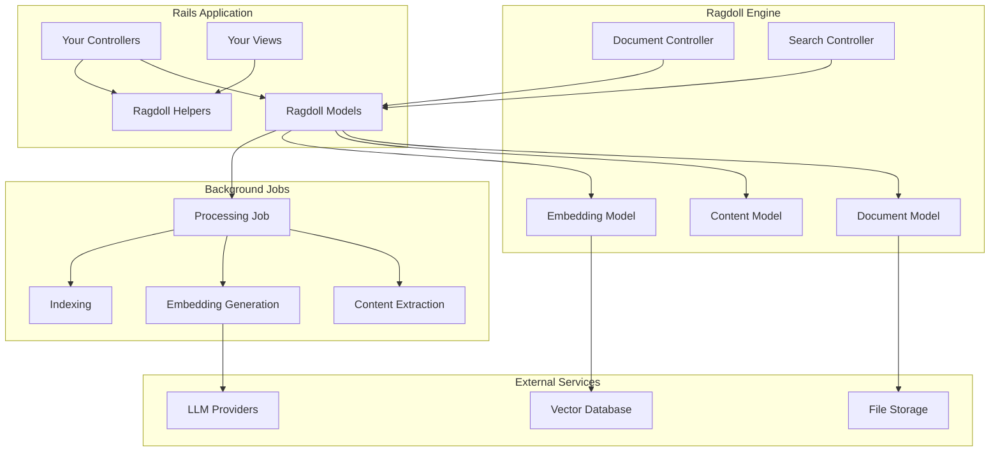

# Ragdoll Rails Integration

The `ragdoll-rails` gem provides seamless integration between the Ragdoll RAG system and Ruby on Rails applications. This Rails engine brings powerful document processing, semantic search, and LLM capabilities directly into your Rails app.

## Overview

Ragdoll Rails is a complete Rails engine that provides:

- **ActiveRecord Models** for documents, embeddings, and content
- **RESTful Controllers** for managing documents and search
- **View Helpers** for search interfaces and document display
- **Background Jobs** for document processing
- **Database Migrations** for Ragdoll schema
- **Rails Generators** for quick setup
- **Configuration Management** for LLM providers and settings

## Key Features

### 🏗️ **Rails Engine Architecture**
- Drop-in integration with existing Rails apps
- Follows Rails conventions and patterns
- Mountable engine with isolated namespace

### 📄 **Document Management**
- ActiveRecord models for documents and content
- File upload handling with Active Storage
- Automatic content extraction and processing
- Metadata management and search

### 🔍 **Search Capabilities**
- Semantic search with vector embeddings
- Hybrid search combining semantic and keyword matching
- Search result ranking and filtering
- Faceted search with metadata

### 🎨 **View Components**
- Pre-built search forms and result displays
- Document viewers for various file types
- Upload interfaces with progress tracking
- Responsive, accessible UI components

### ⚙️ **Background Processing**
- Sidekiq/Resque integration for document processing
- Chunked content processing for large documents
- Embedding generation and indexing
- Retry mechanisms and error handling

## Quick Start

Add to your Gemfile:
```ruby
gem 'ragdoll-rails'
```

Run the initializer and install migrations:
```bash
rails generate ragdoll:init
rails ragdoll:install:migrations
rails db:migrate
```

Mount the engine:
```ruby
# config/routes.rb
mount Ragdoll::Engine => '/ragdoll'
```

Start processing documents:
```ruby
# Upload and process a document
document = Ragdoll::Document.create!(
  title: "My Document",
  file: uploaded_file,
  metadata: { category: "research" }
)

# Search across documents
results = Ragdoll::Document.search("machine learning", limit: 10)
```

## Architecture



## Integration Patterns

### 1. **Full Integration**
Mount the complete engine with all features:
```ruby
mount Ragdoll::Engine => '/documents'
```

### 2. **API Only**
Use models and controllers without views:
```ruby
# Custom controller inheriting from Ragdoll
class DocumentsController < Ragdoll::DocumentsController
  # Your customizations
end
```

### 3. **Models Only**
Use just the ActiveRecord models:
```ruby
class Article < ApplicationRecord
  include Ragdoll::Searchable
  
  ragdoll_document title: :title, content: :body
end
```

## Use Cases

### 📚 **Knowledge Bases**
- Internal documentation systems
- Customer support knowledge bases
- Product documentation sites
- FAQ systems with semantic search

### 🔬 **Research Platforms**
- Academic paper repositories
- Research data management
- Literature review tools
- Citation and reference systems

### 📊 **Content Management**
- Document management systems
- Media asset libraries
- Content discovery platforms
- Digital asset management

### 🏢 **Enterprise Applications**
- Corporate knowledge management
- Policy and procedure systems
- Training material platforms
- Compliance documentation

## Next Steps

- [Installation Guide](installation.md) - Set up Ragdoll in your Rails app
- [Configuration](configuration.md) - Configure models, views, and background jobs
- [Models Reference](models.md) - Learn about the ActiveRecord models
- [Controllers](controllers.md) - Understand the provided controllers
- [Views & Helpers](views-helpers.md) - Use the view components and helpers
- [Generators](generators.md) - Use Rails generators for quick setup
- [Examples](examples.md) - See real-world implementation patterns