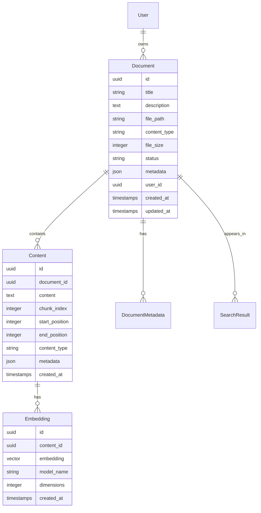

# Rails Models

The ragdoll-rails gem provides a comprehensive set of ActiveRecord models for managing documents, content, embeddings, and search functionality within your Rails application.

## Model Overview

The Ragdoll Rails models follow Rails conventions and provide a clean, intuitive API for document management and search:



## Core Models

### Ragdoll::Document

The central model representing uploaded documents and their metadata.

#### Attributes

```ruby
class Ragdoll::Document < ApplicationRecord
  # Core attributes
  attribute :id, :uuid, default: -> { SecureRandom.uuid }
  attribute :title, :string
  attribute :description, :text
  attribute :file_path, :string
  attribute :content_type, :string
  attribute :file_size, :integer
  attribute :status, :string, default: 'pending'
  attribute :metadata, :json, default: {}
  attribute :user_id, :uuid
  
  # Processing attributes
  attribute :processed_at, :datetime
  attribute :processing_errors, :json, default: []
  attribute :content_hash, :string
  
  # Search attributes
  attribute :search_vector, :tsvector
  attribute :language, :string, default: 'en'
end
```

#### Associations

```ruby
class Ragdoll::Document < ApplicationRecord
  # User association (polymorphic by default)
  belongs_to :user, polymorphic: true, optional: true
  
  # Content associations
  has_many :contents, dependent: :destroy
  has_many :embeddings, through: :contents
  
  # File attachment
  has_one_attached :file
  has_many_attached :images
  
  # Metadata
  has_many :document_metadata, dependent: :destroy
end
```

#### Scopes and Finders

```ruby
class Ragdoll::Document < ApplicationRecord
  # Status scopes
  scope :pending, -> { where(status: 'pending') }
  scope :processing, -> { where(status: 'processing') }
  scope :processed, -> { where(status: 'processed') }
  scope :failed, -> { where(status: 'failed') }
  
  # Content type scopes
  scope :pdfs, -> { where(content_type: 'application/pdf') }
  scope :images, -> { where(content_type: /^image\//) }
  scope :text_files, -> { where(content_type: /^text\//) }
  
  # Date scopes
  scope :recent, ->(days = 7) { where(created_at: days.days.ago..) }
  scope :by_date, ->(date) { where(created_at: date.beginning_of_day..date.end_of_day) }
  
  # User scopes
  scope :by_user, ->(user) { where(user: user) }
  scope :public_documents, -> { where(metadata: { visibility: 'public' }) }
end
```

#### Instance Methods

```ruby
class Ragdoll::Document < ApplicationRecord
  # Status methods
  def pending?
    status == 'pending'
  end
  
  def processed?
    status == 'processed'
  end
  
  def failed?
    status == 'failed'
  end
  
  # Content methods
  def full_content
    contents.order(:chunk_index).pluck(:content).join('\n')
  end
  
  def content_preview(length = 500)
    full_content.truncate(length)
  end
  
  # File methods
  def file_extension
    File.extname(file_path).downcase if file_path
  end
  
  def human_file_size
    ActionController::Base.helpers.number_to_human_size(file_size)
  end
  
  # Metadata methods
  def get_metadata(key)
    metadata[key.to_s]
  end
  
  def set_metadata(key, value)
    metadata[key.to_s] = value
    save!
  end
  
  def add_metadata(hash)
    self.metadata = metadata.merge(hash.stringify_keys)
    save!
  end
end
```

#### Class Methods

```ruby
class Ragdoll::Document < ApplicationRecord
  # Search methods
  def self.search(query, options = {})
    Ragdoll::SearchService.new(query, options).call
  end
  
  def self.semantic_search(query, limit: 10, threshold: 0.7)
    Ragdoll::SemanticSearchService.new(query, limit: limit, threshold: threshold).call
  end
  
  def self.keyword_search(query, limit: 10)
    where("search_vector @@ plainto_tsquery(?)", query).limit(limit)
  end
  
  # Bulk operations
  def self.bulk_process(document_ids)
    where(id: document_ids).find_each do |document|
      Ragdoll::ProcessDocumentJob.perform_later(document)
    end
  end
  
  def self.reindex_all
    processed.find_each do |document|
      Ragdoll::IndexDocumentJob.perform_later(document)
    end
  end
end
```

### Ragdoll::Content

Represents chunked content extracted from documents.

#### Attributes

```ruby
class Ragdoll::Content < ApplicationRecord
  attribute :id, :uuid, default: -> { SecureRandom.uuid }
  attribute :document_id, :uuid
  attribute :content, :text
  attribute :chunk_index, :integer
  attribute :start_position, :integer
  attribute :end_position, :integer
  attribute :content_type, :string, default: 'text/plain'
  attribute :metadata, :json, default: {}
  attribute :language, :string
  attribute :word_count, :integer
  attribute :character_count, :integer
end
```

#### Associations and Methods

```ruby
class Ragdoll::Content < ApplicationRecord
  belongs_to :document
  has_many :embeddings, dependent: :destroy
  
  # Scopes
  scope :by_document, ->(document) { where(document: document) }
  scope :ordered, -> { order(:chunk_index) }
  scope :with_embeddings, -> { joins(:embeddings) }
  
  # Instance methods
  def summary(length = 150)
    content.truncate(length)
  end
  
  def has_embedding?
    embeddings.any?
  end
  
  def primary_embedding
    embeddings.first
  end
  
  # Content analysis
  def calculate_statistics!
    self.word_count = content.split.size
    self.character_count = content.length
    save!
  end
end
```

### Ragdoll::Embedding

Stores vector embeddings for content chunks.

#### Attributes

```ruby
class Ragdoll::Embedding < ApplicationRecord
  attribute :id, :uuid, default: -> { SecureRandom.uuid }
  attribute :content_id, :uuid
  attribute :embedding, :vector
  attribute :model_name, :string
  attribute :dimensions, :integer
  attribute :created_at, :datetime
end
```

#### Methods

```ruby
class Ragdoll::Embedding < ApplicationRecord
  belongs_to :content
  has_one :document, through: :content
  
  # Validations
  validates :embedding, presence: true
  validates :model_name, presence: true
  validates :dimensions, presence: true, numericality: { greater_than: 0 }
  
  # Scopes
  scope :by_model, ->(model) { where(model_name: model) }
  scope :recent, ->(days = 30) { where(created_at: days.days.ago..) }
  
  # Search methods
  def self.similar_to(vector, limit: 10, threshold: 0.7)
    where("embedding <-> ? < ?", vector, 1 - threshold)
      .order("embedding <-> ?", vector)
      .limit(limit)
  end
  
  def self.cosine_similarity(vector, limit: 10)
    select("*, (embedding <=> ?) AS similarity", vector)
      .order("similarity DESC")
      .limit(limit)
  end
  
  # Instance methods
  def similarity_to(other_vector)
    # Calculate cosine similarity
    connection.select_value(
      "SELECT 1 - (embedding <=> ?::vector) AS similarity",
      other_vector
    )
  end
  
  def vector_magnitude
    Math.sqrt(embedding.sum { |x| x * x })
  end
end
```

## Searchable Concern

The `Ragdoll::Searchable` concern can be included in your own models to add search capabilities:

```ruby
class Article < ApplicationRecord
  include Ragdoll::Searchable
  
  # Configure searchable attributes
  ragdoll_searchable do |config|
    config.content_field = :body
    config.title_field = :title
    config.metadata_fields = [:category, :tags, :author]
    config.chunk_size = 1000
    config.auto_process = true
  end
end
```

### Searchable Configuration

```ruby
class BlogPost < ApplicationRecord
  include Ragdoll::Searchable
  
  ragdoll_searchable do |config|
    # Content configuration
    config.content_field = :content
    config.title_field = :title
    config.description_field = :excerpt
    
    # Processing configuration
    config.chunk_size = 800
    config.chunk_overlap = 100
    config.auto_process = true
    config.process_on_create = true
    config.process_on_update = true
    
    # Metadata configuration
    config.metadata_fields = [:category, :tags, :status]
    config.custom_metadata = ->(record) {
      {
        author: record.user.name,
        published_at: record.published_at,
        word_count: record.content.split.size
      }
    }
    
    # Search configuration
    config.searchable = true
    config.enable_suggestions = true
    config.boost_factor = 1.0
  end
end
```

### Generated Methods

When you include `Ragdoll::Searchable`, your model gains these methods:

```ruby
# Search methods
BlogPost.search("machine learning")
BlogPost.semantic_search("AI algorithms", limit: 5)

# Processing methods
post = BlogPost.create!(title: "My Post", content: "Content here")
post.process_for_search!
post.reindex!

# Status methods
post.ragdoll_processed?
post.ragdoll_processing?
post.ragdoll_failed?

# Content methods
post.ragdoll_contents
post.ragdoll_embeddings
post.ragdoll_search_preview
```

## Model Callbacks

### Document Callbacks

```ruby
class Ragdoll::Document < ApplicationRecord
  # Processing callbacks
  after_create :enqueue_processing, if: :should_auto_process?
  after_update :enqueue_reprocessing, if: :file_changed?
  before_destroy :cleanup_attachments
  
  # Search callbacks
  after_save :update_search_vector, if: :title_or_description_changed?
  after_touch :touch_embeddings
  
  private
  
  def should_auto_process?
    file.attached? && Ragdoll.configuration.auto_process_documents
  end
  
  def file_changed?
    saved_change_to_file_path? || file.attachment.changed?
  end
  
  def title_or_description_changed?
    saved_change_to_title? || saved_change_to_description?
  end
  
  def cleanup_attachments
    file.purge_later if file.attached?
    images.purge_later if images.any?
  end
  
  def update_search_vector
    self.update_column(:search_vector, 
      "to_tsvector('#{language}', '#{title} #{description}')"
    )
  end
  
  def touch_embeddings
    embeddings.touch_all
  end
end
```

## Validations

### Document Validations

```ruby
class Ragdoll::Document < ApplicationRecord
  # Required fields
  validates :title, presence: true, length: { maximum: 255 }
  validates :status, presence: true, inclusion: { 
    in: %w[pending processing processed failed] 
  }
  
  # File validations
  validates :file, presence: true, on: :create
  validate :file_type_allowed
  validate :file_size_within_limit
  
  # Content validations
  validates :content_type, presence: true
  validates :file_size, presence: true, numericality: { greater_than: 0 }
  
  # User validations
  validates :user, presence: true, if: :require_user?
  
  private
  
  def file_type_allowed
    return unless file.attached?
    
    allowed_types = Ragdoll.configuration.allowed_file_types
    file_type = file.content_type
    
    unless allowed_types.include?(file_type)
      errors.add(:file, "type #{file_type} is not allowed")
    end
  end
  
  def file_size_within_limit
    return unless file.attached?
    
    max_size = Ragdoll.configuration.max_file_size
    
    if file.byte_size > max_size
      errors.add(:file, "size exceeds maximum allowed (#{max_size} bytes)")
    end
  end
  
  def require_user?
    Ragdoll.configuration.require_user_association
  end
end
```

## Custom Model Extensions

### Adding Custom Attributes

```ruby
# Create a migration to add custom fields
class AddCustomFieldsToRagdollDocuments < ActiveRecord::Migration[7.0]
  def change
    add_column :ragdoll_documents, :category, :string
    add_column :ragdoll_documents, :priority, :integer, default: 0
    add_column :ragdoll_documents, :expires_at, :datetime
    add_index :ragdoll_documents, :category
    add_index :ragdoll_documents, :priority
  end
end

# Extend the model
Ragdoll::Document.class_eval do
  # Add custom validations
  validates :category, presence: true
  validates :priority, inclusion: { in: 0..10 }
  
  # Add custom scopes
  scope :by_category, ->(cat) { where(category: cat) }
  scope :high_priority, -> { where(priority: 8..10) }
  scope :active, -> { where('expires_at IS NULL OR expires_at > ?', Time.current) }
  
  # Add custom methods
  def expired?
    expires_at && expires_at < Time.current
  end
  
  def high_priority?
    priority >= 8
  end
end
```

### Custom Metadata Handling

```ruby
class Ragdoll::Document < ApplicationRecord
  # Typed metadata accessors
  def self.define_metadata_accessor(name, type = :string)
    define_method(name) do
      value = metadata[name.to_s]
      case type
      when :integer then value&.to_i
      when :float then value&.to_f
      when :boolean then !!value
      when :date then value ? Date.parse(value) : nil
      when :datetime then value ? DateTime.parse(value) : nil
      else value
      end
    end
    
    define_method("#{name}=") do |value|
      metadata[name.to_s] = value
    end
  end
  
  # Define typed metadata fields
  define_metadata_accessor :department
  define_metadata_accessor :confidence_score, :float
  define_metadata_accessor :is_public, :boolean
  define_metadata_accessor :published_at, :datetime
end

# Usage
document.department = "Engineering"
document.confidence_score = 0.95
document.is_public = true
document.published_at = 1.week.ago
document.save!
```

## Performance Considerations

### Database Indexes

```ruby
# Create custom indexes for better performance
class AddPerformanceIndexesToRagdollModels < ActiveRecord::Migration[7.0]
  def change
    # Document indexes
    add_index :ragdoll_documents, [:user_id, :status]
    add_index :ragdoll_documents, [:content_type, :created_at]
    add_index :ragdoll_documents, :file_size
    
    # Content indexes
    add_index :ragdoll_contents, [:document_id, :chunk_index]
    add_index :ragdoll_contents, :word_count
    
    # Embedding indexes
    add_index :ragdoll_embeddings, [:content_id, :model_name]
    add_index :ragdoll_embeddings, :created_at
    
    # Vector similarity index (requires pgvector)
    execute "CREATE INDEX CONCURRENTLY IF NOT EXISTS ragdoll_embeddings_embedding_idx 
             ON ragdoll_embeddings USING ivfflat (embedding vector_cosine_ops) 
             WITH (lists = 100)"
  end
end
```

### Query Optimization

```ruby
class Ragdoll::Document < ApplicationRecord
  # Optimized includes for search results
  scope :with_search_data, -> { 
    includes(:contents, :embeddings, :user)
      .select('ragdoll_documents.*, COUNT(ragdoll_contents.id) as content_count')
      .left_joins(:contents)
      .group('ragdoll_documents.id')
  }
  
  # Efficient content loading
  def preload_search_content
    contents.includes(:embeddings).limit(3)
  end
  
  # Cached expensive operations
  def cached_content_preview
    Rails.cache.fetch("document:#{id}:preview", expires_in: 1.hour) do
      content_preview
    end
  end
end
```

This comprehensive model documentation provides everything you need to work with Ragdoll Rails models effectively, from basic usage to advanced customization and performance optimization.