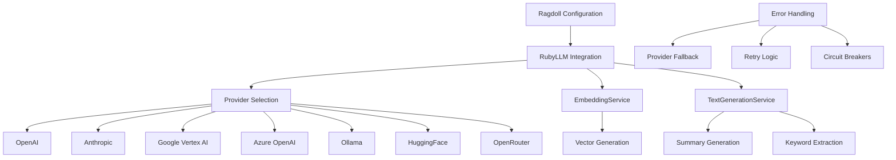

# LLM Integration

Ragdoll provides comprehensive LLM integration through the RubyLLM library, supporting multiple providers with flexible configuration and robust error handling. The system is designed for production use with automatic fallbacks and cost optimization strategies.

## Multiple Provider Support and Configuration

Ragdoll's LLM integration is built on RubyLLM, providing a unified interface to multiple LLM providers. The configuration system supports environment-based setup, automatic provider detection, and sophisticated fallback strategies.

### Architecture Overview



### Configuration Structure

The LLM configuration is centralized in the `ruby_llm_config` section:

```ruby
Ragdoll::Core.configure do |config|
  config.ruby_llm_config = {
    openai: {
      api_key: -> { ENV["OPENAI_API_KEY"] },
      organization: -> { ENV["OPENAI_ORGANIZATION"] },
      project: -> { ENV["OPENAI_PROJECT"] }
    },
    anthropic: {
      api_key: -> { ENV["ANTHROPIC_API_KEY"] }
    },
    google: {
      api_key: -> { ENV["GOOGLE_API_KEY"] },
      project_id: -> { ENV["GOOGLE_PROJECT_ID"] }
    },
    azure: {
      api_key: -> { ENV["AZURE_OPENAI_API_KEY"] },
      endpoint: -> { ENV["AZURE_OPENAI_ENDPOINT"] },
      api_version: -> { ENV["AZURE_OPENAI_API_VERSION"] || "2024-02-01" }
    },
    ollama: {
      endpoint: -> { ENV["OLLAMA_ENDPOINT"] || "http://localhost:11434/v1" }
    },
    huggingface: {
      api_key: -> { ENV["HUGGINGFACE_API_KEY"] }
    },
    openrouter: {
      api_key: -> { ENV["OPENROUTER_API_KEY"] }
    }
  }
end
```

## Supported Providers

Ragdoll supports seven major LLM providers through RubyLLM integration. Each provider is configured through environment variables with automatic validation and fallback handling.

### OpenAI

**Models Supported:**
- GPT-4 series (gpt-4o, gpt-4-turbo, gpt-4)
- GPT-3.5-turbo series
- Text embedding models (text-embedding-3-small, text-embedding-3-large)
- Image understanding via GPT-4 Vision

**Configuration:**
```ruby
config.ruby_llm_config[:openai] = {
  api_key: -> { ENV["OPENAI_API_KEY"] },
  organization: -> { ENV["OPENAI_ORGANIZATION"] },  # Optional
  project: -> { ENV["OPENAI_PROJECT"] }             # Optional
}

# Model selection
config.models = {
  default: "openai/gpt-4o",
  summary: "openai/gpt-4o",
  keywords: "openai/gpt-4o",
  embedding: {
    text: "text-embedding-3-small"
  }
}
```

**Rate Limiting & Optimization:**
- Automatic retry with exponential backoff
- Request batching for embeddings
- Token usage optimization
- Cost monitoring through usage tracking

### Anthropic

**Models Supported:**
- Claude 3 series (claude-3-opus, claude-3-sonnet, claude-3-haiku)
- Claude 2 series for cost optimization
- Long context capabilities (up to 200K tokens)

**Configuration:**
```ruby
config.ruby_llm_config[:anthropic] = {
  api_key: -> { ENV["ANTHROPIC_API_KEY"] }
}

# Using Anthropic models
config.models[:default] = "anthropic/claude-3-sonnet"
config.models[:summary] = "anthropic/claude-3-haiku"  # Cost optimization
```

**Best Practices:**
- Use Claude 3 Haiku for simple tasks (cost-effective)
- Use Claude 3 Sonnet for balanced performance
- Use Claude 3 Opus for complex reasoning tasks
- Leverage long context for document analysis

### Google Vertex AI

**Models Supported:**
- Gemini Pro and Gemini Pro Vision
- PaLM 2 models
- Embedding models (textembedding-gecko)
- Multi-modal capabilities

**Configuration:**
```ruby
config.ruby_llm_config[:google] = {
  api_key: -> { ENV["GOOGLE_API_KEY"] },
  project_id: -> { ENV["GOOGLE_PROJECT_ID"] }
}

# Regional configuration
ENV["GOOGLE_VERTEX_REGION"] = "us-central1"
```

**Service Account Setup:**
1. Create service account in Google Cloud Console
2. Download JSON key file
3. Set `GOOGLE_APPLICATION_CREDENTIALS` environment variable
4. Enable Vertex AI API for your project

### Azure OpenAI

**Enterprise Features:**
- Private endpoints and VNet integration
- Managed identity authentication
- Content filtering and safety
- Compliance certifications (SOC 2, HIPAA)

**Configuration:**
```ruby
config.ruby_llm_config[:azure] = {
  api_key: -> { ENV["AZURE_OPENAI_API_KEY"] },
  endpoint: -> { ENV["AZURE_OPENAI_ENDPOINT"] },
  api_version: -> { ENV["AZURE_OPENAI_API_VERSION"] || "2024-02-01" }
}
```

**Model Deployment:**
```bash
# Example environment variables
export AZURE_OPENAI_ENDPOINT="https://your-resource.openai.azure.com/"
export AZURE_OPENAI_API_KEY="your-api-key"
export AZURE_OPENAI_API_VERSION="2024-02-01"
```

### Ollama (Local Models)

**Supported Models:**
- Llama 2 and Code Llama
- Mistral and Mixtral models
- Phi-3 and other local models
- Custom fine-tuned models

**Configuration:**
```ruby
config.ruby_llm_config[:ollama] = {
  endpoint: -> { ENV["OLLAMA_ENDPOINT"] || "http://localhost:11434/v1" }
}

# No API key required for local deployment
config.embedding_config[:provider] = :ollama
```

**Performance Optimization:**
- GPU acceleration with CUDA/Metal
- Memory management for large models
- Model quantization for efficiency
- Concurrent request handling

**Resource Requirements:**
- Minimum 8GB RAM for 7B models
- 16GB+ RAM for 13B models
- GPU recommended for production use
- SSD storage for model files

### HuggingFace

**Model Hub Integration:**
- 100,000+ models available
- Custom model deployment
- Inference API integration
- Transformers library compatibility

**Configuration:**
```ruby
config.ruby_llm_config[:huggingface] = {
  api_key: -> { ENV["HUGGINGFACE_API_KEY"] }
}

# Model selection
config.models[:embedding][:text] = "sentence-transformers/all-MiniLM-L6-v2"
```

**Performance Tuning:**
- Model caching for faster inference
- Batch processing for embeddings
- Custom inference endpoints
- Auto-scaling with serverless

### OpenRouter

**Provider Routing:**
- Access to 20+ LLM providers
- Automatic provider selection
- Cost optimization routing
- Real-time pricing updates

**Configuration:**
```ruby
config.ruby_llm_config[:openrouter] = {
  api_key: -> { ENV["OPENROUTER_API_KEY"] }
}

# Cost-optimized model selection
config.models[:default] = "openrouter/anthropic/claude-3-haiku"
config.models[:summary] = "openrouter/meta-llama/llama-2-7b-chat"
```

**Fallback Strategies:**
- Primary provider → Secondary provider → Local fallback
- Cost-based provider selection
- Geographic routing for compliance
- Real-time availability checking

## Configuration Patterns

Ragdoll provides flexible configuration patterns that support everything from simple single-provider setups to complex multi-provider environments with cost optimization and failover.

### Provider Selection

**Model-Specific Provider Configuration:**
```ruby
Ragdoll::Core.configure do |config|
  # Different providers for different tasks
  config.models = {
    default: "openai/gpt-4o",           # OpenAI for general tasks
    summary: "anthropic/claude-3-haiku", # Anthropic for summaries
    keywords: "openai/gpt-3.5-turbo",   # OpenAI for keywords
    embedding: {
      text: "text-embedding-3-small",   # OpenAI embeddings
      image: "openai/clip-vit-large",   # OpenAI image embeddings
      audio: "openai/whisper-1"         # OpenAI audio processing
    }
  }
end
```

**Automatic Provider Detection:**
The system uses `parse_provider_model` to automatically detect providers:

```ruby
# Format: "provider/model" -> automatic provider detection
config.models[:default] = "openai/gpt-4o"
config.models[:summary] = "anthropic/claude-3-sonnet"

# Format: "model" -> RubyLLM determines provider
config.models[:embedding][:text] = "text-embedding-3-small"

# Configuration parsing
parsed = config.parse_provider_model("openai/gpt-4o")
# => { provider: :openai, model: "gpt-4o" }

parsed = config.parse_provider_model("gpt-4o")
# => { provider: nil, model: "gpt-4o" } # RubyLLM auto-detects
```

**Fallback Provider Chains:**
```ruby
class CustomTextGenerationService < Ragdoll::Core::TextGenerationService
  private

  def generate_with_fallback(prompt, models)
    models.each do |model_string|
      begin
        parsed = @configuration.parse_provider_model(model_string)
        return generate_with_model(prompt, parsed[:model])
      rescue StandardError => e
        Rails.logger.warn "Provider #{parsed[:provider]} failed: #{e.message}"
        next
      end
    end

    # Ultimate fallback to basic processing
    generate_basic_summary(prompt, 300)
  end
end

# Usage with fallback chain
fallback_models = [
  "openai/gpt-4o",           # Primary
  "anthropic/claude-3-sonnet", # Secondary
  "ollama/llama2"            # Local fallback
]
```

**Cost-Based Selection:**
```ruby
# Cost optimization configuration
config.cost_optimization = {
  enable: true,
  thresholds: {
    summary: { max_cost_per_request: 0.01 },
    keywords: { max_cost_per_request: 0.005 },
    embedding: { max_cost_per_1k_tokens: 0.0001 }
  },
  fallback_models: {
    summary: ["anthropic/claude-3-haiku", "ollama/llama2"],
    keywords: ["openai/gpt-3.5-turbo", "ollama/mistral"]
  }
}
```

### API Key Management

**Environment Variable Setup:**
```bash
# OpenAI
export OPENAI_API_KEY="sk-..."
export OPENAI_ORGANIZATION="org-..."
export OPENAI_PROJECT="proj_..."

# Anthropic
export ANTHROPIC_API_KEY="sk-ant-..."

# Google
export GOOGLE_API_KEY="AIza..."
export GOOGLE_PROJECT_ID="my-project-id"
export GOOGLE_APPLICATION_CREDENTIALS="/path/to/service-account.json"

# Azure
export AZURE_OPENAI_API_KEY="..."
export AZURE_OPENAI_ENDPOINT="https://my-resource.openai.azure.com/"
export AZURE_OPENAI_API_VERSION="2024-02-01"

# HuggingFace
export HUGGINGFACE_API_KEY="hf_..."

# OpenRouter
export OPENROUTER_API_KEY="sk-or-..."
```

**Secure Key Storage:**
```ruby
# Using Rails credentials
config.ruby_llm_config[:openai] = {
  api_key: -> { Rails.application.credentials.openai[:api_key] },
  organization: -> { Rails.application.credentials.openai[:organization] }
}

# Using Vault or similar secret management
config.ruby_llm_config[:openai] = {
  api_key: -> { VaultClient.get_secret("openai/api_key") }
}

# Using AWS Secrets Manager
config.ruby_llm_config[:openai] = {
  api_key: -> {
    AWS::SecretsManager::Client.new.get_secret_value(
      secret_id: "prod/ragdoll/openai_api_key"
    ).secret_string
  }
}
```

**Key Rotation Strategies:**
```ruby
class APIKeyRotationService
  def self.rotate_keys
    # Implement key rotation logic
    providers = [:openai, :anthropic, :google]

    providers.each do |provider|
      current_key = get_current_key(provider)
      new_key = generate_new_key(provider)

      # Test new key
      if test_api_key(provider, new_key)
        update_key_in_secret_store(provider, new_key)
        schedule_old_key_revocation(provider, current_key)
      end
    end
  end

  private

  def self.test_api_key(provider, key)
    # Test API key with minimal request
    test_config = { provider => { api_key: key } }
    service = Ragdoll::Core::EmbeddingService.new
    service.generate_embedding("test")
    true
  rescue
    false
  end
end
```

**Multi-Tenant Key Management:**
```ruby
class MultiTenantConfiguration
  def self.for_tenant(tenant_id)
    Ragdoll::Core.configure do |config|
      tenant_keys = fetch_tenant_keys(tenant_id)

      config.ruby_llm_config = {
        openai: {
          api_key: -> { tenant_keys[:openai_api_key] },
          organization: -> { tenant_keys[:openai_organization] }
        },
        anthropic: {
          api_key: -> { tenant_keys[:anthropic_api_key] }
        }
      }

      # Tenant-specific model preferences
      config.models = tenant_model_preferences(tenant_id)
    end
  end

  private

  def self.fetch_tenant_keys(tenant_id)
    # Fetch from secure tenant key store
    TenantKeyStore.get_keys(tenant_id)
  end
end
```

## Model Selection Strategies

Ragdoll implements intelligent model selection based on task requirements, performance characteristics, and cost considerations. The system supports both automatic and manual model selection strategies.

### Task-Specific Models

**Embedding Model Selection:**
```ruby
config.models[:embedding] = {
  text: "text-embedding-3-small",      # Fast, cost-effective for most text
  image: "clip-vit-large-patch14",     # Best for image understanding
  audio: "whisper-embedding-v1",      # Audio content embeddings
  code: "text-embedding-3-large",     # Higher accuracy for code
  multilingual: "multilingual-e5-large" # Multi-language support
}

# Dynamic embedding model selection
class SmartEmbeddingService < Ragdoll::Core::EmbeddingService
  def generate_embedding(text, content_type: :text)
    model = select_embedding_model(text, content_type)
    super(text, model: model)
  end

  private

  def select_embedding_model(text, content_type)
    case content_type
    when :code
      detect_programming_language(text) ? "text-embedding-3-large" : "text-embedding-3-small"
    when :multilingual
      detect_language(text) != "en" ? "multilingual-e5-large" : "text-embedding-3-small"
    when :long_document
      text.length > 5000 ? "text-embedding-3-large" : "text-embedding-3-small"
    else
      Ragdoll.config.models[:embedding][content_type]
    end
  end
end
```

**Summary Generation Models:**
```ruby
# Task-specific summary model configuration
config.summarization_config = {
  enable: true,
  models: {
    short_content: "openai/gpt-3.5-turbo",    # < 1000 tokens
    medium_content: "anthropic/claude-3-haiku", # 1000-5000 tokens
    long_content: "anthropic/claude-3-sonnet",  # > 5000 tokens
    technical: "openai/gpt-4o",                # Technical documents
    creative: "anthropic/claude-3-opus"        # Creative content
  },
  max_length: 300,
  quality_threshold: 0.8
}

# Intelligent model selection in TextGenerationService
def select_summary_model(content)
  token_count = estimate_token_count(content)
  content_type = detect_content_type(content)

  case
  when token_count < 1000
    @configuration.summarization_config[:models][:short_content]
  when technical_content?(content)
    @configuration.summarization_config[:models][:technical]
  when creative_content?(content)
    @configuration.summarization_config[:models][:creative]
  else
    @configuration.summarization_config[:models][:medium_content]
  end
end
```

**Keyword Extraction Models:**
```ruby
# Specialized keyword extraction configuration
config.keyword_extraction = {
  models: {
    general: "openai/gpt-3.5-turbo",
    technical: "openai/gpt-4o",
    academic: "anthropic/claude-3-sonnet",
    multilingual: "google/gemini-pro"
  },
  max_keywords: 20,
  confidence_threshold: 0.7
}

# Context-aware keyword extraction
class AdvancedKeywordExtraction < Ragdoll::Core::TextGenerationService
  def extract_keywords(text, context: :general)
    model = select_keyword_model(text, context)

    prompt = build_contextual_keyword_prompt(text, context)

    extract_with_model(text, model, prompt)
  end

  private

  def select_keyword_model(text, context)
    case context
    when :technical
      detect_technical_terms(text) ? "openai/gpt-4o" : "openai/gpt-3.5-turbo"
    when :academic
      "anthropic/claude-3-sonnet"
    when :multilingual
      "google/gemini-pro"
    else
      "openai/gpt-3.5-turbo"
    end
  end
end
```

**Classification Models:**
```ruby
# Document classification configuration
config.classification = {
  models: {
    content_type: "openai/gpt-3.5-turbo",
    sentiment: "anthropic/claude-3-haiku",
    topic: "openai/gpt-4o",
    language: "google/gemini-pro"
  },
  categories: {
    content_type: ["technical", "business", "academic", "creative"],
    sentiment: ["positive", "negative", "neutral"],
    topic: ["technology", "finance", "healthcare", "education"]
  }
}
```

### Performance vs Cost

**Model Performance Comparison:**
```ruby
# Performance benchmarking data
MODEL_PERFORMANCE = {
  "openai/gpt-4o" => {
    accuracy: 0.95,
    speed: "medium",
    cost_per_1k_tokens: 0.03,
    best_for: ["complex_reasoning", "technical_analysis"]
  },
  "anthropic/claude-3-sonnet" => {
    accuracy: 0.92,
    speed: "fast",
    cost_per_1k_tokens: 0.015,
    best_for: ["document_analysis", "summarization"]
  },
  "openai/gpt-3.5-turbo" => {
    accuracy: 0.87,
    speed: "very_fast",
    cost_per_1k_tokens: 0.002,
    best_for: ["simple_tasks", "bulk_processing"]
  }
}

class PerformanceCostOptimizer
  def select_optimal_model(task_type, content_length, quality_requirement)
    candidates = MODEL_PERFORMANCE.select do |model, stats|
      stats[:best_for].include?(task_type.to_s) &&
      stats[:accuracy] >= quality_requirement
    end

    # Sort by cost-effectiveness (accuracy/cost ratio)
    candidates.min_by do |model, stats|
      estimated_cost = calculate_cost(content_length, stats[:cost_per_1k_tokens])
      estimated_cost / stats[:accuracy]
    end.first
  end
end
```

**Cost Optimization Strategies:**
```ruby
# Adaptive cost optimization
config.cost_optimization = {
  enable: true,
  budget_limits: {
    daily: 100.00,    # Daily budget limit
    monthly: 2000.00  # Monthly budget limit
  },
  strategies: {
    batch_processing: true,     # Batch similar requests
    caching: true,             # Cache similar requests
    model_downgrade: true,     # Use cheaper models when possible
    queue_management: true     # Queue non-urgent requests
  }
}

class CostOptimizationService
  def optimize_request(request_type, content, urgency: :normal)
    current_spend = calculate_daily_spend
    remaining_budget = config.cost_optimization[:budget_limits][:daily] - current_spend

    if remaining_budget < 10.00 && urgency != :high
      # Use cheaper model or queue request
      return queue_request(request_type, content)
    end

    # Check for cached similar requests
    if cached_result = check_cache(request_type, content)
      return cached_result
    end

    # Select cost-effective model
    model = select_cost_effective_model(request_type, remaining_budget)
    process_request(request_type, content, model)
  end
end
```

**Quality Thresholds:**
```ruby
# Quality control configuration
config.quality_control = {
  minimum_thresholds: {
    embedding_similarity: 0.7,
    summary_coherence: 0.8,
    keyword_relevance: 0.75
  },
  validation_methods: {
    semantic_coherence: true,
    factual_accuracy: true,
    language_quality: true
  },
  retry_on_low_quality: true,
  max_retries: 2
}

class QualityValidator
  def validate_summary(summary, original_content)
    scores = {
      coherence: calculate_coherence_score(summary),
      relevance: calculate_relevance_score(summary, original_content),
      completeness: calculate_completeness_score(summary, original_content)
    }

    overall_score = scores.values.sum / scores.length

    if overall_score < config.quality_control[:minimum_thresholds][:summary_coherence]
      raise QualityThresholdError, "Summary quality below threshold: #{overall_score}"
    end

    { valid: true, scores: scores, overall_score: overall_score }
  end
end
```

**Batch Processing Optimization:**
```ruby
# Efficient batch processing
class BatchOptimizedEmbeddingService < Ragdoll::Core::EmbeddingService
  MAX_BATCH_SIZE = 100
  OPTIMAL_BATCH_SIZE = 50

  def generate_embeddings_optimized(texts)
    # Group texts by optimal batch size
    batches = texts.each_slice(OPTIMAL_BATCH_SIZE).to_a

    results = []
    batches.each_with_index do |batch, index|
      # Add delay between batches to respect rate limits
      sleep(0.1) if index > 0

      batch_results = generate_embeddings_batch(batch)
      results.concat(batch_results)

      # Progress tracking
      progress = ((index + 1) * 100.0 / batches.length).round(1)
      puts "Batch processing: #{progress}% complete"
    end

    results
  end
end
```

## Error Handling

Ragdoll implements comprehensive error handling with automatic retries, intelligent fallbacks, and circuit breaker patterns to ensure reliable LLM integration in production environments.

### Provider Failures

**Automatic Retry Strategies:**
```ruby
class RobustLLMService
  MAX_RETRIES = 3
  RETRY_DELAYS = [1, 2, 4] # Exponential backoff in seconds

  def generate_with_retry(content, model, max_retries: MAX_RETRIES)
    attempt = 0

    begin
      attempt += 1
      result = generate_content(content, model)

      # Reset success counter on successful request
      reset_failure_count(model)
      return result

    rescue RateLimitError => e
      if attempt <= max_retries
        delay = calculate_rate_limit_delay(e)
        Rails.logger.warn "Rate limited, retrying in #{delay}s (attempt #{attempt})"
        sleep(delay)
        retry
      else
        handle_rate_limit_failure(model, e)
      end

    rescue APIError => e
      if retryable_error?(e) && attempt <= max_retries
        delay = RETRY_DELAYS[attempt - 1] || 4
        Rails.logger.warn "API error, retrying in #{delay}s (attempt #{attempt}): #{e.message}"
        sleep(delay)
        retry
      else
        handle_api_failure(model, e)
      end

    rescue StandardError => e
      Rails.logger.error "Unexpected error with #{model}: #{e.message}"
      increment_failure_count(model)
      raise e
    end
  end

  private

  def retryable_error?(error)
    case error
    when NetworkError, TimeoutError, TemporaryServerError
      true
    when AuthenticationError, InvalidModelError
      false
    else
      error.message.include?("temporary") || error.message.include?("retry")
    end
  end
end
```

**Provider Fallback:**
```ruby
class ProviderFallbackService
  def initialize
    @provider_health = Hash.new(0) # Track failure counts
    @circuit_breakers = {} # Circuit breaker states
  end

  def generate_with_fallback(content, task_type)
    providers = get_provider_chain(task_type)

    providers.each do |provider_config|
      next if circuit_breaker_open?(provider_config[:provider])

      begin
        result = attempt_generation(content, provider_config)
        record_success(provider_config[:provider])
        return result

      rescue StandardError => e
        record_failure(provider_config[:provider], e)
        Rails.logger.warn "Provider #{provider_config[:provider]} failed: #{e.message}"

        # Continue to next provider
        next
      end
    end

    # All providers failed, use basic fallback
    Rails.logger.error "All LLM providers failed, using basic fallback"
    generate_basic_fallback(content, task_type)
  end

  private

  def get_provider_chain(task_type)
    case task_type
    when :summary
      [
        { provider: :openai, model: "gpt-4o", priority: 1 },
        { provider: :anthropic, model: "claude-3-sonnet", priority: 2 },
        { provider: :ollama, model: "llama2", priority: 3 }
      ]
    when :embedding
      [
        { provider: :openai, model: "text-embedding-3-small", priority: 1 },
        { provider: :huggingface, model: "sentence-transformers/all-MiniLM-L6-v2", priority: 2 }
      ]
    end.sort_by { |config| config[:priority] }
  end
end
```

**Error Classification:**
```ruby
module ErrorClassification
  class LLMError < StandardError; end
  class RateLimitError < LLMError; end
  class AuthenticationError < LLMError; end
  class QuotaExceededError < LLMError; end
  class ModelUnavailableError < LLMError; end
  class InvalidRequestError < LLMError; end
  class NetworkError < LLMError; end
  class TimeoutError < LLMError; end

  def classify_error(error_response)
    case error_response
    when /rate limit/i, /too many requests/i
      RateLimitError.new(error_response)
    when /unauthorized/i, /invalid api key/i
      AuthenticationError.new(error_response)
    when /quota exceeded/i, /billing/i
      QuotaExceededError.new(error_response)
    when /model.*not available/i, /model.*not found/i
      ModelUnavailableError.new(error_response)
    when /timeout/i, /connection/i
      NetworkError.new(error_response)
    else
      LLMError.new(error_response)
    end
  end
end
```

**Circuit Breaker Patterns:**
```ruby
class CircuitBreaker
  FAILURE_THRESHOLD = 5
  RECOVERY_TIMEOUT = 300 # 5 minutes
  HALF_OPEN_MAX_CALLS = 3

  def initialize(provider)
    @provider = provider
    @failure_count = 0
    @last_failure_time = nil
    @state = :closed # :closed, :open, :half_open
    @half_open_calls = 0
  end

  def call(&block)
    case @state
    when :closed
      execute_closed(&block)
    when :open
      execute_open(&block)
    when :half_open
      execute_half_open(&block)
    end
  end

  private

  def execute_closed(&block)
    begin
      result = block.call
      reset_failure_count
      result
    rescue StandardError => e
      record_failure
      if @failure_count >= FAILURE_THRESHOLD
        @state = :open
        @last_failure_time = Time.current
        Rails.logger.error "Circuit breaker opened for #{@provider}"
      end
      raise e
    end
  end

  def execute_open(&block)
    if Time.current - @last_failure_time > RECOVERY_TIMEOUT
      @state = :half_open
      @half_open_calls = 0
      Rails.logger.info "Circuit breaker half-open for #{@provider}"
      execute_half_open(&block)
    else
      raise CircuitBreakerOpenError, "Circuit breaker is open for #{@provider}"
    end
  end

  def execute_half_open(&block)
    begin
      result = block.call
      @half_open_calls += 1

      if @half_open_calls >= HALF_OPEN_MAX_CALLS
        @state = :closed
        reset_failure_count
        Rails.logger.info "Circuit breaker closed for #{@provider}"
      end

      result
    rescue StandardError => e
      @state = :open
      @last_failure_time = Time.current
      Rails.logger.error "Circuit breaker reopened for #{@provider}"
      raise e
    end
  end
end
```

### Rate Limiting

**Request Throttling:**
```ruby
class RateLimitManager
  def initialize
    @request_timestamps = Hash.new { |h, k| h[k] = [] }
    @rate_limits = {
      openai: { requests_per_minute: 60, tokens_per_minute: 150_000 },
      anthropic: { requests_per_minute: 50, tokens_per_minute: 100_000 },
      google: { requests_per_minute: 100, tokens_per_minute: 200_000 }
    }
  end

  def throttle_request(provider, estimated_tokens)
    cleanup_old_timestamps(provider)

    current_requests = @request_timestamps[provider].length
    current_tokens = calculate_current_token_usage(provider)

    limits = @rate_limits[provider]

    # Check request rate limit
    if current_requests >= limits[:requests_per_minute]
      delay = calculate_request_delay(provider)
      Rails.logger.info "Rate limiting: waiting #{delay}s for #{provider}"
      sleep(delay)
    end

    # Check token rate limit
    if current_tokens + estimated_tokens > limits[:tokens_per_minute]
      delay = calculate_token_delay(provider, estimated_tokens)
      Rails.logger.info "Token rate limiting: waiting #{delay}s for #{provider}"
      sleep(delay)
    end

    # Record this request
    @request_timestamps[provider] << Time.current
  end

  private

  def cleanup_old_timestamps(provider)
    cutoff = Time.current - 60 # Remove timestamps older than 1 minute
    @request_timestamps[provider].reject! { |timestamp| timestamp < cutoff }
  end
end
```

**Queue Management:**
```ruby
class LLMRequestQueue
  def initialize
    @queues = {
      high_priority: [],
      normal_priority: [],
      low_priority: []
    }
    @processing = false
  end

  def enqueue_request(request, priority: :normal_priority)
    @queues[priority] << {
      request: request,
      timestamp: Time.current,
      retries: 0
    }

    process_queue unless @processing
  end

  def process_queue
    @processing = true

    while (item = get_next_item)
      begin
        result = process_request(item[:request])
        item[:request][:callback].call(result) if item[:request][:callback]

      rescue RateLimitError => e
        if item[:retries] < 3
          item[:retries] += 1
          delay = extract_retry_delay(e) || 60

          # Re-queue with delay
          Thread.new do
            sleep(delay)
            @queues[:normal_priority] << item
          end
        else
          handle_failed_request(item, e)
        end

      rescue StandardError => e
        handle_failed_request(item, e)
      end
    end

    @processing = false
  end

  private

  def get_next_item
    # Process high priority first, then normal, then low
    [:high_priority, :normal_priority, :low_priority].each do |priority|
      return @queues[priority].shift unless @queues[priority].empty?
    end
    nil
  end
end
```

**Backoff Strategies:**
```ruby
class AdaptiveBackoffStrategy
  def initialize
    @base_delay = 1.0
    @max_delay = 300.0 # 5 minutes
    @backoff_multiplier = 2.0
    @jitter_factor = 0.1
  end

  def calculate_delay(attempt, error_type = :generic)
    base = case error_type
           when :rate_limit
             @base_delay * 2 # Longer delays for rate limits
           when :server_error
             @base_delay * 1.5
           else
             @base_delay
           end

    # Exponential backoff with jitter
    delay = base * (@backoff_multiplier ** (attempt - 1))
    delay = [@max_delay, delay].min

    # Add jitter to prevent thundering herd
    jitter = delay * @jitter_factor * rand
    delay + jitter
  end

  def calculate_rate_limit_delay(error_response)
    # Try to extract suggested delay from error response
    if match = error_response.match(/retry.*?(\d+).*?second/i)
      match[1].to_i + rand(5) # Add small jitter
    elsif match = error_response.match(/retry.*?(\d+).*?minute/i)
      (match[1].to_i * 60) + rand(30)
    else
      60 + rand(30) # Default 60-90 seconds
    end
  end
end
```

**Cost Management:**
```ruby
class CostManager
  def initialize
    @daily_spend = 0.0
    @monthly_spend = 0.0
    @cost_per_provider = Hash.new(0.0)
    @cost_tracking_enabled = true
  end

  def track_request_cost(provider, tokens_used, model)
    return unless @cost_tracking_enabled

    cost = calculate_cost(provider, tokens_used, model)

    @daily_spend += cost
    @monthly_spend += cost
    @cost_per_provider[provider] += cost

    # Check budget limits
    check_budget_limits(cost)

    # Log cost tracking
    Rails.logger.info "LLM cost tracking: #{provider}/#{model} - #{tokens_used} tokens - $#{cost.round(4)}"
  end

  private

  def calculate_cost(provider, tokens, model)
    rate = PRICING_TABLE[provider][model] || 0.002 # Fallback rate
    (tokens / 1000.0) * rate
  end

  def check_budget_limits
    daily_limit = Ragdoll.config.cost_optimization[:budget_limits][:daily]
    monthly_limit = Ragdoll.config.cost_optimization[:budget_limits][:monthly]

    if @daily_spend > daily_limit * 0.9 # 90% of limit
      Rails.logger.warn "Approaching daily budget limit: $#{@daily_spend}/$#{daily_limit}"

      if @daily_spend > daily_limit
        raise BudgetExceededError, "Daily budget limit exceeded: $#{@daily_spend}"
      end
    end
  end
end
```

## Best Practices

Implementing LLM integration effectively requires careful consideration of provider characteristics, cost optimization, security, and quality assurance. These best practices are derived from production deployments and real-world experience.

### Provider-Specific Optimization

**OpenAI Optimization:**
```ruby
# OpenAI-specific optimizations
config.openai_optimization = {
  # Use streaming for long responses
  enable_streaming: true,

  # Optimize token usage
  token_optimization: {
    max_tokens: 4000,
    temperature: 0.3,    # Lower for consistent results
    top_p: 0.9,         # Nucleus sampling
    frequency_penalty: 0.1,
    presence_penalty: 0.1
  },

  # Batch embeddings for cost efficiency
  embedding_batch_size: 100,

  # Use cheaper models for simple tasks
  model_selection: {
    simple_tasks: "gpt-3.5-turbo",
    complex_tasks: "gpt-4o",
    embeddings: "text-embedding-3-small"
  }
}

class OptimizedOpenAIService
  def generate_summary(content)
    # Use gpt-3.5-turbo for short content, gpt-4o for complex content
    model = content.length < 2000 ? "gpt-3.5-turbo" : "gpt-4o"

    # Optimize prompt for OpenAI
    prompt = build_openai_optimized_prompt(content)

    RubyLLM.chat.with_model(model)
           .with_temperature(0.3)
           .with_max_tokens(300)
           .add_message(role: "user", content: prompt)
           .complete
  end

  private

  def build_openai_optimized_prompt(content)
    # OpenAI responds well to structured prompts
    <<~PROMPT
      Task: Create a concise summary of the following content.

      Requirements:
      - Maximum 250 words
      - Focus on key points and main themes
      - Use clear, professional language

      Content:
      #{content}

      Summary:
    PROMPT
  end
end
```

**Anthropic (Claude) Optimization:**
```ruby
# Claude-specific optimizations
config.anthropic_optimization = {
  # Claude handles long context very well
  max_context_length: 100_000,

  # Optimize for Claude's strengths
  use_cases: {
    document_analysis: "claude-3-sonnet",    # Excellent for documents
    creative_writing: "claude-3-opus",      # Best creative capabilities
    cost_effective: "claude-3-haiku"        # Fast and cheap
  },

  # Claude-optimized parameters
  generation_params: {
    temperature: 0.1,     # Claude is naturally creative
    max_tokens: 1000
  }
}

class OptimizedClaudeService
  def analyze_document(content)
    # Claude excels at document analysis
    prompt = build_claude_optimized_prompt(content)

    RubyLLM.chat.with_model("claude-3-sonnet")
           .with_temperature(0.1)
           .add_message(role: "user", content: prompt)
           .complete
  end

  private

  def build_claude_optimized_prompt(content)
    # Claude prefers conversational, detailed prompts
    <<~PROMPT
      I need you to analyze this document and provide insights. Please:

      1. Identify the main themes and topics
      2. Extract key facts and data points
      3. Summarize the document's purpose and conclusions
      4. Note any important technical details

      Here's the document to analyze:

      #{content}

      Please provide a thorough analysis following the structure above.
    PROMPT
  end
end
```

**Local Model (Ollama) Optimization:**
```ruby
# Ollama-specific optimizations
config.ollama_optimization = {
  # Optimize for local hardware
  gpu_acceleration: true,
  memory_management: {
    model_cache_size: "8GB",
    concurrent_requests: 4
  },

  # Model selection for different tasks
  models: {
    general: "llama2:7b",
    code: "codellama:7b",
    embedding: "nomic-embed-text"
  },

  # Performance tuning
  generation_params: {
    temperature: 0.7,
    num_ctx: 4096,      # Context window
    num_predict: 512,   # Max prediction tokens
    repeat_penalty: 1.1
  }
}

class OptimizedOllamaService
  def initialize
    @model_cache = {}
    @request_queue = Queue.new
    setup_worker_threads
  end

  def generate_text(prompt, model: "llama2:7b")
    # Warm up model if not cached
    warm_up_model(model) unless @model_cache[model]

    # Use optimized prompt for local models
    optimized_prompt = optimize_for_local_model(prompt)

    RubyLLM.chat.with_model(model)
           .with_temperature(0.7)
           .add_message(role: "user", content: optimized_prompt)
           .complete
  end

  private

  def optimize_for_local_model(prompt)
    # Local models benefit from more structured prompts
    "### Instruction:\n#{prompt}\n\n### Response:"
  end
end
```

### Model Fine-Tuning Approaches

**Domain-Specific Fine-Tuning:**
```ruby
class FineTuningManager
  def self.prepare_training_data(domain:, documents:)
    training_examples = []

    documents.each do |doc|
      # Create training examples from document content
      examples = case domain
                 when :legal
                   extract_legal_examples(doc)
                 when :medical
                   extract_medical_examples(doc)
                 when :technical
                   extract_technical_examples(doc)
                 end

      training_examples.concat(examples)
    end

    # Format for OpenAI fine-tuning
    format_for_openai_training(training_examples)
  end

  def self.create_fine_tuned_model(training_file:, base_model: "gpt-3.5-turbo")
    # Submit fine-tuning job to OpenAI
    client = OpenAI::Client.new

    response = client.fine_tuning.create(
      training_file: training_file,
      model: base_model,
      hyperparameters: {
        n_epochs: 3,
        batch_size: 16,
        learning_rate: 0.0001
      }
    )

    response["id"]
  end
end
```

### Prompt Engineering

**Effective Prompt Patterns:**
```ruby
module PromptEngineering
  # Chain-of-thought prompting
  def self.build_cot_prompt(question, context: nil)
    prompt = "Let's approach this step-by-step:\n\n"
    prompt += "Context: #{context}\n\n" if context
    prompt += "Question: #{question}\n\n"
    prompt += "Let's think through this carefully:\n"
    prompt += "1) First, I'll identify the key elements...\n"
    prompt += "2) Then, I'll analyze the relationships...\n"
    prompt += "3) Finally, I'll draw conclusions...\n\n"
    prompt += "Step-by-step analysis:"
    prompt
  end

  # Few-shot prompting
  def self.build_few_shot_prompt(task, examples, input)
    prompt = "Here are some examples of #{task}:\n\n"

    examples.each_with_index do |example, index|
      prompt += "Example #{index + 1}:\n"
      prompt += "Input: #{example[:input]}\n"
      prompt += "Output: #{example[:output]}\n\n"
    end

    prompt += "Now, please #{task} for the following:\n"
    prompt += "Input: #{input}\n"
    prompt += "Output:"
    prompt
  end

  # Role-based prompting
  def self.build_role_prompt(role, task, content)
    <<~PROMPT
      You are a #{role} with extensive experience in your field.

      Your task: #{task}

      Please approach this with your professional expertise and provide:
      - Clear, accurate analysis
      - Relevant professional insights
      - Actionable recommendations

      Content to analyze:
      #{content}

      Your professional analysis:
    PROMPT
  end
end

# Usage examples
class SmartPromptService
  include PromptEngineering

  def generate_technical_summary(content)
    prompt = build_role_prompt(
      "senior technical writer",
      "create a concise technical summary",
      content
    )

    generate_with_prompt(prompt)
  end

  def extract_key_insights(content)
    examples = [
      {
        input: "Quarterly revenue increased by 15% due to strong product sales...",
        output: "Revenue growth: +15%, Driver: Strong product sales, Time: Quarterly"
      },
      {
        input: "Customer satisfaction scores improved following the new support system...",
        output: "Customer satisfaction: Improved, Cause: New support system, Impact: Positive"
      }
    ]

    prompt = build_few_shot_prompt("extract key insights", examples, content)
    generate_with_prompt(prompt)
  end
end
```

### Quality Assessment

**Automated Quality Metrics:**
```ruby
class QualityAssessmentService
  def assess_summary_quality(summary, original_content)
    metrics = {}

    # Semantic similarity
    metrics[:semantic_similarity] = calculate_semantic_similarity(summary, original_content)

    # Information coverage
    metrics[:coverage] = calculate_information_coverage(summary, original_content)

    # Coherence score
    metrics[:coherence] = calculate_coherence_score(summary)

    # Factual accuracy
    metrics[:factual_accuracy] = verify_factual_accuracy(summary, original_content)

    # Length appropriateness
    metrics[:length_score] = assess_length_appropriateness(summary, original_content)

    # Overall quality score
    metrics[:overall_score] = calculate_overall_score(metrics)

    metrics
  end

  def assess_keyword_quality(keywords, content)
    {
      relevance: calculate_keyword_relevance(keywords, content),
      coverage: calculate_keyword_coverage(keywords, content),
      specificity: calculate_keyword_specificity(keywords),
      uniqueness: calculate_keyword_uniqueness(keywords)
    }
  end

  private

  def calculate_semantic_similarity(text1, text2)
    embedding1 = embedding_service.generate_embedding(text1)
    embedding2 = embedding_service.generate_embedding(text2)

    cosine_similarity(embedding1, embedding2)
  end

  def calculate_information_coverage(summary, original)
    # Extract key concepts from both texts
    original_concepts = extract_key_concepts(original)
    summary_concepts = extract_key_concepts(summary)

    # Calculate coverage ratio
    covered_concepts = original_concepts & summary_concepts
    covered_concepts.length.to_f / original_concepts.length
  end
end

# Quality monitoring and alerting
class QualityMonitor
  QUALITY_THRESHOLDS = {
    semantic_similarity: 0.75,
    information_coverage: 0.80,
    coherence: 0.85,
    factual_accuracy: 0.90
  }

  def monitor_quality(result, type)
    quality_scores = assess_quality(result, type)

    # Check for quality issues
    issues = []
    QUALITY_THRESHOLDS.each do |metric, threshold|
      if quality_scores[metric] < threshold
        issues << "#{metric}: #{quality_scores[metric]} (threshold: #{threshold})"
      end
    end

    # Alert if quality issues found
    if issues.any?
      alert_quality_issues(type, issues, quality_scores)
    end

    quality_scores
  end

  private

  def alert_quality_issues(type, issues, scores)
    Rails.logger.warn "Quality issues detected for #{type}:"
    issues.each { |issue| Rails.logger.warn "  - #{issue}" }

    # Send notification if configured
    if Rails.env.production?
      QualityAlertMailer.quality_degradation(
        type: type,
        issues: issues,
        scores: scores
      ).deliver_now
    end
  end
end
```

### Production Deployment Checklist

```ruby
# Production readiness checklist
class ProductionReadinessChecker
  def self.check_readiness
    checks = {
      api_keys_configured: check_api_keys,
      rate_limits_configured: check_rate_limits,
      error_handling_enabled: check_error_handling,
      monitoring_setup: check_monitoring,
      cost_controls_active: check_cost_controls,
      quality_thresholds_set: check_quality_thresholds,
      backup_providers_configured: check_backup_providers
    }

    failed_checks = checks.select { |check, passed| !passed }

    if failed_checks.any?
      raise ProductionReadinessError, "Failed checks: #{failed_checks.keys.join(', ')}"
    end

    true
  end

  private

  def self.check_api_keys
    required_keys = %w[OPENAI_API_KEY ANTHROPIC_API_KEY]
    required_keys.all? { |key| ENV[key].present? }
  end

  def self.check_rate_limits
    Ragdoll.config.respond_to?(:rate_limits) &&
    Ragdoll.config.rate_limits.present?
  end

  def self.check_cost_controls
    Ragdoll.config.cost_optimization[:enable] &&
    Ragdoll.config.cost_optimization[:budget_limits].present?
  end
end
```

---

*This document is part of the Ragdoll documentation suite. For immediate help, see the [Quick Start Guide](../getting-started/quick-start.md) or [API Reference](../api-reference/api-client.md).*
