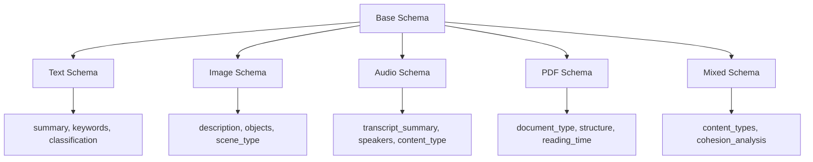

# Metadata Schemas

Ragdoll implements a sophisticated metadata schema system that ensures consistent, structured metadata generation across different content types. The system uses JSON Schema-based definitions to guide LLM-powered metadata extraction and validate the resulting structured data.

## Structured Content Analysis and Validation

The metadata schema system provides:

- **Content-Type Specific Schemas**: Tailored metadata structures for text, images, audio, PDFs, and multi-modal content
- **LLM-Guided Generation**: Schema-aware prompts ensure consistent metadata format and quality
- **Validation Framework**: Automatic validation of generated metadata against defined schemas
- **Extensible Architecture**: Easy addition of new content types and custom schema definitions
- **Dual Metadata System**: Separation of LLM-generated content metadata and system file metadata
- **Quality Assurance**: Built-in fallback strategies and error handling for robust metadata generation

## Schema Architecture

Ragdoll uses a dual metadata architecture that separates concerns between AI-generated content insights and technical file properties:

### Dual Metadata System

**LLM-Generated Content Metadata (`metadata` column)**
```ruby
# Stored in document.metadata (JSON column)
{
  "summary": "This research paper explores machine learning applications...",
  "keywords": ["machine learning", "neural networks", "AI"],
  "classification": "research",
  "topics": ["artificial intelligence", "computer science"],
  "sentiment": "neutral",
  "complexity_level": "advanced",
  "reading_time_minutes": 25,
  "language": "en",
  "tags": ["AI", "research", "academic"]
}
```

**System-Generated File Metadata (`file_metadata` column)**
```ruby
# Stored in document.file_metadata (JSON column)
{
  "file_size": 2048576,
  "file_type": "pdf",
  "page_count": 15,
  "creation_date": "2024-01-15T10:30:00Z",
  "modification_date": "2024-01-20T14:15:30Z",
  "author": "Dr. Jane Smith",
  "title": "Advanced ML Techniques",
  "encoding": "UTF-8",
  "extraction_method": "pdf-reader",
  "processing_time_ms": 1250
}
```

**Schema Separation Rationale:**
1. **Semantic vs Technical**: Content metadata focuses on meaning, file metadata on technical properties
2. **LLM vs System Generated**: Different generation methods require different validation approaches
3. **Update Patterns**: Content metadata may be regenerated, file metadata is typically static
4. **Search Optimization**: Separate indexes for semantic search vs file property filtering
5. **Schema Evolution**: Content schemas evolve with AI capabilities, file schemas remain stable

**Integration Patterns:**
```ruby
# Combined search across both metadata types
Document.search_combined(
  content_query: "machine learning",  # Searches content metadata
  file_filters: { file_type: 'pdf', page_count: 10..50 }  # Filters file metadata
)

# Unified metadata access
document.combined_metadata  # Merges both metadata types
document.searchable_content # Optimized for search indexing
```

### Content Type Schemas

Ragdoll provides specialized schemas for different content types:



**Schema Inheritance Pattern:**
```ruby
module MetadataSchemas
  # Base fields common to all content types
  BASE_PROPERTIES = {
    summary: { type: "string", description: "Content summary" },
    keywords: { type: "array", items: { type: "string" } },
    classification: { type: "string" },
    tags: { type: "array", items: { type: "string" } }
  }.freeze

  # Content-specific extensions
  TEXT_EXTENSIONS = {
    reading_time_minutes: { type: "integer" },
    complexity_level: { type: "string", enum: %w[beginner intermediate advanced expert] },
    sentiment: { type: "string", enum: %w[positive negative neutral mixed] }
  }.freeze

  # Combined schema
  TEXT_SCHEMA = {
    type: "object",
    properties: BASE_PROPERTIES.merge(TEXT_EXTENSIONS),
    required: %w[summary keywords classification]
  }.freeze
end
```

## Standard Metadata Fields

Ragdoll defines comprehensive metadata fields organized by function and content type:

### Content Analysis Fields

#### Summary Generation
```ruby
# Text content summary
summary: {
  type: "string",
  description: "Concise summary of the text content (2-3 sentences)",
  min_length: 50,
  max_length: 500,
  required: true
}

# Image content summary
summary: {
  type: "string",
  description: "Brief summary of the image content (1 sentence)",
  max_length: 200,
  required: true
}

# Multi-modal summary
summary: {
  type: "string",
  description: "Overall summary combining all content types in the document",
  max_length: 600,
  required: true
}
```

#### Keyword Extraction
```ruby
# Standard keyword field (all content types)
keywords: {
  type: "array",
  items: { type: "string" },
  description: "Relevant keywords and phrases extracted from content",
  maxItems: 10,
  minItems: 3,
  required: true,
  validation: {
    min_word_length: 3,
    no_stopwords: true,
    unique_only: true
  }
}

# Enhanced keywords with confidence scores
keywords_enhanced: {
  type: "array",
  items: {
    type: "object",
    properties: {
      term: { type: "string" },
      confidence: { type: "number", minimum: 0, maximum: 1 },
      category: { type: "string", enum: %w[concept entity action descriptor] }
    }
  },
  maxItems: 15
}
```

#### Topic Classification
```ruby
# Primary classification
classification: {
  type: "string",
  enum: {
    text: %w[research article blog documentation technical legal financial marketing other],
    image: %w[technical diagram photo artwork chart screenshot document other],
    audio: %w[educational entertainment business technical musical interview podcast other],
    pdf: %w[academic business legal technical manual report presentation other]
  },
  required: true
}

# Detailed topics array
topics: {
  type: "array",
  items: { type: "string" },
  description: "Main topics discussed in the document",
  maxItems: 5,
  validation: {
    hierarchical: true,  # Support parent::child topic structure
    taxonomy_validation: true
  }
}

# Classification confidence
classification_confidence: {
  type: "number",
  minimum: 0,
  maximum: 1,
  description: "Confidence score for the assigned classification"
}
```

#### Sentiment Analysis
```ruby
# Basic sentiment (text content)
sentiment: {
  type: "string",
  enum: %w[positive negative neutral mixed],
  description: "Overall sentiment of the text"
}

# Detailed sentiment analysis
sentiment_detailed: {
  type: "object",
  properties: {
    overall: { type: "string", enum: %w[positive negative neutral mixed] },
    confidence: { type: "number", minimum: 0, maximum: 1 },
    emotional_tone: {
      type: "array",
      items: { type: "string" },
      enum: %w[joy sadness anger fear disgust surprise trust anticipation]
    },
    subjectivity: { type: "string", enum: %w[objective subjective] }
  }
}

# Mood for images and audio
mood: {
  type: "string",
  enum: {
    image: %w[professional casual formal technical artistic dramatic serene energetic other],
    audio: %w[formal casual energetic calm professional educational entertaining informative other]
  },
  description: "Overall mood or tone of the content"
}
```

#### Content Categorization
```ruby
# Complexity assessment
complexity_level: {
  type: "string",
  enum: %w[beginner intermediate advanced expert],
  description: "Complexity/difficulty level of the content",
  scoring_criteria: {
    beginner: "Basic concepts, simple language, introductory material",
    intermediate: "Some specialized knowledge required, moderate complexity",
    advanced: "Specialized knowledge required, complex concepts",
    expert: "Deep expertise required, highly technical content"
  }
}

# Reading time estimation
reading_time_minutes: {
  type: "integer",
  minimum: 1,
  maximum: 600,  # 10 hours max
  description: "Estimated reading time in minutes",
  calculation: "Based on 200-250 words per minute average reading speed"
}

# Language detection
language: {
  type: "string",
  pattern: "^[a-z]{2}(-[A-Z]{2})?$",  # ISO 639-1 format
  description: "Primary language of the content",
  examples: ["en", "es", "fr", "de", "zh-CN"]
}

# User-defined tags
tags: {
  type: "array",
  items: { type: "string" },
  description: "User-defined or AI-suggested tags for organization",
  maxItems: 20,
  validation: {
    no_spaces: false,  # Allow multi-word tags
    lowercase: true,
    unique_only: true
  }
}
```

### Technical Metadata

#### Processing Parameters
```ruby
# Content processing metadata (stored in file_metadata)
processing_metadata: {
  extraction_method: { type: "string" },  # "pdf-reader", "docx", "image-magick"
  processing_time_ms: { type: "integer" },
  embedding_model: { type: "string" },
  embedding_dimensions: { type: "integer" },
  chunk_count: { type: "integer" },
  chunk_strategy: { type: "string" },
  content_hash: { type: "string" },  # For change detection
  last_processed_at: { type: "string", format: "date-time" }
}
```

#### Quality Metrics
```ruby
# Content quality assessment
quality_metrics: {
  content_completeness: { type: "number", minimum: 0, maximum: 1 },
  extraction_confidence: { type: "number", minimum: 0, maximum: 1 },
  metadata_completeness: { type: "number", minimum: 0, maximum: 1 },
  validation_score: { type: "number", minimum: 0, maximum: 1 },
  overall_quality: { type: "number", minimum: 0, maximum: 1 }
}
```

#### Performance Data
```ruby
# Performance tracking metadata
performance_data: {
  file_size_bytes: { type: "integer" },
  processing_duration_ms: { type: "integer" },
  embedding_generation_time_ms: { type: "integer" },
  metadata_generation_time_ms: { type: "integer" },
  memory_usage_mb: { type: "number" },
  cpu_usage_percent: { type: "number" },
  api_calls_made: { type: "integer" },
  cost_estimate_usd: { type: "number" }
}
```

## Schema Validation

Ragdoll implements comprehensive validation to ensure metadata quality and consistency:

### Validation Rules

#### Required Fields Validation
```ruby
# Schema-based required field checking
def self.validate_metadata(document_type, metadata)
  schema = schema_for(document_type)
  required_fields = schema[:required] || []
  errors = []

  required_fields.each do |field|
    unless metadata.key?(field) && !metadata[field].to_s.strip.empty?
      errors << "Missing required field: #{field}"
    end
  end

  errors
end

# Content-specific required fields
TEXT_SCHEMA[:required] = %w[summary keywords classification]
IMAGE_SCHEMA[:required] = %w[description summary scene_type classification]
AUDIO_SCHEMA[:required] = %w[summary content_type classification]
PDF_SCHEMA[:required] = %w[summary document_type classification]
MIXED_SCHEMA[:required] = %w[summary content_types primary_content_type classification]
```

#### Data Type Constraints
```ruby
# Type validation with coercion
class MetadataValidator
  def self.validate_field_type(field_name, value, field_schema)
    expected_type = field_schema[:type]

    case expected_type
    when 'string'
      validate_string_field(field_name, value, field_schema)
    when 'array'
      validate_array_field(field_name, value, field_schema)
    when 'integer'
      validate_integer_field(field_name, value, field_schema)
    when 'number'
      validate_number_field(field_name, value, field_schema)
    when 'boolean'
      validate_boolean_field(field_name, value, field_schema)
    when 'object'
      validate_object_field(field_name, value, field_schema)
    else
      ["Unknown field type: #{expected_type}"]
    end
  end

  private

  def self.validate_string_field(field_name, value, schema)
    errors = []

    unless value.is_a?(String)
      return ["#{field_name} must be a string, got #{value.class}"]
    end

    # Length constraints
    if schema[:minLength] && value.length < schema[:minLength]
      errors << "#{field_name} must be at least #{schema[:minLength]} characters"
    end

    if schema[:maxLength] && value.length > schema[:maxLength]
      errors << "#{field_name} must be no more than #{schema[:maxLength]} characters"
    end

    # Enum validation
    if schema[:enum] && !schema[:enum].include?(value)
      errors << "#{field_name} must be one of: #{schema[:enum].join(', ')}"
    end

    # Pattern validation
    if schema[:pattern] && !value.match?(Regexp.new(schema[:pattern]))
      errors << "#{field_name} does not match required pattern"
    end

    errors
  end
end
```

#### Format Validation
```ruby
# Specialized format validators
class FormatValidators
  # Language code validation (ISO 639-1)
  def self.validate_language_code(code)
    valid_codes = %w[en es fr de it pt ru ja ko zh ar hi]
    return true if valid_codes.include?(code)
    return true if code.match?(/^[a-z]{2}-[A-Z]{2}$/)  # en-US format
    false
  end

  # Keyword validation
  def self.validate_keywords(keywords)
    errors = []

    return ["Keywords must be an array"] unless keywords.is_a?(Array)

    keywords.each_with_index do |keyword, index|
      unless keyword.is_a?(String)
        errors << "Keyword at index #{index} must be a string"
        next
      end

      if keyword.length < 3
        errors << "Keyword '#{keyword}' must be at least 3 characters"
      end

      if keyword.length > 50
        errors << "Keyword '#{keyword}' must be no more than 50 characters"
      end

      if keyword.match?(/^\d+$/)  # Only numbers
        errors << "Keyword '#{keyword}' cannot be only numbers"
      end
    end

    # Check for duplicates
    duplicates = keywords.group_by(&:downcase).select { |k, v| v.size > 1 }.keys
    if duplicates.any?
      errors << "Duplicate keywords found: #{duplicates.join(', ')}"
    end

    errors
  end

  # URL validation for image sources
  def self.validate_url(url)
    return true if url.nil? || url.empty?

    begin
      uri = URI.parse(url)
      uri.is_a?(URI::HTTP) || uri.is_a?(URI::HTTPS)
    rescue URI::InvalidURIError
      false
    end
  end
end
```

#### Range Constraints
```ruby
# Numeric range validation
class RangeValidator
  def self.validate_reading_time(minutes)
    errors = []

    unless minutes.is_a?(Integer)
      return ["Reading time must be an integer"]
    end

    if minutes < 1
      errors << "Reading time must be at least 1 minute"
    end

    if minutes > 600  # 10 hours
      errors << "Reading time cannot exceed 600 minutes (10 hours)"
    end

    # Warn for unusual values
    if minutes > 120  # 2 hours
      errors << "Warning: Reading time of #{minutes} minutes seems unusually high"
    end

    errors
  end

  def self.validate_confidence_score(score)
    return ["Confidence score must be a number"] unless score.is_a?(Numeric)
    return ["Confidence score must be between 0 and 1"] unless (0..1).cover?(score)
    []
  end
end
```

### Error Handling

#### Validation Error Reporting
```ruby
class ValidationErrorReporter
  def self.generate_detailed_report(document_type, metadata, errors)
    {
      document_type: document_type,
      validation_status: errors.empty? ? 'passed' : 'failed',
      error_count: errors.length,
      errors: errors.map { |error| format_error(error) },
      metadata_completeness: calculate_completeness(document_type, metadata),
      suggestions: generate_suggestions(document_type, errors),
      schema_version: get_schema_version(document_type)
    }
  end

  private

  def self.format_error(error)
    {
      message: error,
      severity: determine_severity(error),
      field: extract_field_name(error),
      suggestion: suggest_fix(error)
    }
  end

  def self.determine_severity(error)
    case error
    when /Missing required field/
      'critical'
    when /must be one of/
      'error'
    when /Warning:/
      'warning'
    else
      'error'
    end
  end
end
```

#### Schema Compatibility Checking
```ruby
class SchemaCompatibilityChecker
  def self.check_compatibility(old_metadata, new_schema)
    compatibility_report = {
      compatible: true,
      issues: [],
      migration_required: false,
      breaking_changes: []
    }

    # Check for removed required fields
    old_schema = infer_schema_from_metadata(old_metadata)
    new_required = new_schema[:required] || []
    old_required = old_schema[:required] || []

    removed_required = old_required - new_required
    added_required = new_required - old_required

    if removed_required.any?
      compatibility_report[:issues] << {
        type: 'removed_required_fields',
        fields: removed_required,
        impact: 'breaking_change'
      }
      compatibility_report[:compatible] = false
    end

    if added_required.any?
      compatibility_report[:issues] << {
        type: 'new_required_fields',
        fields: added_required,
        impact: 'migration_required'
      }
      compatibility_report[:migration_required] = true
    end

    compatibility_report
  end
end
```

#### Fallback Strategies
```ruby
class MetadataFallbackHandler
  def self.apply_fallbacks(document_type, invalid_metadata, errors)
    fallback_metadata = invalid_metadata.dup

    errors.each do |error|
      case error
      when /Missing required field: summary/
        fallback_metadata['summary'] = generate_fallback_summary(invalid_metadata)
      when /Missing required field: keywords/
        fallback_metadata['keywords'] = extract_fallback_keywords(invalid_metadata)
      when /Missing required field: classification/
        fallback_metadata['classification'] = infer_classification(document_type, invalid_metadata)
      when /Invalid language code/
        fallback_metadata['language'] = 'en'  # Default to English
      when /Reading time.*unreasonable/
        fallback_metadata['reading_time_minutes'] = estimate_reading_time(invalid_metadata)
      end
    end

    # Re-validate with fallbacks applied
    new_errors = validate_metadata(document_type, fallback_metadata)

    {
      fallback_metadata: fallback_metadata,
      remaining_errors: new_errors,
      fallbacks_applied: errors.length - new_errors.length
    }
  end

  private

  def self.generate_fallback_summary(metadata)
    # Generate basic summary from available content
    if metadata['description']
      metadata['description'][0..200] + (metadata['description'].length > 200 ? '...' : '')
    elsif metadata['title']
      "Document: #{metadata['title']}"
    else
      "Content summary not available"
    end
  end
end
```

#### Quality Thresholds
```ruby
class QualityThresholdManager
  QUALITY_THRESHOLDS = {
    minimum_acceptable: 0.6,
    good_quality: 0.8,
    excellent_quality: 0.95
  }.freeze

  def self.assess_metadata_quality(document_type, metadata)
    schema = MetadataSchemas.schema_for(document_type)
    total_possible_fields = schema[:properties].keys.length

    scores = {
      completeness: calculate_completeness_score(metadata, schema),
      accuracy: calculate_accuracy_score(metadata, schema),
      richness: calculate_richness_score(metadata, schema),
      consistency: calculate_consistency_score(metadata)
    }

    overall_score = (
      scores[:completeness] * 0.3 +
      scores[:accuracy] * 0.4 +
      scores[:richness] * 0.2 +
      scores[:consistency] * 0.1
    )

    {
      overall_score: overall_score,
      quality_level: determine_quality_level(overall_score),
      component_scores: scores,
      meets_threshold: overall_score >= QUALITY_THRESHOLDS[:minimum_acceptable],
      recommendations: generate_quality_recommendations(overall_score, scores)
    }
  end
end
```

## Custom Schemas

Ragdoll supports creating custom metadata schemas for specialized content types and domain-specific requirements:

### Schema Definition

#### JSON Schema Format
```ruby
# Custom schema for legal documents
LEGAL_DOCUMENT_SCHEMA = {
  type: "object",
  schema_version: "1.0.0",
  schema_id: "legal_document_v1",
  description: "Metadata schema for legal documents and contracts",

  properties: {
    # Required base fields (inherited)
    summary: {
      type: "string",
      description: "Legal document summary focusing on key provisions",
      minLength: 100,
      maxLength: 1000
    },

    # Legal-specific fields
    document_type: {
      type: "string",
      enum: %w[contract agreement policy statute regulation ordinance brief motion other],
      description: "Type of legal document"
    },

    jurisdiction: {
      type: "string",
      description: "Legal jurisdiction (e.g., 'US-CA', 'UK', 'EU')",
      pattern: "^[A-Z]{2}(-[A-Z]{2})?$"
    },

    legal_areas: {
      type: "array",
      items: {
        type: "string",
        enum: %w[contract corporate employment intellectual_property real_estate family criminal civil other]
      },
      maxItems: 5,
      description: "Areas of law covered by this document"
    },

    parties: {
      type: "array",
      items: {
        type: "object",
        properties: {
          name: { type: "string" },
          role: { type: "string", enum: %w[plaintiff defendant buyer seller lessor lessee employer employee other] },
          entity_type: { type: "string", enum: %w[individual corporation llc partnership government other] }
        },
        required: %w[name role]
      },
      maxItems: 10
    },

    effective_date: {
      type: "string",
      format: "date",
      description: "Date when the document becomes effective"
    },

    expiration_date: {
      type: "string",
      format: "date",
      description: "Date when the document expires (if applicable)"
    },

    key_terms: {
      type: "array",
      items: {
        type: "object",
        properties: {
          term: { type: "string" },
          definition: { type: "string" },
          importance: { type: "string", enum: %w[critical important standard] }
        },
        required: %w[term definition]
      },
      maxItems: 20
    },

    compliance_requirements: {
      type: "array",
      items: { type: "string" },
      description: "Regulatory or legal compliance requirements"
    },

    risk_level: {
      type: "string",
      enum: %w[low medium high critical],
      description: "Risk assessment level for the document"
    }
  },

  required: %w[summary document_type jurisdiction legal_areas],

  # Custom validation rules
  custom_validators: %w[validate_jurisdiction_format validate_date_consistency validate_party_roles],

  # Schema metadata
  created_by: "Legal Team",
  created_at: "2024-01-15",
  compatible_with: ["base_schema_v1"],
  extends: "base_document_schema"
}.freeze
```

#### Field Type Definitions
```ruby
# Extended field type system
CUSTOM_FIELD_TYPES = {
  # Geographic types
  "coordinates" => {
    type: "object",
    properties: {
      latitude: { type: "number", minimum: -90, maximum: 90 },
      longitude: { type: "number", minimum: -180, maximum: 180 }
    },
    required: %w[latitude longitude]
  },

  # Monetary types
  "currency_amount" => {
    type: "object",
    properties: {
      amount: { type: "number", minimum: 0 },
      currency: { type: "string", pattern: "^[A-Z]{3}$" },  # ISO 4217
      formatted: { type: "string" }
    },
    required: %w[amount currency]
  },

  # Person/entity types
  "person" => {
    type: "object",
    properties: {
      name: { type: "string" },
      email: { type: "string", format: "email" },
      role: { type: "string" },
      organization: { type: "string" }
    },
    required: %w[name]
  },

  # Date range types
  "date_range" => {
    type: "object",
    properties: {
      start_date: { type: "string", format: "date" },
      end_date: { type: "string", format: "date" },
      duration_days: { type: "integer", minimum: 0 }
    },
    required: %w[start_date end_date]
  }
}.freeze
```

#### Validation Rule Specification
```ruby
# Custom validation rules for specialized schemas
class CustomValidators
  def self.validate_jurisdiction_format(value)
    # US state codes, country codes, or international codes
    valid_patterns = [
      /^US-[A-Z]{2}$/,    # US-CA, US-NY
      /^[A-Z]{2}$/,       # US, UK, DE
      /^EU$/,             # European Union
      /^UN$/              # United Nations
    ]

    return [] if valid_patterns.any? { |pattern| value.match?(pattern) }
    ["Invalid jurisdiction format: #{value}"]
  end

  def self.validate_date_consistency(metadata)
    errors = []

    if metadata['effective_date'] && metadata['expiration_date']
      effective = Date.parse(metadata['effective_date'])
      expiration = Date.parse(metadata['expiration_date'])

      if effective > expiration
        errors << "Effective date cannot be after expiration date"
      end

      if expiration < Date.current
        errors << "Warning: Document appears to be expired"
      end
    end

    errors
  rescue Date::Error
    ["Invalid date format in date fields"]
  end

  def self.validate_party_roles(parties)
    return [] unless parties.is_a?(Array)

    errors = []
    role_counts = parties.group_by { |p| p['role'] }.transform_values(&:count)

    # Business logic validation
    if role_counts['buyer'] && role_counts['seller']
      unless role_counts['buyer'] == role_counts['seller']
        errors << "Number of buyers must equal number of sellers in transaction"
      end
    end

    # Check for conflicting roles
    parties.each do |party|
      name = party['name']
      conflicting_parties = parties.select { |p| p['name'] == name && p['role'] != party['role'] }

      if conflicting_parties.any?
        errors << "Party '#{name}' has conflicting roles: #{[party['role']] + conflicting_parties.map { |p| p['role'] }}"
      end
    end

    errors
  end
end
```

#### Documentation Requirements
```ruby
# Schema documentation template
SCHEMA_DOCUMENTATION_TEMPLATE = {
  schema_info: {
    name: "Legal Document Schema",
    version: "1.0.0",
    description: "Comprehensive metadata schema for legal documents",
    use_cases: [
      "Contract analysis and management",
      "Legal compliance tracking",
      "Document classification and search"
    ],
    target_documents: ["contracts", "agreements", "policies", "regulations"]
  },

  field_documentation: {
    "jurisdiction" => {
      description: "Legal jurisdiction where document applies",
      examples: ["US-CA", "UK", "EU"],
      validation_notes: "Must follow ISO country codes or US state format",
      business_impact: "Critical for determining applicable laws and regulations"
    },

    "parties" => {
      description: "All parties involved in the legal document",
      examples: [
        { name: "Acme Corp", role: "buyer", entity_type: "corporation" },
        { name: "John Smith", role: "seller", entity_type: "individual" }
      ],
      validation_notes: "Must include name and role for each party",
      business_impact: "Essential for contract management and obligation tracking"
    }
  },

  usage_guidelines: {
    best_practices: [
      "Always validate jurisdiction format before processing",
      "Include all parties mentioned in the document",
      "Use standardized role names for consistency"
    ],
    common_mistakes: [
      "Forgetting to include all parties",
      "Using non-standard jurisdiction codes",
      "Inconsistent date formats"
    ]
  }
}.freeze
```

### Schema Registration

#### Schema Loading Mechanisms
```ruby
class CustomSchemaRegistry
  @@registered_schemas = {}
  @@schema_versions = {}

  def self.register_schema(schema_id, schema_definition)
    validate_schema_format!(schema_definition)

    version = schema_definition[:schema_version] || '1.0.0'

    @@registered_schemas[schema_id] = schema_definition
    @@schema_versions[schema_id] ||= []
    @@schema_versions[schema_id] << version

    # Register custom validators if present
    if schema_definition[:custom_validators]
      register_custom_validators(schema_id, schema_definition[:custom_validators])
    end

    Rails.logger.info "Registered custom schema: #{schema_id} v#{version}"
  end

  def self.load_schemas_from_directory(directory_path)
    Dir.glob(File.join(directory_path, '*.rb')).each do |schema_file|
      load_schema_file(schema_file)
    end
  end

  def self.get_schema(schema_id, version: 'latest')
    base_schema = @@registered_schemas[schema_id]
    return nil unless base_schema

    if version == 'latest'
      base_schema
    else
      get_schema_version(schema_id, version)
    end
  end

  private

  def self.validate_schema_format!(schema)
    required_keys = %w[type properties required]
    missing_keys = required_keys - schema.keys.map(&:to_s)

    if missing_keys.any?
      raise "Schema missing required keys: #{missing_keys.join(', ')}"
    end

    unless schema[:type] == 'object'
      raise "Schema type must be 'object', got '#{schema[:type]}'"
    end
  end
end

# Usage
CustomSchemaRegistry.register_schema('legal_document', LEGAL_DOCUMENT_SCHEMA)
CustomSchemaRegistry.load_schemas_from_directory(Rails.root.join('config', 'schemas'))
```

#### Version Management
```ruby
class SchemaVersionManager
  def self.create_new_version(schema_id, updates)
    current_schema = CustomSchemaRegistry.get_schema(schema_id)
    return nil unless current_schema

    current_version = current_schema[:schema_version] || '1.0.0'
    new_version = increment_version(current_version, updates[:breaking_changes])

    new_schema = current_schema.deep_merge(updates).merge(
      schema_version: new_version,
      previous_version: current_version,
      migration_guide: generate_migration_guide(current_schema, updates)
    )

    CustomSchemaRegistry.register_schema("#{schema_id}_v#{new_version.gsub('.', '_')}", new_schema)

    new_schema
  end

  def self.increment_version(current_version, has_breaking_changes)
    major, minor, patch = current_version.split('.').map(&:to_i)

    if has_breaking_changes
      "#{major + 1}.0.0"
    elsif updates[:new_fields]&.any?
      "#{major}.#{minor + 1}.0"
    else
      "#{major}.#{minor}.#{patch + 1}"
    end
  end
end
```

#### Migration Strategies
```ruby
class SchemaMigrator
  def self.migrate_metadata(old_metadata, from_schema, to_schema)
    migration_plan = create_migration_plan(from_schema, to_schema)
    migrated_metadata = old_metadata.dup

    migration_plan[:field_mappings].each do |old_field, new_field|
      if migrated_metadata.key?(old_field)
        migrated_metadata[new_field] = migrated_metadata.delete(old_field)
      end
    end

    migration_plan[:field_transformations].each do |field, transformer|
      if migrated_metadata.key?(field)
        migrated_metadata[field] = apply_transformation(migrated_metadata[field], transformer)
      end
    end

    migration_plan[:default_values].each do |field, default|
      migrated_metadata[field] ||= default
    end

    {
      migrated_metadata: migrated_metadata,
      migration_warnings: validate_migrated_metadata(migrated_metadata, to_schema),
      migration_log: migration_plan[:log]
    }
  end
end
```

## Domain-Specific Schemas

Ragdoll provides specialized schemas for common document domains:

### Academic Papers

#### Citation Extraction Schema
```ruby
ACADEMIC_PAPER_SCHEMA = {
  type: "object",
  properties: {
    # Standard fields
    summary: {
      type: "string",
      description: "Abstract or executive summary of the research"
    },

    # Academic-specific fields
    paper_type: {
      type: "string",
      enum: %w[research_paper review_article conference_paper thesis dissertation preprint technical_report other],
      description: "Type of academic document"
    },

    research_areas: {
      type: "array",
      items: { type: "string" },
      description: "Research disciplines and fields covered",
      maxItems: 5
    },

    authors: {
      type: "array",
      items: {
        type: "object",
        properties: {
          name: { type: "string" },
          affiliation: { type: "string" },
          email: { type: "string", format: "email" },
          orcid: { type: "string", pattern: "^\\d{4}-\\d{4}-\\d{4}-\\d{3}[0-9X]$" },
          corresponding_author: { type: "boolean" }
        },
        required: %w[name]
      },
      minItems: 1
    },

    publication_info: {
      type: "object",
      properties: {
        journal: { type: "string" },
        conference: { type: "string" },
        volume: { type: "string" },
        issue: { type: "string" },
        pages: { type: "string" },
        publication_date: { type: "string", format: "date" },
        doi: { type: "string", pattern: "^10\\.\\d+/.+" },
        isbn: { type: "string" },
        publisher: { type: "string" }
      }
    },

    citations: {
      type: "array",
      items: {
        type: "object",
        properties: {
          title: { type: "string" },
          authors: { type: "string" },
          year: { type: "integer", minimum: 1900, maximum: 2030 },
          source: { type: "string" },
          doi: { type: "string" },
          citation_type: { type: "string", enum: %w[foundational supportive comparative critical methodological] }
        },
        required: %w[title authors year]
      }
    },

    methodology: {
      type: "object",
      properties: {
        research_methods: {
          type: "array",
          items: { type: "string", enum: %w[experimental observational survey case_study meta_analysis theoretical computational qualitative quantitative mixed_methods] }
        },
        data_sources: { type: "array", items: { type: "string" } },
        sample_size: { type: "integer", minimum: 0 },
        statistical_methods: { type: "array", items: { type: "string" } }
      }
    },

    funding: {
      type: "array",
      items: {
        type: "object",
        properties: {
          agency: { type: "string" },
          grant_number: { type: "string" },
          amount: { type: "number" },
          currency: { type: "string" }
        },
        required: %w[agency]
      }
    },

    peer_review_status: {
      type: "string",
      enum: %w[peer_reviewed non_peer_reviewed preprint under_review],
      description: "Peer review status of the publication"
    },

    impact_metrics: {
      type: "object",
      properties: {
        citation_count: { type: "integer", minimum: 0 },
        h_index_contribution: { type: "number" },
        altmetric_score: { type: "number" },
        download_count: { type: "integer", minimum: 0 }
      }
    }
  },

  required: %w[summary paper_type research_areas authors]
}.freeze
```

### Legal Documents

#### Legal Classification Schema
```ruby
LEGAL_DOCUMENT_SCHEMA = {
  type: "object",
  properties: {
    # Standard fields adapted for legal content
    summary: {
      type: "string",
      description: "Legal summary focusing on key provisions and obligations",
      minLength: 100
    },

    # Legal-specific classification
    document_type: {
      type: "string",
      enum: %w[contract agreement policy statute regulation ordinance brief motion pleading judgment settlement nda license other],
      description: "Type of legal document"
    },

    jurisdiction: {
      type: "object",
      properties: {
        primary: { type: "string", description: "Primary jurisdiction (US-CA, UK, EU)" },
        additional: { type: "array", items: { type: "string" } },
        court_level: { type: "string", enum: %w[federal state local municipal international] }
      },
      required: %w[primary]
    },

    legal_areas: {
      type: "array",
      items: {
        type: "string",
        enum: %w[contract corporate employment intellectual_property real_estate family criminal civil tax immigration environmental securities banking healthcare privacy data_protection other]
      },
      maxItems: 5
    },

    parties: {
      type: "array",
      items: {
        type: "object",
        properties: {
          name: { type: "string" },
          role: {
            type: "string",
            enum: %w[plaintiff defendant buyer seller lessor lessee employer employee licensor licensee grantor grantee other]
          },
          entity_type: {
            type: "string",
            enum: %w[individual corporation llc partnership government nonprofit trust estate other]
          },
          representation: { type: "string", description: "Legal representation/counsel" }
        },
        required: %w[name role entity_type]
      }
    },

    key_provisions: {
      type: "array",
      items: {
        type: "object",
        properties: {
          provision_type: {
            type: "string",
            enum: %w[payment termination liability confidentiality indemnification warranty limitation_of_liability force_majeure governing_law dispute_resolution other]
          },
          description: { type: "string" },
          critical: { type: "boolean" },
          page_reference: { type: "string" }
        },
        required: %w[provision_type description]
      }
    },

    compliance_requirements: {
      type: "array",
      items: {
        type: "object",
        properties: {
          regulation: { type: "string" },
          requirement: { type: "string" },
          deadline: { type: "string", format: "date" },
          responsible_party: { type: "string" },
          penalty: { type: "string" }
        },
        required: %w[regulation requirement]
      }
    },

    risk_analysis: {
      type: "object",
      properties: {
        overall_risk_level: { type: "string", enum: %w[low medium high critical] },
        financial_exposure: { type: "string" },
        operational_risks: { type: "array", items: { type: "string" } },
        legal_risks: { type: "array", items: { type: "string" } },
        mitigation_strategies: { type: "array", items: { type: "string" } }
      }
    },

    important_dates: {
      type: "array",
      items: {
        type: "object",
        properties: {
          date: { type: "string", format: "date" },
          description: { type: "string" },
          date_type: { type: "string", enum: %w[effective_date expiration_date deadline milestone notification_date other] },
          recurring: { type: "boolean" },
          recurrence_pattern: { type: "string" }
        },
        required: %w[date description date_type]
      }
    }
  },

  required: %w[summary document_type jurisdiction legal_areas parties]
}.freeze
```

### Technical Documentation

#### API Documentation Schema
```ruby
TECHNICAL_DOCUMENTATION_SCHEMA = {
  type: "object",
  properties: {
    # Standard technical fields
    summary: {
      type: "string",
      description: "Technical summary of the documentation content"
    },

    documentation_type: {
      type: "string",
      enum: %w[api_reference user_guide developer_guide installation_guide troubleshooting architecture_document code_documentation release_notes other],
      description: "Type of technical documentation"
    },

    # API-specific fields
    api_info: {
      type: "object",
      properties: {
        api_name: { type: "string" },
        version: { type: "string", pattern: "^\\d+\\.\\d+\\.\\d+" },
        base_url: { type: "string", format: "uri" },
        authentication_methods: {
          type: "array",
          items: { type: "string", enum: %w[api_key oauth2 jwt basic_auth bearer_token none] }
        },
        supported_formats: {
          type: "array",
          items: { type: "string", enum: %w[json xml yaml csv] }
        },
        rate_limits: {
          type: "object",
          properties: {
            requests_per_minute: { type: "integer" },
            requests_per_hour: { type: "integer" },
            requests_per_day: { type: "integer" }
          }
        }
      }
    },

    endpoints: {
      type: "array",
      items: {
        type: "object",
        properties: {
          path: { type: "string" },
          method: { type: "string", enum: %w[GET POST PUT DELETE PATCH HEAD OPTIONS] },
          description: { type: "string" },
          parameters: {
            type: "array",
            items: {
              type: "object",
              properties: {
                name: { type: "string" },
                type: { type: "string" },
                required: { type: "boolean" },
                description: { type: "string" },
                example: { type: "string" }
              },
              required: %w[name type required]
            }
          },
          response_codes: {
            type: "array",
            items: {
              type: "object",
              properties: {
                code: { type: "integer" },
                description: { type: "string" },
                example: { type: "string" }
              }
            }
          }
        },
        required: %w[path method description]
      }
    },

    code_examples: {
      type: "array",
      items: {
        type: "object",
        properties: {
          language: { type: "string", enum: %w[javascript python ruby java php curl bash other] },
          code: { type: "string" },
          description: { type: "string" },
          output_example: { type: "string" }
        },
        required: %w[language code]
      }
    },

    dependencies: {
      type: "array",
      items: {
        type: "object",
        properties: {
          name: { type: "string" },
          version: { type: "string" },
          type: { type: "string", enum: %w[runtime development build peer optional] },
          purpose: { type: "string" },
          license: { type: "string" }
        },
        required: %w[name version type]
      }
    },

    version_info: {
      type: "object",
      properties: {
        current_version: { type: "string" },
        supported_versions: { type: "array", items: { type: "string" } },
        deprecated_versions: { type: "array", items: { type: "string" } },
        version_history: {
          type: "array",
          items: {
            type: "object",
            properties: {
              version: { type: "string" },
              release_date: { type: "string", format: "date" },
              changes: { type: "array", items: { type: "string" } },
              breaking_changes: { type: "boolean" }
            }
          }
        }
      }
    },

    technical_requirements: {
      type: "object",
      properties: {
        minimum_versions: {
          type: "object",
          patternProperties: {
            ".*": { type: "string" }  # e.g., "node": ">=14.0.0", "python": ">=3.8"
          }
        },
        supported_platforms: {
          type: "array",
          items: { type: "string", enum: %w[windows macos linux docker kubernetes web mobile] }
        },
        hardware_requirements: {
          type: "object",
          properties: {
            min_memory_mb: { type: "integer" },
            min_disk_space_mb: { type: "integer" },
            cpu_cores: { type: "integer" }
          }
        }
      }
    },

    troubleshooting: {
      type: "array",
      items: {
        type: "object",
        properties: {
          problem: { type: "string" },
          solution: { type: "string" },
          error_codes: { type: "array", items: { type: "string" } },
          category: { type: "string", enum: %w[installation configuration authentication authorization performance security other] }
        },
        required: %w[problem solution]
      }
    }
  },

  required: %w[summary documentation_type]
}.freeze
```

#### Code Documentation Schema
```ruby
CODE_DOCUMENTATION_SCHEMA = {
  type: "object",
  properties: {
    summary: {
      type: "string",
      description: "Summary of the code functionality and purpose"
    },

    code_type: {
      type: "string",
      enum: %w[class function module library framework application script configuration other],
      description: "Type of code being documented"
    },

    programming_language: {
      type: "string",
      enum: %w[javascript typescript python ruby java csharp cpp c php go rust swift kotlin scala other],
      description: "Primary programming language"
    },

    functions_and_methods: {
      type: "array",
      items: {
        type: "object",
        properties: {
          name: { type: "string" },
          description: { type: "string" },
          parameters: {
            type: "array",
            items: {
              type: "object",
              properties: {
                name: { type: "string" },
                type: { type: "string" },
                required: { type: "boolean" },
                default_value: { type: "string" },
                description: { type: "string" }
              }
            }
          },
          return_type: { type: "string" },
          return_description: { type: "string" },
          exceptions: { type: "array", items: { type: "string" } },
          complexity: { type: "string", enum: %w[O(1) O(log n) O(n) O(n log n) O(n²) O(2^n) other] }
        },
        required: %w[name description]
      }
    },

    design_patterns: {
      type: "array",
      items: { type: "string", enum: %w[singleton factory observer strategy command adapter decorator facade mvc mvp mvvm repository unit_of_work other] }
    },

    testing_info: {
      type: "object",
      properties: {
        test_coverage: { type: "number", minimum: 0, maximum: 100 },
        testing_frameworks: { type: "array", items: { type: "string" } },
        test_types: { type: "array", items: { type: "string", enum: %w[unit integration e2e performance security accessibility] } }
      }
    }
  },

  required: %w[summary code_type programming_language]
}.freeze
```

## LLM Metadata Generation

Ragdoll uses advanced prompt engineering and LLM integration for high-quality metadata generation:

### Generation Process

#### Content Analysis Pipeline
```ruby
class Ragdoll::MetadataGenerator
  def generate_for_document(document)
    content_analyzer = ContentAnalyzer.new(document)

    # Stage 1: Content preprocessing
    preprocessed_content = content_analyzer.preprocess

    # Stage 2: Schema selection
    schema = MetadataSchemas.schema_for(document.document_type)

    # Stage 3: Model selection
    model = select_optimal_model(document, schema)

    # Stage 4: Prompt generation
    prompt = generate_schema_aware_prompt(preprocessed_content, schema)

    # Stage 5: LLM generation
    raw_metadata = call_llm_with_retry(model, prompt)

    # Stage 6: Validation and cleanup
    validated_metadata = validate_and_clean(raw_metadata, schema)

    # Stage 7: Quality assessment
    quality_score = assess_metadata_quality(validated_metadata, schema)

    {
      metadata: validated_metadata,
      quality_score: quality_score,
      model_used: model,
      processing_time: Time.current - start_time
    }
  end
end
```

#### Model Selection Strategies
```ruby
class ModelSelector
  MODEL_CAPABILITIES = {
    'openai/gpt-4o' => {
      strengths: [:complex_analysis, :technical_content, :multilingual],
      optimal_for: [:academic_papers, :legal_documents, :technical_docs],
      cost: :high,
      speed: :medium,
      max_tokens: 128000
    },

    'openai/gpt-4o-mini' => {
      strengths: [:general_analysis, :speed, :cost_effective],
      optimal_for: [:text_documents, :simple_classification],
      cost: :low,
      speed: :fast,
      max_tokens: 128000
    },

    'anthropic/claude-3-sonnet-20240229' => {
      strengths: [:detailed_analysis, :accuracy, :reasoning],
      optimal_for: [:complex_documents, :legal_analysis],
      cost: :medium,
      speed: :medium,
      max_tokens: 200000
    },

    'anthropic/claude-3-haiku-20240307' => {
      strengths: [:speed, :simple_tasks, :cost_effective],
      optimal_for: [:keyword_extraction, :basic_classification],
      cost: :low,
      speed: :very_fast,
      max_tokens: 200000
    }
  }.freeze

  def self.select_optimal_model(document, schema)
    content_complexity = analyze_content_complexity(document)
    schema_complexity = analyze_schema_complexity(schema)

    # Score models based on document and schema requirements
    model_scores = MODEL_CAPABILITIES.map do |model, capabilities|
      score = 0

      # Content type optimization
      if capabilities[:optimal_for].include?(document.document_type.to_sym)
        score += 30
      end

      # Complexity matching
      case content_complexity
      when :high
        score += 20 if capabilities[:strengths].include?(:complex_analysis)
      when :medium
        score += 15 if capabilities[:cost] == :medium
      when :low
        score += 25 if capabilities[:speed] == :fast
      end

      # Schema complexity matching
      if schema_complexity == :high && capabilities[:strengths].include?(:detailed_analysis)
        score += 15
      end

      # Cost optimization (configurable weight)
      cost_weight = Ragdoll.config.metadata_generation[:cost_optimization_weight] || 0.2
      case capabilities[:cost]
      when :low then score += (20 * cost_weight)
      when :medium then score += (10 * cost_weight)
      when :high then score -= (10 * cost_weight)
      end

      [model, score]
    end

    # Return the highest scoring model
    model_scores.max_by { |model, score| score }.first
  end
end
```

#### Quality Assessment
```ruby
class MetadataQualityAssessor
  def self.assess_quality(metadata, schema, original_content)
    scores = {
      completeness: assess_completeness(metadata, schema),
      accuracy: assess_accuracy(metadata, original_content),
      consistency: assess_consistency(metadata),
      relevance: assess_relevance(metadata, original_content),
      specificity: assess_specificity(metadata)
    }

    # Weighted overall score
    overall_score = (
      scores[:completeness] * 0.25 +
      scores[:accuracy] * 0.30 +
      scores[:consistency] * 0.15 +
      scores[:relevance] * 0.20 +
      scores[:specificity] * 0.10
    )

    {
      overall_score: overall_score,
      component_scores: scores,
      quality_level: determine_quality_level(overall_score),
      recommendations: generate_improvement_recommendations(scores)
    }
  end
end
```

### Prompt Engineering

#### Schema-Aware Prompts
```ruby
class SchemaAwarePromptBuilder
  def build_prompt(content, schema)
    prompt_parts = []

    # System instruction
    prompt_parts << build_system_instruction(schema)

    # Schema specification
    prompt_parts << build_schema_specification(schema)

    # Content context
    prompt_parts << build_content_context(content)

    # Examples (few-shot learning)
    prompt_parts << build_examples(schema)

    # Final instruction
    prompt_parts << build_final_instruction(schema)

    prompt_parts.join("\n\n")
  end

  private

  def build_system_instruction(schema)
    <<~PROMPT
      You are an expert content analyst specializing in extracting structured metadata from documents.

      Your task is to analyze the provided content and generate metadata that strictly follows the given JSON schema.

      Key requirements:
      - All required fields must be present
      - Enum values must match exactly (case-sensitive)
      - Array fields must not exceed maxItems limits
      - Provide accurate, relevant, and specific information
      - If information is not available, use appropriate defaults or null values
      - Maintain consistency across related fields
    PROMPT
  end

  def build_schema_specification(schema)
    <<~PROMPT
      ## JSON Schema Specification

      ```json
      #{JSON.pretty_generate(schema)}
      ```

      Required fields: #{schema[:required]&.join(', ') || 'none'}
    PROMPT
  end

  def build_content_context(content)
    # Truncate content if too long for model context
    truncated_content = truncate_for_model(content)

    <<~PROMPT
      ## Content to Analyze

      ```
      #{truncated_content}
      ```
    PROMPT
  end

  def build_examples(schema)
    example_metadata = generate_example_metadata(schema)

    <<~PROMPT
      ## Example Output Format

      ```json
      #{JSON.pretty_generate(example_metadata)}
      ```
    PROMPT
  end

  def build_final_instruction(schema)
    <<~PROMPT
      ## Instructions

      Analyze the provided content and generate metadata following the exact schema format.

      Return only valid JSON that matches the schema - no additional text or explanations.

      Focus on:
      #{build_focus_points(schema)}
    PROMPT
  end

  def build_focus_points(schema)
    focus_points = []

    schema[:properties].each do |field, field_schema|
      case field
      when :summary, "summary"
        focus_points << "- Create a concise, informative summary (#{field_schema[:description]})"
      when :keywords, "keywords"
        focus_points << "- Extract relevant, specific keywords (max #{field_schema[:maxItems] || 10})"
      when :classification, "classification"
        focus_points << "- Choose the most appropriate classification from: #{field_schema[:enum]&.join(', ')}"
      end
    end

    focus_points.join("\n")
  end
end
```

#### Consistency Optimization
```ruby
class ConsistencyOptimizer
  def self.optimize_for_consistency(prompt, previous_metadata = nil)
    optimized_prompt = prompt.dup

    if previous_metadata
      # Add consistency instruction
      consistency_instruction = build_consistency_instruction(previous_metadata)
      optimized_prompt += "\n\n#{consistency_instruction}"
    end

    # Add terminology consistency rules
    optimized_prompt += "\n\n#{build_terminology_rules}"

    optimized_prompt
  end

  private

  def self.build_consistency_instruction(previous_metadata)
    <<~INSTRUCTION
      ## Consistency Requirements

      Maintain consistency with previously generated metadata:

      - Use similar classification categories when appropriate
      - Maintain consistent keyword terminology
      - Keep similar complexity levels for related content
      - Use consistent language and tone in summaries

      Previous metadata reference:
      ```json
      #{JSON.pretty_generate(previous_metadata.sample(3))}  # Sample for reference
      ```
    INSTRUCTION
  end

  def self.build_terminology_rules
    <<~RULES
      ## Terminology Standards

      - Use consistent technical terms (e.g., "API" not "api" or "Api")
      - Standardize compound terms (e.g., "machine learning" not "machine-learning")
      - Use full forms for important concepts (e.g., "artificial intelligence" before "AI")
      - Maintain consistent capitalization in proper nouns
      - Use industry-standard terminology when available
    RULES
  end
end
```

#### Error Reduction Techniques
```ruby
class ErrorReductionStrategies
  def self.apply_error_reduction(prompt, schema)
    enhanced_prompt = prompt.dup

    # Add common error prevention
    enhanced_prompt += "\n\n#{build_error_prevention_rules(schema)}"

    # Add validation reminders
    enhanced_prompt += "\n\n#{build_validation_reminders(schema)}"

    enhanced_prompt
  end

  private

  def self.build_error_prevention_rules(schema)
    rules = []

    # Enum validation rules
    enum_fields = schema[:properties].select { |k, v| v[:enum] }
    if enum_fields.any?
      rules << "CRITICAL: Enum fields must use exact values from the schema:"
      enum_fields.each do |field, field_schema|
        rules << "- #{field}: #{field_schema[:enum].join(' | ')}"
      end
    end

    # Array length rules
    array_fields = schema[:properties].select { |k, v| v[:type] == 'array' && v[:maxItems] }
    if array_fields.any?
      rules << "\nArray length limits:"
      array_fields.each do |field, field_schema|
        rules << "- #{field}: maximum #{field_schema[:maxItems]} items"
      end
    end

    # Required field reminders
    if schema[:required]&.any?
      rules << "\nRequired fields (cannot be null or empty):"
      rules << "- #{schema[:required].join(', ')}"
    end

    rules.join("\n")
  end

  def self.build_validation_reminders(schema)
    <<~REMINDERS
      ## Pre-submission Checklist

      Before returning your response, verify:
      ✓ All required fields are present and non-empty
      ✓ Enum values match exactly (check spelling and case)
      ✓ Arrays don't exceed maximum item limits
      ✓ JSON is valid and properly formatted
      ✓ Field types match schema requirements
      ✓ No additional fields outside the schema
    REMINDERS
  end
end
```

#### Multi-Language Support
```ruby
class MultiLanguagePromptBuilder < SchemaAwarePromptBuilder
  LANGUAGE_INSTRUCTIONS = {
    'es' => {
      system_instruction: "Eres un analista experto en contenido especializado en extraer metadatos estructurados de documentos.",
      focus_keywords: "Extrae palabras clave relevantes y específicas en español",
      summary_instruction: "Crea un resumen conciso e informativo en español"
    },
    'fr' => {
      system_instruction: "Vous êtes un analyste de contenu expert spécialisé dans l'extraction de métadonnées structurées de documents.",
      focus_keywords: "Extraire des mots-clés pertinents et spécifiques en français",
      summary_instruction: "Créer un résumé concis et informatif en français"
    },
    'de' => {
      system_instruction: "Sie sind ein Experte für Inhaltsanalyse, der auf die Extraktion strukturierter Metadaten aus Dokumenten spezialisiert ist.",
      focus_keywords: "Extrahieren Sie relevante und spezifische Schlüsselwörter auf Deutsch",
      summary_instruction: "Erstellen Sie eine prägnante und informative Zusammenfassung auf Deutsch"
    }
  }.freeze

  def build_prompt(content, schema, language = 'en')
    if language == 'en'
      super(content, schema)
    else
      build_multilingual_prompt(content, schema, language)
    end
  end

  private

  def build_multilingual_prompt(content, schema, language)
    instructions = LANGUAGE_INSTRUCTIONS[language] || LANGUAGE_INSTRUCTIONS['en']

    prompt_parts = [
      instructions[:system_instruction],
      build_schema_specification(schema),
      build_content_context(content),
      build_language_specific_instructions(language, instructions),
      build_final_instruction(schema)
    ]

    prompt_parts.join("\n\n")
  end

  def build_language_specific_instructions(language, instructions)
    <<~INSTRUCTIONS
      ## Language-Specific Requirements

      - Content language: #{language.upcase}
      - #{instructions[:summary_instruction]}
      - #{instructions[:focus_keywords]}
      - Maintain cultural context and terminology appropriate for #{language.upcase}
      - Use native language conventions for formatting and style
    INSTRUCTIONS
  end
end
```

---

*This document is part of the Ragdoll documentation suite. For immediate help, see the [Quick Start Guide](../getting-started/quick-start.md) or [API Reference](../api-reference/api-client.md).*
