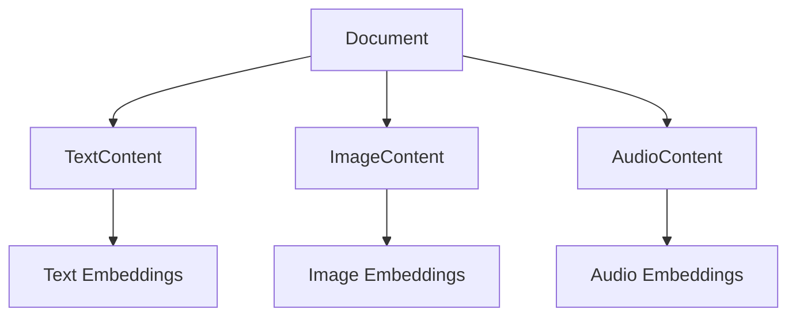

# Document Processing

Ragdoll provides comprehensive document processing capabilities that handle multiple file formats, extract content, and generate intelligent metadata using LLM providers. The system uses a multi-modal Single Table Inheritance (STI) architecture to store different content types efficiently.

## File Parsing, Metadata Extraction, and Content Analysis

The document processing pipeline transforms raw files into searchable, embedded content through several stages:

- **File Format Detection**: Automatic detection and routing to appropriate parsers
- **Content Extraction**: Specialized extraction for text, images, and metadata
- **Multi-Modal STI Storage**: Stores content in specialized models (TextContent, ImageContent, AudioContent)
- **LLM-Powered Metadata**: AI-generated summaries, keywords, and structured metadata
- **Vector Embeddings**: Semantic search capabilities through embedding generation
- **Error Handling**: Robust error recovery and validation at each stage

## Supported File Types

Ragdoll supports a wide range of file formats through specialized parsers:

### Text Documents

**PDF Processing (`pdf-reader` gem)**
- Full text extraction from all pages
- Metadata extraction (title, author, subject, creator, producer)
- Creation and modification dates
- Page count and page-by-page processing
- Handles malformed PDFs with graceful error recovery
- Supports password-protected PDFs

**DOCX Processing (`docx` gem)**
- Paragraph text extraction with formatting preservation
- Table content extraction with structure maintained
- Core document properties (title, author, subject, description)
- Keywords and metadata from document properties
- Creation and modification timestamps
- Word and paragraph count statistics

**HTML and Markdown Parsing**
- Script and style tag removal for clean content
- HTML tag stripping with whitespace normalization
- Markdown files processed as plain text
- File size and encoding detection
- Preserves content structure and readability

**Plain Text Handling**
- UTF-8 encoding with fallback to ISO-8859-1
- File size and encoding metadata
- Direct content preservation without modification
- Supports `.txt`, `.md`, `.markdown` extensions

### Image Documents

**Supported Formats**
```
.jpg, .jpeg, .png, .gif, .bmp, .webp, .svg, .ico, .tiff, .tif
```

**Image Processing (ImageMagick/RMagick)**
- Automatic dimension extraction (width × height)
- File size and format metadata
- AI-powered description generation using vision models
- Content stored as descriptive text for search indexing
- Error-resilient processing with fallback descriptions

**Vision AI Integration**
- Integrated with `ImageDescriptionService`
- Configurable vision models (GPT-4 Vision, Claude 3, etc.)
- Generates contextual descriptions for semantic search
- Fallback to filename-based descriptions if AI fails

### Audio Documents (Planned)

**Supported Formats (Future)**
```
.mp3, .wav, .flac, .m4a, .ogg, .aac
```

**Audio Processing (Planned)**
- Speech-to-text transcription using Whisper or similar
- Audio metadata extraction (duration, bitrate, codec)
- Transcript storage in AudioContent models
- Speaker identification and timestamp extraction
- Background job processing for long audio files

## Processing Pipeline

The document processing workflow follows a structured six-stage pipeline:

### 1. File Upload and Validation

```ruby
# File path processing
document = DocumentProcessor.create_document_from_file(
  'path/to/document.pdf',
  title: 'Custom Title',
  metadata: { source: 'import' }
)

# Upload processing (Shrine compatible)
document = DocumentProcessor.create_document_from_upload(
  uploaded_file,
  title: 'Uploaded Document',
  metadata: { user_id: 123 }
)
```

**Validation Steps:**
- File existence and accessibility verification
- File size limits (configurable)
- Format detection via extension and MIME type
- Permission checks for file access
- Malware scanning (if configured)

### 2. Format Detection and Routing

**Primary Detection Method:**
```ruby
def self.determine_document_type(file_path)
  case File.extname(file_path).downcase
  when ".pdf" then "pdf"
  when ".docx" then "docx"
  when ".txt" then "text"
  when ".md", ".markdown" then "markdown"
  when ".html", ".htm" then "html"
  when /\.(jpg|jpeg|png|gif|bmp|webp|svg|ico|tiff|tif)$/i then "image"
  else "text"  # Default fallback
  end
end
```

**Secondary Detection (MIME Type):**
- Used for uploaded files without reliable extensions
- Content-type header analysis
- Magic number detection for binary files
- Fallback to text processing for unknown types

### 3. Content Extraction

**Multi-Modal STI Architecture:**


**Content Storage Strategy:**
- **TextContent**: Raw text, processed text, word/character counts
- **ImageContent**: AI description, dimensions, file metadata
- **AudioContent**: Transcript, duration, speaker info (planned)
- **Polymorphic Embeddings**: Linked to each content type

### 4. Metadata Generation with LLM

**AI-Powered Analysis:**
```ruby
# Automatic metadata generation
doc.generate_metadata!

# Generated metadata includes:
# - summary: Concise document summary
# - keywords: Extracted key terms
# - classification: Document category
# - description: Detailed description
# - tags: Topical tags
```

**Schema Validation:**
- Document type-specific schemas
- Required field validation
- Format and length constraints
- Error handling with fallback values

### 5. Content Chunking for Embeddings

**TextChunker Integration:**
```ruby
# Configurable chunking strategy
config.chunking[:text][:max_tokens] = 1000
config.chunking[:text][:overlap] = 200
config.chunking[:text][:strategy] = 'sentence_boundary'
```

**Chunking Strategies:**
- **Sentence Boundary**: Respects sentence structure
- **Token-Based**: Fixed token count with overlap
- **Paragraph-Based**: Natural paragraph breaks
- **Semantic Chunking**: Content-aware splitting (planned)

### 6. Database Storage and Indexing

**PostgreSQL Storage:**
- **Documents**: Main document metadata and status
- **Contents**: STI-based content storage
- **Embeddings**: Vector storage with pgvector
- **Full-text Indexes**: PostgreSQL GIN indexes
- **JSON Metadata**: Structured metadata with indexes

**Index Strategy:**
```sql
-- Full-text search index
CREATE INDEX idx_documents_fulltext ON ragdoll_documents 
USING gin(to_tsvector('english', title || ' ' || 
  COALESCE(metadata->>'summary', '') || ' ' || 
  COALESCE(metadata->>'keywords', '')));

-- Vector similarity index
CREATE INDEX idx_embeddings_vector ON ragdoll_embeddings 
USING ivfflat (embedding_vector vector_cosine_ops);
```

## Metadata Generation

Ragdoll uses AI-powered metadata extraction to enhance document searchability and organization:

### LLM-Based Content Analysis

**MetadataGenerator Service:**
```ruby
generator = Services::MetadataGenerator.new
metadata = generator.generate_for_document(document)

# Example generated metadata:
{
  "summary" => "This technical document explains the implementation...",
  "keywords" => ["API", "authentication", "security", "OAuth"],
  "classification" => "technical_documentation",
  "description" => "Comprehensive guide to API security practices",
  "tags" => ["development", "security", "best-practices"],
  "sentiment" => "neutral",
  "complexity" => "intermediate",
  "estimated_reading_time" => 15
}
```

**Configurable LLM Models:**
```ruby
# Different models for different tasks
config.summarization_config[:model] = 'openai/gpt-4o'
config.keywords_config[:model] = 'anthropic/claude-3-haiku-20240307'
config.classification_config[:model] = 'openai/gpt-4o-mini'
```

### Schema Validation

**Document Type-Specific Schemas:**
```ruby
# Text document schema
MetadataSchemas::TEXT_SCHEMA = {
  summary: { type: :string, required: true, max_length: 500 },
  keywords: { type: :array, items: :string, max_items: 20 },
  classification: { type: :string, enum: CLASSIFICATIONS },
  description: { type: :string, max_length: 1000 },
  tags: { type: :array, items: :string, max_items: 10 }
}

# Image document schema
MetadataSchemas::IMAGE_SCHEMA = {
  description: { type: :string, required: true },
  objects_detected: { type: :array, items: :string },
  scene_type: { type: :string },
  colors: { type: :array, items: :string },
  text_content: { type: :string }  # OCR results
}
```

**Validation Process:**
```ruby
errors = MetadataSchemas.validate_metadata(document_type, metadata)
if errors.any?
  Rails.logger.warn "Metadata validation errors: #{errors.join(', ')}"
  # Apply fallback values for failed fields
end
```

### Summary Generation

**Configurable Summary Strategy:**
```ruby
config.summarization_config.tap do |c|
  c[:enable] = true
  c[:model] = 'openai/gpt-4o'
  c[:max_length] = 300
  c[:style] = 'concise'  # concise, detailed, bullet_points
  c[:include_keywords] = true
end
```

**Content-Aware Summarization:**
- **Technical Documents**: Focus on key concepts and procedures
- **Legal Documents**: Highlight important clauses and obligations
- **Academic Papers**: Emphasize methodology and findings
- **General Content**: Extract main themes and conclusions

### Keyword Extraction

**Multi-Strategy Keyword Extraction:**
```ruby
# LLM-based extraction
llm_keywords = extract_keywords_with_llm(content)

# Statistical extraction (TF-IDF)
stats_keywords = extract_keywords_statistical(content)

# Hybrid approach combining both
final_keywords = merge_keyword_strategies(
  llm_keywords, 
  stats_keywords,
  weights: { llm: 0.7, statistical: 0.3 }
)
```

**Keyword Quality Filtering:**
- Minimum length requirements (>3 characters)
- Stop word removal
- Duplicate detection and merging
- Relevance scoring
- Maximum keyword limits (configurable)

### Classification and Tagging

**Hierarchical Classification:**
```ruby
CLASSIFICATIONS = {
  'technical_documentation' => {
    'api_documentation' => ['rest', 'graphql', 'rpc'],
    'user_guides' => ['tutorial', 'how-to', 'reference'],
    'architecture' => ['design', 'patterns', 'infrastructure']
  },
  'business_documents' => {
    'contracts' => ['nda', 'service_agreement', 'license'],
    'reports' => ['financial', 'quarterly', 'analysis'],
    'procedures' => ['policy', 'workflow', 'compliance']
  }
}
```

**Smart Tagging System:**
```ruby
# Auto-generated tags based on content analysis
auto_tags = [
  content_based_tags,      # From text analysis
  format_based_tags,       # From document format
  metadata_based_tags,     # From existing metadata
  context_based_tags       # From file location/name
].flatten.uniq

# User-defined tags (preserved and merged)
final_tags = (user_tags + auto_tags).uniq
```

**Tag Confidence Scoring:**
- High confidence: Direct content matches
- Medium confidence: Contextual indicators
- Low confidence: Statistical correlations
- Threshold-based filtering for quality control

## Background Processing

Ragdoll uses background jobs for resource-intensive processing operations:

### ActiveJob Integration

**Available Background Jobs:**
```ruby
# Text extraction job
Ragdoll::ExtractTextJob.perform_later(document_id)

# Embedding generation job
Ragdoll::GenerateEmbeddingsJob.perform_later(content_id, content_type)

# Summary generation job
Ragdoll::GenerateSummaryJob.perform_later(document_id)

# Keyword extraction job
Ragdoll::ExtractKeywordsJob.perform_later(document_id)
```

**Job Configuration:**
```ruby
config.background_processing_config.tap do |c|
  c[:enable] = true
  c[:queue_name] = 'ragdoll_processing'
  c[:job_timeout] = 300.seconds
  c[:max_retry_attempts] = 3
  c[:retry_backoff] = :exponential
end
```

### Job Queues and Workers

**Queue Priority System:**
```ruby
# High priority: User-facing operations
queue_as :ragdoll_high_priority, priority: 10

# Medium priority: Batch processing
queue_as :ragdoll_medium_priority, priority: 5

# Low priority: Background optimization
queue_as :ragdoll_low_priority, priority: 1
```

**Worker Scaling Configuration:**
```bash
# Development: Single worker
bundle exec sidekiq -q ragdoll_processing

# Production: Multiple workers with priority queues
bundle exec sidekiq -q ragdoll_high_priority:3 -q ragdoll_medium_priority:2 -q ragdoll_low_priority:1
```

### Error Handling and Retries

**Retry Strategy:**
```ruby
class ProcessDocumentJob < ApplicationJob
  retry_on StandardError, wait: :exponentially_longer, attempts: 3
  retry_on ActiveRecord::Deadlocked, wait: 5.seconds, attempts: 3
  
  discard_on ActiveJob::DeserializationError
  discard_on Ragdoll::Core::UnsupportedFormatError
  
  def perform(document_id)
    document = Document.find(document_id)
    document.process_content!
  rescue => e
    document&.update(status: 'error', error_message: e.message)
    raise
  end
end
```

**Error Recovery:**
- Automatic retries with exponential backoff
- Dead letter queue for failed jobs
- Error notification system
- Manual job retry capabilities
- Partial processing recovery

### Progress Tracking

**Job Status Monitoring:**
```ruby
# Document processing status
document.status  # 'pending', 'processing', 'processed', 'error'

# Detailed progress tracking
processing_info = {
  stage: 'embedding_generation',
  progress: 75,
  total_steps: 4,
  current_step: 3,
  estimated_completion: 2.minutes.from_now
}

document.update(processing_info: processing_info)
```

**Real-time Updates:**
```ruby
# WebSocket integration for live progress
ActionCable.server.broadcast(
  "document_#{document.id}",
  {
    event: 'processing_update',
    progress: 50,
    message: 'Generating embeddings...'
  }
)
```

### Scaling Considerations

**Horizontal Scaling:**
```yaml
# Docker Compose example
services:
  ragdoll_worker_1:
    build: .
    command: bundle exec sidekiq -q ragdoll_high_priority:2
    environment:
      - REDIS_URL=redis://redis:6379/0
    
  ragdoll_worker_2:
    build: .
    command: bundle exec sidekiq -q ragdoll_medium_priority:3 -q ragdoll_low_priority:1
    environment:
      - REDIS_URL=redis://redis:6379/0
```

**Resource Management:**
```ruby
# Memory-aware job processing
class ProcessLargeDocumentJob < ApplicationJob
  def perform(document_id)
    # Process in chunks to manage memory
    document = Document.find(document_id)
    
    if document.file_size > 50.megabytes
      process_in_chunks(document)
    else
      process_normally(document)
    end
  ensure
    GC.start  # Force garbage collection
  end
end
```

**Performance Monitoring:**
```ruby
# Job performance metrics
class JobMetrics
  def self.track_job_performance(job_name, &block)
    start_time = Time.current
    result = block.call
    duration = Time.current - start_time
    
    Rails.logger.info "Job #{job_name} completed in #{duration}s"
    
    # Send to monitoring service
    StatsD.histogram('job.duration', duration, tags: ["job:#{job_name}"])
    
    result
  end
end
```

## Configuration Options

Ragdoll provides extensive configuration options for document processing:

### Chunk Size and Overlap Settings

**Text Chunking Configuration:**
```ruby
Ragdoll::Core.configure do |config|
  config.chunking[:text].tap do |c|
    c[:max_tokens] = 1000           # Maximum tokens per chunk
    c[:overlap] = 200               # Token overlap between chunks
    c[:strategy] = 'sentence'       # 'sentence', 'paragraph', 'token'
    c[:min_chunk_size] = 100        # Minimum viable chunk size
    c[:preserve_paragraphs] = true  # Respect paragraph boundaries
    c[:split_on_headers] = true     # Split at header boundaries
  end
end
```

**Content-Type Specific Chunking:**
```ruby
# PDF documents (technical content)
config.chunking[:pdf][:max_tokens] = 1500
config.chunking[:pdf][:overlap] = 300
config.chunking[:pdf][:preserve_page_breaks] = true

# HTML documents (web content)
config.chunking[:html][:max_tokens] = 800
config.chunking[:html][:overlap] = 150
config.chunking[:html][:preserve_structure] = true

# Code documents
config.chunking[:code][:max_tokens] = 2000
config.chunking[:code][:overlap] = 100
config.chunking[:code][:preserve_functions] = true
```

### Model Selection for Metadata Generation

**LLM Model Configuration:**
```ruby
config.ruby_llm_config.tap do |llm|
  # Primary models for different tasks
  llm[:openai][:api_key] = ENV['OPENAI_API_KEY']
  llm[:anthropic][:api_key] = ENV['ANTHROPIC_API_KEY']
  llm[:google][:api_key] = ENV['GOOGLE_API_KEY']
end

# Task-specific model assignment
config.models.tap do |m|
  m[:summarization] = 'openai/gpt-4o'           # Best for summaries
  m[:keywords] = 'anthropic/claude-3-haiku'     # Fast keyword extraction
  m[:classification] = 'openai/gpt-4o-mini'     # Cost-effective classification
  m[:description] = 'google/gemini-1.5-pro'    # Detailed descriptions
end
```

**Embedding Model Configuration:**
```ruby
config.embedding_config.tap do |e|
  # Text embeddings
  e[:text][:model] = 'openai/text-embedding-3-large'
  e[:text][:dimensions] = 3072
  e[:text][:batch_size] = 100
  
  # Image embeddings (planned)
  e[:image][:model] = 'openai/clip-vit-large-patch14'
  e[:image][:dimensions] = 768
  
  # Audio embeddings (planned)
  e[:audio][:model] = 'openai/whisper-embedding-v1'
  e[:audio][:dimensions] = 1024
end
```

### Processing Timeouts

**Timeout Configuration:**
```ruby
config.processing_timeouts.tap do |t|
  # Per-operation timeouts
  t[:file_parsing] = 120.seconds        # File content extraction
  t[:text_extraction] = 60.seconds      # Text processing
  t[:image_analysis] = 180.seconds      # Vision AI processing
  t[:metadata_generation] = 300.seconds # LLM metadata creation
  t[:embedding_generation] = 240.seconds # Vector embedding creation
  
  # Document size-based scaling
  t[:scaling_factor] = 1.5              # Multiply timeout by this for large docs
  t[:large_document_threshold] = 10.megabytes
end
```

**Background Job Timeouts:**
```ruby
config.background_processing_config.tap do |bg|
  bg[:job_timeout] = 600.seconds        # Maximum job execution time
  bg[:queue_timeout] = 3600.seconds     # Maximum time in queue
  bg[:retry_timeout] = 1800.seconds     # Time between retries
end
```

### Quality Thresholds

**Content Quality Filters:**
```ruby
config.quality_thresholds.tap do |q|
  # Minimum content requirements
  q[:min_text_length] = 50              # Minimum characters for processing
  q[:min_word_count] = 10               # Minimum words for meaningful content
  q[:max_empty_lines_ratio] = 0.5       # Maximum ratio of empty lines
  
  # Metadata quality requirements
  q[:min_summary_length] = 20           # Minimum summary length
  q[:max_summary_length] = 500          # Maximum summary length
  q[:min_keywords_count] = 3            # Minimum number of keywords
  q[:max_keywords_count] = 20           # Maximum number of keywords
  
  # Embedding quality thresholds
  q[:min_embedding_similarity] = 0.1    # Minimum similarity for relevance
  q[:duplicate_threshold] = 0.95        # Similarity threshold for duplicates
end
```

**Language Detection and Filtering:**
```ruby
config.language_config.tap do |l|
  l[:enabled] = true
  l[:supported_languages] = ['en', 'es', 'fr', 'de', 'it']
  l[:confidence_threshold] = 0.8         # Minimum language detection confidence
  l[:fallback_language] = 'en'          # Default when detection fails
  l[:skip_unsupported] = false          # Process unsupported languages as text
end
```

### Advanced Processing Options

**Performance Optimization:**
```ruby
config.performance_config.tap do |p|
  # Parallel processing
  p[:parallel_processing] = true
  p[:max_parallel_jobs] = 4
  p[:chunk_processing_batch_size] = 50
  
  # Memory management
  p[:memory_limit] = 2.gigabytes
  p[:gc_frequency] = 100               # GC every N operations
  p[:temp_file_cleanup] = true
  
  # Caching
  p[:cache_parsed_content] = true
  p[:cache_embeddings] = true
  p[:cache_ttl] = 1.hour
end
```

**Error Handling Configuration:**
```ruby
config.error_handling.tap do |e|
  e[:continue_on_parse_error] = true    # Continue processing other content
  e[:retry_failed_chunks] = true       # Retry failed chunk processing
  e[:max_retry_attempts] = 3           # Maximum retry attempts
  e[:fallback_to_text] = true          # Fallback to text processing
  e[:notify_on_errors] = true          # Send error notifications
end
```

### Environment-Specific Configuration

**Development Settings:**
```ruby
if Rails.env.development?
  config.chunking[:text][:max_tokens] = 500    # Smaller chunks for faster processing
  config.processing_timeouts[:metadata_generation] = 60.seconds
  config.background_processing_config[:enable] = false  # Synchronous processing
end
```

**Production Settings:**
```ruby
if Rails.env.production?
  config.chunking[:text][:max_tokens] = 1500   # Larger chunks for efficiency
  config.background_processing_config[:enable] = true
  config.performance_config[:parallel_processing] = true
  config.quality_thresholds[:min_text_length] = 100
end
```

---

*This document is part of the Ragdoll documentation suite. For immediate help, see the [Quick Start Guide](../getting-started/quick-start.md) or [API Reference](../api-reference/api-client.md).*