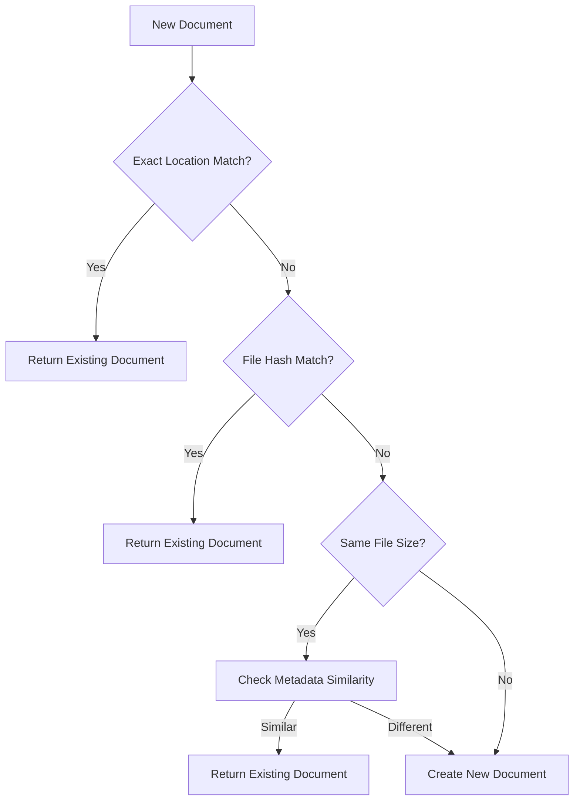
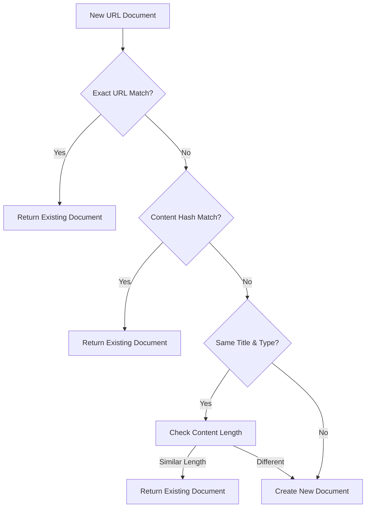

# Duplicate Detection

Ragdoll includes a sophisticated multi-level duplicate detection system to prevent redundant document processing and storage. This system uses multiple detection criteria to identify duplicates while providing options to override when needed.

## Overview

The duplicate detection system operates on several levels:

1. **Primary Detection**: Exact location and file modification time matching
2. **Secondary Detection**: File content hashing (SHA256)
3. **Tertiary Detection**: Content hashing and metadata similarity
4. **Quaternary Detection**: Smart similarity analysis with configurable tolerance

## Detection Methods

### Location-Based Detection

**Exact Path Matching:**
```ruby
# Primary check - fastest detection method
existing = Document.find_by(location: file_path)
return existing if existing
```

**Path + Modification Time:**
```ruby
# For file-based documents, include modification time
existing = Document.find_by(
  location: file_path,
  file_modified_at: File.mtime(file_path)
)
```

### Hash-Based Detection

**File Content Hash (SHA256):**
```ruby
# Most reliable method for file integrity
file_hash = Digest::SHA256.file(file_path).hexdigest
existing = Document.where("metadata->>'file_hash' = ?", file_hash).first

# Automatically calculated during document processing
metadata[:file_hash] = calculate_file_hash(file_path)
```

**Text Content Hash:**
```ruby
# For extracted text content
content_hash = Digest::SHA256.hexdigest(extracted_text)
existing = Document.where("metadata->>'content_hash' = ?", content_hash).first

# Added to all document types during processing
metadata[:content_hash] = calculate_content_hash(content)
```

### Similarity-Based Detection

**Content Length Comparison:**
```ruby
# 5% tolerance for minor content differences
content_length_diff = (existing_length - new_length).abs
max_length = [existing_length, new_length].max
similarity_within_tolerance = (content_length_diff.to_f / max_length) <= 0.05
```

**Metadata Similarity:**
```ruby
def documents_are_similar?(existing_doc, new_doc)
  # Compare filename (basename without extension)
  existing_basename = File.basename(existing_doc.location, File.extname(existing_doc.location))
  new_basename = File.basename(new_doc.location, File.extname(new_doc.location))
  return false unless existing_basename == new_basename
  
  # Compare document types
  return false if existing_doc.document_type != new_doc.document_type
  
  # Compare titles if available
  return false if existing_doc.title != new_doc.title
  
  # Content length tolerance check
  if existing_doc.content.present? && new_doc.content.present?
    length_diff = (existing_doc.content.length - new_doc.content.length).abs
    max_length = [existing_doc.content.length, new_doc.content.length].max
    return false if max_length > 0 && (length_diff.to_f / max_length) > 0.05
  end
  
  true
end
```

## Detection Process Flow

### File-Based Documents



### URL/Web Documents



## Configuration

### Basic Configuration

```ruby
Ragdoll.configure do |config|
  config.duplicate_detection.tap do |dd|
    dd[:enabled] = true                      # Enable duplicate detection
    dd[:content_similarity_threshold] = 0.95 # Content similarity threshold
    dd[:content_length_tolerance] = 0.05     # 5% content length tolerance
    dd[:check_file_hash] = true             # Enable file hash checking
    dd[:check_content_hash] = true          # Enable content hash checking
    dd[:check_metadata_similarity] = true   # Enable metadata comparison
  end
end
```

### Advanced Configuration

```ruby
config.duplicate_detection.tap do |dd|
  # Detection method priorities
  dd[:detection_methods] = [
    :location_match,           # Fastest - exact location
    :file_hash_match,         # Most reliable - file content
    :content_hash_match,      # Text content comparison
    :metadata_similarity      # Fuzzy matching
  ]
  
  # Performance tuning
  dd[:max_similarity_checks] = 100  # Limit expensive similarity checks
  dd[:hash_cache_ttl] = 1.hour      # Cache file hashes
  dd[:enable_parallel_checks] = true # Parallel hash calculation
  
  # File size thresholds
  dd[:large_file_threshold] = 50.megabytes
  dd[:skip_hash_for_large_files] = false
  
  # Content type specific settings
  dd[:pdf_content_tolerance] = 0.02      # Stricter for PDFs
  dd[:text_content_tolerance] = 0.05     # Standard for text
  dd[:image_similarity_threshold] = 0.98 # Very strict for images
end
```

## Force Override Option

### Basic Usage

```ruby
# Bypass duplicate detection completely
result = Ragdoll.add_document(
  path: 'document.pdf',
  force: true
)

# Creates new document with modified location to avoid conflicts
# Location becomes: "/path/to/document.pdf#forced_1642608000_a1b2c3d4"
```

### Advanced Force Options

```ruby
# Force with custom metadata
result = Ragdoll.add_document(
  path: 'document.pdf',
  force: true,
  metadata: {
    version: '2.0',
    reason: 'Updated content',
    previous_document_id: original_id
  }
)

# Force in DocumentManagement service
document_id = Ragdoll::DocumentManagement.add_document(
  location,
  content,
  metadata,
  force: true
)
```

### Location Modification Strategy

When forcing duplicate creation, Ragdoll modifies the location to avoid database unique constraint violations:

```ruby
if force
  # Append timestamp and random hex to make location unique
  final_location = "#{absolute_location}#forced_#{Time.current.to_i}_#{SecureRandom.hex(4)}"
else
  final_location = absolute_location
end
```

## Database Performance

### Indexes for Fast Detection

```sql
-- Primary location lookup (unique constraint)
CREATE UNIQUE INDEX idx_documents_location ON ragdoll_documents (location);

-- Hash-based lookups using GIN indexes for JSON metadata
CREATE INDEX idx_documents_file_hash ON ragdoll_documents 
USING gin((metadata->>'file_hash'));

CREATE INDEX idx_documents_content_hash ON ragdoll_documents 
USING gin((metadata->>'content_hash'));

-- File size for similarity filtering
CREATE INDEX idx_documents_file_size ON ragdoll_documents 
USING btree((metadata->>'file_size'));

-- Document type filtering
CREATE INDEX idx_documents_type ON ragdoll_documents (document_type);

-- File modification time for temporal checks
CREATE INDEX idx_documents_file_modified_at ON ragdoll_documents (file_modified_at);
```

### Query Performance Optimization

**Fast Path Queries:**
```ruby
# O(1) lookup via unique index
Document.find_by(location: file_path)

# O(log n) hash lookup via GIN index
Document.where("metadata->>'file_hash' = ?", file_hash).limit(1)
```

**Efficient Similarity Queries:**
```ruby
# Filter by file size first to reduce comparison set
same_size_docs = Document.where("metadata->>'file_size' = ?", file_size.to_s)
                        .where(document_type: document_type)
                        .limit(50)  # Reasonable limit for similarity checks
```

## Use Cases and Examples

### Development Environment

**Avoid Re-processing During Development:**
```ruby
# First call processes the document
result1 = Ragdoll.add_document(path: 'test_document.pdf')
puts result1[:message] # "Document 'test_document' added successfully"

# Second call returns existing document immediately
result2 = Ragdoll.add_document(path: 'test_document.pdf')
puts result2[:message] # "Document 'test_document' already exists"
assert_equal result1[:document_id], result2[:document_id]
```

### Production Batch Import

**Safe Bulk Import Without Duplicates:**
```ruby
documents = Dir.glob('/import_folder/**/*.pdf')

import_stats = { added: 0, skipped: 0, errors: 0 }

documents.each do |file_path|
  begin
    result = Ragdoll.add_document(path: file_path)
    
    if result[:duplicate]
      import_stats[:skipped] += 1
      puts "SKIPPED: #{file_path} (duplicate of document #{result[:document_id]})"
    else
      import_stats[:added] += 1
      puts "ADDED: #{file_path} (new document #{result[:document_id]})"
    end
  rescue => e
    import_stats[:errors] += 1
    puts "ERROR: #{file_path} - #{e.message}"
  end
end

puts "\nImport Summary:"
puts "Added: #{import_stats[:added]}"
puts "Skipped: #{import_stats[:skipped]}"
puts "Errors: #{import_stats[:errors]}"
```

### Content Versioning

**Managing Document Versions:**
```ruby
# Original document
original = Ragdoll.add_document(
  path: 'manual_v1.pdf',
  metadata: { version: '1.0' }
)

# Updated version - force new document
updated = Ragdoll.add_document(
  path: 'manual_v2.pdf',  # Same content, different name
  force: true,
  metadata: {
    version: '2.0',
    supersedes: original[:document_id],
    changelog: 'Added new chapter on advanced features'
  }
)

# Link versions in metadata
Ragdoll.update_document(
  id: original[:document_id],
  metadata: { superseded_by: updated[:document_id] }
)
```

### Multi-Source Document Management

**Handling Documents from Different Sources:**
```ruby
# Same document from different sources
local_result = Ragdoll.add_document(
  path: '/local/docs/whitepaper.pdf',
  metadata: { source: 'local_filesystem' }
)

# URL to same document - detected as duplicate via content hash
url_result = Ragdoll.add_document(
  path: 'https://example.com/whitepaper.pdf',
  metadata: { source: 'company_website' }
)

# Both return same document_id due to content hash matching
assert_equal local_result[:document_id], url_result[:document_id]

# Force separate entries if needed for tracking
forced_url_result = Ragdoll.add_document(
  path: 'https://example.com/whitepaper.pdf',
  force: true,
  metadata: { 
    source: 'company_website',
    primary_document_id: local_result[:document_id]
  }
)
```

## Monitoring and Analytics

### Duplicate Detection Metrics

```ruby
# Check duplicate detection effectiveness
stats = Ragdoll.stats
puts "Total documents: #{stats[:total_documents]}"
puts "Duplicates prevented: #{stats[:duplicates_prevented]}"
puts "Duplicate detection rate: #{(stats[:duplicates_prevented].to_f / stats[:total_attempts] * 100).round(2)}%"

# Analyze duplicate patterns
duplicate_analysis = Ragdoll::Document.joins(
  "LEFT JOIN ragdoll_documents rd2 ON rd2.metadata->>'file_hash' = ragdoll_documents.metadata->>'file_hash'"
).where("rd2.id IS NOT NULL AND rd2.id != ragdoll_documents.id")
.group("ragdoll_documents.metadata->>'file_hash'")
.count

puts "Hash collision analysis: #{duplicate_analysis}"
```

### Performance Monitoring

```ruby
# Monitor detection performance
require 'benchmark'

detection_time = Benchmark.measure do
  result = Ragdoll.add_document(path: 'large_document.pdf')
end

puts "Duplicate detection took: #{detection_time.real}s"

# Log slow detection cases
if detection_time.real > 1.0
  Rails.logger.warn "Slow duplicate detection: #{detection_time.real}s for #{file_path}"
end
```

## Troubleshooting

### Common Issues

**False Positives (Legitimate Documents Detected as Duplicates):**
```ruby
# Check why document was considered duplicate
result = Ragdoll.add_document(path: 'document.pdf', debug: true)
puts result[:duplicate_reason]  # "file_hash_match", "content_similarity", etc.

# Force addition if false positive
result = Ragdoll.add_document(path: 'document.pdf', force: true)
```

**Performance Issues with Large Documents:**
```ruby
# Temporarily disable expensive checks for large files
config.duplicate_detection[:skip_content_hash_for_large_files] = true
config.duplicate_detection[:large_file_threshold] = 10.megabytes

# Or use background processing
config.duplicate_detection[:async_hash_calculation] = true
```

**Database Constraint Violations:**
```ruby
# Check for location conflicts
begin
  result = Ragdoll.add_document(path: 'document.pdf', force: true)
rescue ActiveRecord::RecordNotUnique => e
  # This shouldn't happen with proper force handling
  Rails.logger.error "Unexpected duplicate constraint violation: #{e.message}"
end
```

### Debug Mode

```ruby
# Enable detailed duplicate detection logging
Ragdoll.configure do |config|
  config.duplicate_detection[:debug] = true
  config.logging_config[:log_level] = :debug
end

# Results in detailed logs:
# DEBUG: Checking location match for /path/to/document.pdf
# DEBUG: No location match found
# DEBUG: Calculating file hash for /path/to/document.pdf
# DEBUG: File hash: a1b2c3d4e5f6...
# DEBUG: Checking for existing documents with same hash
# DEBUG: Found potential duplicate: Document ID 123
# DEBUG: Comparing metadata similarity...
# DEBUG: Documents are similar, returning existing document
```

---

*This document is part of the Ragdoll documentation suite. For immediate help, see the [Quick Start Guide](../getting-started/quick-start.md) or [Document Processing](document-processing.md).*